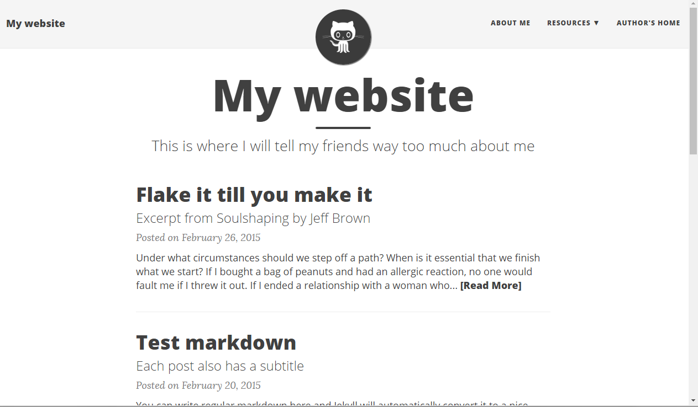

# Beautiful-Jekyll Theme (beautiful-jekyll-theme gem)

[](https://www.paypal.me/daattali/20)
[](https://badge.fury.io/rb/beautiful-jekyll-theme)

> *Copyright 2016 [Dean Attali](http://deanattali.com)*

**Beautiful-Jekyll** is a ready-to-use Jekyll theme to help you create an awesome website quickly. Perfect for personal blogs or simple project websites, with a focus on responsive and clean design. You can look at [my personal website](http://deanattali.com) to see it in use, or see examples of websites other people created using this theme [here](https://github.com/daattali/beautiful-jekyll#showcased-users-success-stories).

**This theme was developed for non-commerical purposes. For commerical usage, or if you enjoy this theme, please consider [supporting me](https://www.paypal.me/daattali/20) for the development and continuous maintenance of this template.**

<p align="center">
  <a href="https://www.paypal.me/daattali">
    
  </a>
</p>



## Prerequisites

To use this theme's gem, you need to first have a functioning Jekyll website. If you don't, there are many resources online for how to set up a Jekyll site. Here are the basic commands to get a minimal Jekyll site set up in Ubuntu:

```
$ sudo apt-get update
$ sudo apt-get install ruby ruby-dev make gcc
$ sudo gem install jekyll bundler
$ jekyll new ~/mysite
```

## Installation

To use the Beautiful-Jekyll theme, add this line to your Jekyll site's `Gemfile`:

```ruby
gem "beautiful-jekyll-theme"
```

Then add this line to your Jekyll site's `_config.yml`:

```yaml
theme: beautiful-jekyll-theme
```

And finally execute:

```
$ bundle
```

To preview your site, run `bundle exec jekyll serve` (optionally with the `--host 0.0.0.0` flag if needed) and open your browser at `http://localhost:4000`.

## Usage

Using Beautiful-Jekyll is very simple, but you should take a few minutes to read through the features it supports to learn how to use it.

### Adding content

You can now start adding pages to your site. Beautiful-Jekyll supports three layouts: `post`, `page`, and `minimal`. In order to use Beautiful-Jekyll's template, a page must have its `layout` parameter set to one of these options in the YAML.

Any blog posts (pages under the `_posts` directory) should use the `post` layout, while most other pages should use the `page` layout. You can use the `minimal` layout if you want a page with minimal styling, without the bulky navigation bar and footer.

Instead of remembering to manually add the layout parameter to every page's YAML, I recommend you add the following lines to your `_config.yml` so that all blog posts will automatically have layout `post` and all other pages will have layout `page`:

```yaml
defaults:
  -
    scope:
      path: ""
      type: "posts"
    values:
      layout: "post"
  -
    scope:
      path: ""
    values:
      layout: "page"
```

### Adding an index page

Feel free to create the index page (homepage) of your site however you'd like. If you want to have an index page similar to the one at [deanattali.com](http://deanattali.com), then create `index.html` as follows: 

```html
---
layout: page
title: My Website
subtitle: Some short description of my site
---

<div class="posts-list">
  
  <article class="post-preview">
    <a href="{{ post.url }}">
      <h2 class="post-title">{{ post.title }}</h2>
        
          <h3 class="post-subtitle">{{ post.subtitle }}</h3>
        
    </a>

    <p class="post-meta">
      Posted on {{ post.date | date: "%B %-d, %Y" }}
    </p>

    <div class="post-entry">
      {{ post.excerpt | strip_html | xml_escape | truncatewords: 50 }}
      
      
        <a href="{{ post.url }}" class="post-read-more">[Read&nbsp;More]</a>
      
    </div>

    
    <div class="blog-tags">
      Tags:
      {{ post.tags | join: ", " }}
    </div>
    

   </article>
  
</div>


<ul class="pager main-pager">
  
  <li class="previous">
    <a href="{{ paginator.previous_page_path | replace: '//', '/' }}">&larr; Newer Posts</a>
  </li>
  
  
  <li class="next">
    <a href="{{ paginator.next_page_path | replace: '//', '/' }}">Older Posts &rarr;</a>
  </li>
  
</ul>

```

You'll also need to add these lines to your `_config.yml` because the code above uses pagination:

```yaml
paginate: 5
gems:
  - jekyll-paginate
```

Make sure there is no `index.md` file (if there is one, then delete it).

### Creating a navigation bar

Add these lines to your `_config.yml` file to get a demo navigation bar:   

```yaml
navbar-links:
  Home: ""
  About Me: "aboutme"
  Resources:
    - Beautiful Jekyll: "http://deanattali.com/beautiful-jekyll/"
    - Learn markdown: "http://www.markdowntutorial.com/"
    - GitHub Pages: "https://pages.github.com/"
  Author's home: "http://deanattali.com"
```

Change these values to match the pages on your site. Each menu item is composed of a `key:value` pair, where the `key` is the text that shows up in the navigation bar, and `value` is the URL to link to. The URL can either be the name of a page on your site (eg. `""` will go to your homepage, `aboutme` will go to a page called `aboutme` on your site), or a URL to an external site beginning in `http`. If you want to define sub-menus, use the format that the `Resources` menu is using in the sample code above.

#### Displaying an image in the navigation bar

You can add an image to the navigation bar by defining the `avatar` parameter in `_config.yml`. The image should be a square (width = height).

```yaml
avatar: "/path/to/image.png"
```

### Add your name/email/social media links to the footer

You can add contact information and social media links in the footer. They will be displayed as nice little logos, to give the footer a clean feel. Add the following to your `_config.yml` file:

```yaml
author:
  name: Some Person
  email: "youremail@domain.com"
  facebook: yourname  # eg. daattali
  github: yourname    # eg. daattali
  twitter: yourname   # eg. daattali
  telephone: yourphone     # eg. +14159998888
  reddit: yourname    # eg. daattali
  google-plus: +yourname   # eg. +DeanAttali or 109424658772469020925
  linkedin: yourname  # eg. daattali
  xing: yourname      # eg. daattali
  stackoverflow: yourlink  # eg. "3943160/daattali"
  snapchat: yourname  # eg. daattali
  instagram: yourname # eg. daattali
  youtube: yourlink   # eg. user/daattali or channel/daattali
  spotify: yourname   # eg. daattali
```

Remove the lines that you don't want to display in the footer, and change `yourname` to the correct values in the links you want to keep.

#### Add your website's name to the footer

After all the contact info links, you can also add the name of your website by defining the` url-pretty` parameter in `_config.yml`:

```yaml
url-pretty: "MyWebsite.com"
```

### Buttons for sharing blog posts on social media

By default, every blog post will have buttons at the bottom for sharing the page on Twitter, Facebook, LinkedIn, and Google+. If you want to disable these buttons, add these lines to your `_config.yml`:

```yaml
share-links-active:
  twitter: false
  facebook: false
  google: false
  linkedin: false
```

These settings will remove all four buttons. You can use `true` instead of `false` for any buttons that you want to keep.

### Allowing users to leave comments

If you want to enable comments on your site, Beautiful-Jekyll supports the [Disqus](https://disqus.com/) comments plugin.  To use it, simply sign up to Disqus and add your Disqus shortname (**not** the userid) to the `disqus` parameter in `_config.yml`:

```yaml
disqus: yourshortname
```

### Adding Google Analytics to track page views

Beautiful-Jekyll lets you easily add Google Analytics to all your pages. This will allow you to track all sorts of information about visits to your website, such as how many times each page is viewed and where (geographically) your users come from.  To add Google Analytics, simply sign up to [Google Analytics](http://www.google.com/analytics/) to obtain your Google Tracking ID, and add this tracking ID to the `google_analytics` parameter in `_config.yml`:

```yaml
google_analytics: yourid
```

### YAML parameter you can use to personalize each page

These are all the parameters you can place inside a page's YAML front matter that Beautiful-Jekyll supports.

Parameter   | Description
----------- | -----------
layout      | What type of page this is (default is `blog` for blog posts and `page` for other pages. You can use `minimal` if you don't want a header and footer).
title       | Page or blog post title.
subtitle    | Short description of page or blog post that goes under the title.
bigimg      | Include a large full-width image at the top of the page.  You can either give the path to a single image, or provide a list of images to cycle through (see [my personal website](http://deanattali.com/) as an example).
comments    | Only applicable if the `disqus` parameter is set in the `_config.yml` file. All blog posts automatically have comments enabled. To enable comments on a specific page, use `comments: true`; to turn comments off for a specific blog post, use `comments: false`.
social-share | If you don't want to show buttons to share a blog post on social media, use `social-share: false` (this feature is turned on by default).
share-img   | If you want to specify an image to use when sharing the page on Facebook or Twitter, then provide the image's full URL here.
js          | List of local JavaScript files to include in the page (eg. `/js/mypage.js`)
ext-js      | List of external JavaScript files to include in the page (eg. `//cdnjs.cloudflare.com/ajax/libs/underscore.js/1.8.2/underscore-min.js`)
css         | List of local CSS files to include in the page
ex-css      | List of external CSS files to include in the page
googlefonts | List of Google fonts to include in the page (eg. `["Monoton", "Lobster"]`)

## Contributions

If you find anything wrong or would like to contribute in any way, feel free to submit a pull request/open an issue [on GitHub](https://github.com/daattali/beautiful-jekyll), or [send me a message](http://deanattali.com/contact).

Thank you to [all contributors](https://github.com/daattali/beautiful-jekyll/graphs/contributors). Special thanks to the following people with non-trivial contributions (in chronological order): [@hristoyankov](https://github.com/hristoyankov), [@jamesonzimmer](https://github.com/jamesonzimmer), [@XNerv](https://github.com/XNerv), [@epwalsh](https://github.com/epwalsh), [@rtlee9](https://github.com/rtlee9).

## Credits

This template was not made entirely from scratch. I would like to give special thanks to:
- [Barry Clark](https://github.com/barryclark) and his project [Jekyll Now](https://github.com/barryclark/jekyll-now), from whom I've taken several ideas and code snippets, as well as some documenation tips.
- [Iron Summit Media](https://github.com/IronSummitMedia) and their project [Bootstrap Clean Blog](https://github.com/IronSummitMedia/startbootstrap-clean-blog), from which I've used some design ideas and some of the templating code for posts and pagination.

I'd also like to thank [Dr. Jekyll's Themes](http://drjekyllthemes.github.io/), [Jekyll Themes](http://jekyllthemes.org/), and another [Jekyll Themes](http://jekyllrc.github.io/jekyllthemes/) for featuring Beautiful Jekyll in their Jekyll theme directories.
