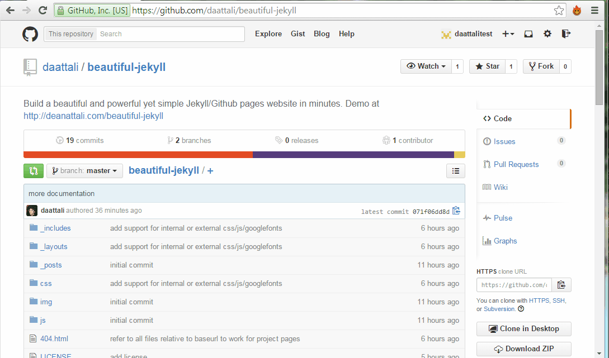

## IMPORTANT NOTE

#### If you've been using Beautiful-Jekyll for a while and it all of a sudden broke after Feb 1, 2016, do not panic. It's because GitHub upgraded to a newer version of Jekyll, and it unfortunately broke tons of websites. To fix your website, there are two files you need to change: [`_includes/head.html`](./_includes/head.html) and [`_includes/footer-scripts.html`](_includes/footer-scripts.html). You need to edit your version of these two files and change them to match my version (click on the links in the previous sentence to see my version).

### IMPORTANT NOTE 2:

#### During February/March 2016 I will be extremely busy trying to write my thesis, so please do not send me private emails asking for personal help. Help me graduate :)

# Beautiful Jekyll

**Beautiful Jekyll** is a ready-to-use template to help you create an awesome website quickly. Perfect for personal blogs or simple project websites.  [Check out a demo](http://deanattali.com/beautiful-jekyll) of what you'll get after just two minutes.  You can look at [my personal website](http://deanattali.com) to see it in use, or see examples of websites other people created using this theme [here](#featured-users).

Feel free to modify this in any way you'd like, but I would appreciate it if you don't remove the attribution to Beautiful Jekyll. I've noticed that many people copy this website and deliberately remove the tiny phrase that gives me credit, and it feels a bit sad to not get credit for the countless hours I've put into this. Don't make me sad!

If you need a bit of help or have comments, feel free to [contact me](http://deanattali.com/aboutme#contact). Even if you don't have anything important to say but found this useful, I'd love to [hear about it](http://deanattali.com/aboutme#contact). Lastly, if you like this theme, please consider [supporting me with a small donation](http://deanattali.com/aboutme#feed-meeee) if you want to make me extra happy. :)

This template is built on top of [Jekyll](http://jekyllrb.com/) and can be used for any [GitHub Pages](https://pages.github.com/) website.  (If you don't know what these two things are, that's absolutely fine, you don't need to!)

### Table of contents

- [Prerequisites](#prerequisites)
- [Build your website in 3 steps](#build-your-website-in-3-steps)
- [Add your own content](#add-your-own-content)
- [Last important thing: YAML front matter ("parameters" for a page)](#last-important-thing-yaml-front-matter)
- [Basic features](#features)
- [Advanced features](#more-advanced-features)
- [Featured users](#featured-users)
- [Very advanced: local development](#advanced-local-development)
- [Credits](#credits)
- [Contributions](#contributions)
- [Known limitations](#known-limitations)

## Prerequisites

- You need to have a GitHub account. If you don't have one, [sign up here](https://github.com/join) - it takes one minute. This is where your website will live - if you sign up with username `johnsmith` then your website will be `http://johnsmith.github.io`.  
- It would be helpful to understand what Markdown is and how to write it. Markdown is just a way to take a piece of text and format it to look a little nicer.  For example, this whole instruction set that you're reading is written in markdown - it's just text with some words being bold/larger/italicized/etc. I recommend taking 5 minutes to learn markdown [with this amazingly easy yet useful tutorial](http://markdowntutorial.com/).

## Build your website in 3 steps

Getting started is *literally* as easy as 1-2-3 :smile:   
Scroll down to see the steps involved, but here is a 40-second video just as a reference as you work through the steps.



### 1. Fork this repository 

(Assuming you are on this page and logged into GitHub) Fork this repository by clicking the *Fork* button on the top right corner. Forking means that you now copied this whole project and all the files into your account.

### 2. Rename the repository to `<yourusername>.github.io`

This will create a GitHub User page ready with the **Beautiful Jekyll** template that will be available at `http://<yourusername>.github.io` within a couple minutes.  To do this, click on "Settings" on the right (the tools icon) and there you'll have an option to rename.

### 3. Customize your website settings

Edit the `_config.yml` file to change all the settings to reflect your site. To edit the file, click on it and then click on the pencil icon (watch the video tutorial above if you're confused).  The settings in the file are fairly self-explanatory and I added comments inside the file to help you further. Any line that begins with a pound sign (`#`) is a comment, and the rest of the lines are settings.

Another way to edit the config file (or any other file) is to use [prose.io](http://prose.io/), which is just a simple interface to allow you to more intuitively edit files or new new files to your project.

After you save your changes to the config file (by clicking on "Commit changes" as the video tutorial shows), your website should be ready in a minute or two at `<yourusername>.github.io`. Every time you make a change to any file, your website will get rebuilt and should be updated in about a minute or so.

You can now visit your shiny new website, which will be seeded with several sample blog posts and a couple other pages. Your website is at `http://<yourusername>.github.io` (replace `<yourusername>` with your user name). Do not add `www` to the URL - it will not work!

**Note:** The video above goes through the setup for a user with username `daattalitest`. I only edited one setting in the `_config.yml` file in the video, but **you should actually go through the rest of the settings as well. Don't be lazy, go through all the settings :)**

### Add your own content

To add pages to your site, you can either write a markdown file (`.md`) or you can write an HTML file directly.  It is much easier to write markdown than HTML, so I suggest you do that (use the tutorial above if you need to learn markdown). You can look at some files on this site to get an idea of how to write markdown. To look at existing files, click on any file that ends in `.md`, for example [`aboutme.md`](./aboutme.md). On the next page you can see some nicely formatted text (there is a word in bold, a link, bullet points), and if you click on the pencil icon to edit the file, you will see the markdown that generated the pretty text. Very easy!

In contrast, look at [`index.html`](./index.html). That's how your write HTML - not as pretty. So stick with markdown if you don't know HTML.

Any file that you add inside the [`_posts`](./_posts) directory will be treated as a blog entry.  You can look at the existing files there to get an idea of how to write blog posts.  After you successfully add your own post, you can delete the existing files [`_posts`](./_posts), as those are just demo posts to help you learn.

As mentioned previously, you can use [prose.io](http://prose.io/) to add or edit files instead of doing it directly on GitHub, it can be a little easier that way.

### Last important thing: YAML front matter

In order to have your new pages use this template and not just be plain pages, you need to add [YAML front matter](http://jekyllrb.com/docs/frontmatter/) to the top of each page. This is where you'll give each page some parameters that I made available, such as a title and subtitle. I'll go into more detail about what parameters are available later. If you don't want to use any parameters on your new page (this also means having no title), then use the empty YAML front matter:

```
---
---
```

If you want to use any parameters, write them between the two lines. For example, you can have this at the top of a page:

```
---
title: Contact me
subtitle: Here you'll find all the ways to get in touch with me
---
```

You can look at the top of [`aboutme.md`](./aboutme.md) or [`index.html`](./index.html) as more examples.

**Important takeaway: always add the YAML front matter to every page, which is two lines with three dashes. If you have any parameters, they go between the two lines.**    
If you don't include YAML then your file will not use the template.

## Features

#### Mobile-first
**Beautiful Jekyll** is designed to look great on both large-screen and small-screen (mobile) devices. Load up your site on your phone and your gigantic iMac, and the site will work well on both, though it will look slightly different.

#### Personalization

Many personalization settings in `_config.yml`, such as setting your name and site's description, setting your avatar to add a little image in the navigation bar, customizing the links in the menus, customizing what social media links to show in the footer, etc.

#### Allowing users to leave comments

If you want to enable comments on your site, Beautiful Jekyll supports the [Disqus](https://disqus.com/) comments plugin.  To use it, simply sign up to Disqus and add your Disqus shortname to the `disqus` parameter in the `_config.yml`.

If the `disqus` parameter is set in the configuration file, then all blog posts will have comments turned on by default. To turn off comments on a particular blog post, add `comments: false` to the YAML front matter. If you want to add comments on the bottom of a non-blog page, add `comments: true` to the YAML front matter.

#### Adding Google Analytics to track page views

Beautiful Jekyll lets you easily add Google Analytics to all your pages. This will let you track all sorts of information about visits to your website, such as how many times each page is viewed and where (geographically) your users come from.  To add Google Analytics, simply sign up to [Google Analytics](http://www.google.com/analytics/) to obtain your Google Tracking ID, and add this tracking ID to the `google_analytics` parameter in `_config.yml`.  

#### Page types

- **post** - To write a blog post, add a markdown or HTML file in the `_posts` folder and assign `layout: post` in the YAML front matter. Look at the existing blog post files to see examples of how to use YAML parameters in blog posts.
- **page** - To add a non-blog page, add a markdown or HTML file in the root directory and assign `layout: page` in the YAML front matter. Look at `aboutme.md` and `index.html` as examples.
- **minimal** - To add a random page with minimal styling (ie. without the bulky navigation bar and footer), assign `layout: minimal`.
- To write your own HTML page and completely bypass the Jekyll engine, simply omit the YAML front matter. Only do this if you know what you're doing.

#### YAML front matter parameters

These are the main parameters you can place inside a page's YAML front matter that **Beautiful Jekyll** supports.

Parameter   | Description
----------- | -----------
layout      | What type of page this is (recommended options are `page`, `post`, or `minimal`)
title       | Page or blog post title
subtitle    | Short description of page or blog post
bigimg      | Include a large full-width image at the top of the page.  You can either give the path to a single image, or provide a list of images to cycle through (see [my personal website](http://deanattali.com/) as an example).
comments    | If you want do add Disqus comments to a specific page, use `comments: true`. Comments are automatically enabled on blog posts, to turn comments off for a specific post, use `comments: false`. Comments only work if you set your Disqus id in the _config.yml file.
show-avatar | If you have an avatar configured in the `_config.yml` but you want to turn it off on a specific page, use `show-avatar: false`. If you want to turn it off by default, locate the line `show-avatar: true` in the file `_config.yml` and change the `true` to `false`; then you can selectively turn it on in specific pages using `show-avatar: true`.
js          | List of local JavaScript files to include in the page (eg. `/js/mypage.js`)
ext-js      | List of external JavaScript files to include in the page (eg. `//cdnjs.cloudflare.com/ajax/libs/underscore.js/1.8.2/underscore-min.js`)
css         | List of local CSS files to include in the page
ex-css      | List of external CSS files to include in the page
googlefonts | List of Google fonts to include in the page (eg. `["Monoton", "Lobster"]`)
fb-img      | If you want to share a page on Facebook, by default Facebook will use the first image it can find on the page.  If you want to specify an image to use when sharing the page on Facebook, then provide the image's URL here

### RSS feed

Beautiful Jekyll automatically generates a simple RSS feed of your blog posts, to allow others to subscribe to your posts.  If you want to add a link to your RSS feed in the footer of every page, find the `rss: false` line in `_config.yml` and change it to `rss: true`.

### GitHub Project page vs user page

If you're not sure what the difference is, then ignore this section.

If you want to use this theme for a project page for a specific repository instead of your main GitHub user page, that's no problem. The demo for this site ([daattali.github.io/beautiful-jekyll](http://deanattali.com/beautiful-jekyll)) is actually set up as a project page while my personal site ([daattali.github.io](http://deanattali.com)) is a regular user page.  The only difference is that in the `_config.yml`, you should set `baseurl` to be `/projectname` instead of `""`.

To set up a GitHub Project page, simply fork this repository into a branch called `gh-pages` in your repository. Whatever is under the `gh-pages` branch will be served by Jekyll. Your site will be at `http://username.github.io/projectname/`.

---

### More advanced features

I wrote [a blog post](http://deanattali.com/2015/03/12/beautiful-jekyll-how-to-build-a-site-in-minutes/) describing some more advanced features that I used in my website that are applicable to any Jekyll site.  It describes how I used a custom URL for my site (deanattali.com instead of daattali.github.io), how to add a Google-powered search into your site, and provides a few more details about having an RSS feed. 

### Advanced: Local development

Beautiful Jekyll is meant to be so simple to use that you can do it all within the browser. However, if you'd like to develop locally on your own machine, that's possible too if you're comfortable with command line. Folow these simple steps to do that with Vagrant:

1. Install [VirtualBox](http://virtualbox.org) and [Vagrant](https://www.vagrantup.com)
2. Clone your fork `git clone git@github.com:yourusername/yourusername.github.io.git`
3. Inside your repository folder, run `vagrant up`
4. View your website at `http://0.0.0.0:4000` on *nix or `http://127.0.0.1:4000` on Windows. 
5. Commit any changes and push everything to the master branch of your GitHub repository. GitHub Pages will then rebuild and serve your website automatically.

Disclaimer: I personally am NOT using local development so I don't know much about running Jekyll locally. If you follow this route, please don't ask me questions because unfortunately I honestly won't be able to help!

### Featured users

To my huge surprise, Beautiful Jekyll has been used in over 500 websites in its first 6 months. Here is a hand-picked selection of some websites that use Beautiful Jekyll.

Want your website featured here? [Contact me](http://deanattali.com/aboutme#contact) to let me know about your website.

#### Project/company websites

| Website | Description |
| :------ |:----------- |
| [teampass.net](http://teampass.net) | Collaborative Passwords Manager |
| [derekogle.com/fishR](http://derekogle.com/fishR/) | Using R for Fisheries Analyses |
| [bigdata.juju.solutions](http://bigdata.juju.solutions) | Creating Big Data solutions Juju Solutions |
| [joecks.github.io/clipboard-actions](http://joecks.github.io/clipboard-actions/) | Clipboard Actions - an Android app |
| [embedded.guide](http://embedded.guide) | Writing an Embedded OS |
| [blabel.github.io](http://blabel.github.io) | Library for canonicalising blank node labels in RDF graphs |
| [organicrails.github.io](http://organicrails.github.io) | Ruby on Rails tutorial |
| [esentire.github.io](https://esentire.github.io) | Blog about threats and malware | 

#### Personal websites

| Website | Who | What |
| :------ |:--- | :--- |
| [deanattali.com](http://deanattali.com) | Dean Attali | Creator of Beautiful Jekyll |
| [ouzor.github.io](http://ouzor.github.io) | Juuso Parkkinen | Data scientist |
| [derekogle.com](http://derekogle.com/) | Derek Ogle | Professor of Mathematical Sciences and Natural Resources |
| [tomwhite.io](http://tomwhite.io) | Thomas White | Ecology PhD student |
| [rikosjett.no](http://rikosjett.no) | Ronnie André Bjørvik Sletta | I'm not sure, his website is in Norwegian... |
| [trappmartin.github.io](http://trappmartin.github.io) | Martin Trapp | Machine learning researcher |
| [selimsalihovic.github.io](http://selimsalihovic.github.io/) | Selim Salihovic | Software Developer |
| [melyanna.github.io](http://melyanna.github.io/) | Melyanna | Shows off her nice art |
| [chaitanyajoshi.xyz](http://chaitanyajoshi.xyz/) | Chaitanya Joshi | Computer Science undergrad |

### Credits

This template was not made entirely from scratch. I would like to give special thanks to:
- [Barry Clark](https://github.com/barryclark) and his project [Jekyll Now](https://github.com/barryclark/jekyll-now), from whom I've taken several ideas and code snippets, as well as some documenation tips.
- [Iron Summit Media](https://github.com/IronSummitMedia) and their project [Bootstrap Clean Blog](https://github.com/IronSummitMedia/startbootstrap-clean-blog), from which I've used some design ideas and some of the templating code for posts and pagination.

I'd also like to thank [Dr. Jekyll's Themes](http://drjekyllthemes.github.io/), [Jekyll Themes](http://jekyllthemes.org/), and another [Jekyll Themes](http://jekyllrc.github.io/jekyllthemes/) for featuring Beautiful Jekyll in their Jekyll theme directories.

### Contributions

If you find anything wrong or would like to contribute in any way, feel free to create a pull request/open an issue/send me a message.  Any comments are welcome!

If you do fork this project to use as a template for your site, I would appreciate if you keep the link in the footer to this project.  I've noticed that several people who forked this repo removed the attribution and I would prefer to get the recognition if you do use this :)

### Known limitations

- If you have a project page and you want a custom 404 page, you must have a custom domain.  See https://help.github.com/articles/custom-404-pages/.  This means that if you have a regular User Page you can use the 404 page from this theme, but if it's a website for a specific repository, the 404 page will not be used.
