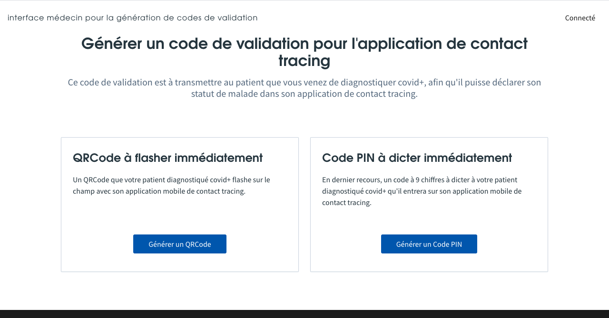
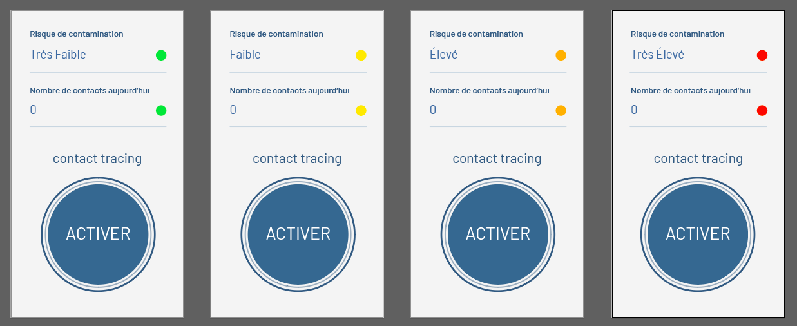

**100% Open Source contact tracing application, powered by contributors and fueled by community.**

Mobile tracing apps have a potential to support our efforts to limit the spread of COVID-19 and to keep some semblance of normality despite containment/preventive measures:
* people can be quickly informed that they may have been in contact with an infected person
* people can receive instructions on which further actions to take from public health authorities
* epidemiologists could receive anonymous or pseudonymous research information about the spread from volunteering users

## Why OpenStopcovid ?

Different initiatives have been taken to tackle the underlying technical difficulties of contact tracing:
* the use of Bluetooth LE (Low Energy) for proximity detection of nearby mobile phones;
* privacy-preserving - personal data should be securely encrypted and dismantled as soon as no longer needed.

The most famous being [BlueTrace](https://bluetrace.io/) by the Singaporean Government, or [DP-3T](https://github.com/DP-3T/documents) and [ROBERT](https://github.com/ROBERT-proximity-tracing/documents) from the Pan-European Privacy-Preserving Proximity Tracing (PEPP-PT) project.

Although all procols have been publicly published, only BlueTrace proposes an Open Source [reference implementation](https://github.com/OpenTrace-community). However, it was published before Google and Apple jointly announced a [framework](https://www.apple.com/covid19/contacttracing) to support contact tracing apps. Moreover, it is thightly coupled to a specific Cloud Provider and we believe that a universal solution should be cloud-agnostic as much as possible.

So far no reference implementation has been published for ROBERT. Moreover, the choice of a centralized approach makes it hardly compatible with the contact tracing framework of Google and Apple. Indeed, Bluetooth tracking on mobile devices requires privileged access to the system in order to work efficiently.

As a consequence, we selected [DP-3T](https://github.com/DP-3T/documents) as the underlying technology to provide our reference implementation. We strongly believe that a easy-to-install, cloud-agnostic, 100% Open Source application is mandatory to increase trust and allow large scale deployment at the level of what is at stake.

## What's inside ?

The global architecture is depicted by the following diagram:

The main components of OpenStopCovid are the following:

* [Backend microservices](https://github.com/OpenStopCovid/dp3t-ms)
  * [exposed-keys] microservice to publish exposed keys and get a list of exposed keys
  * [codes] microservice to create and use validation codes to declare sick patients

* [User interface for physicians](https://github.com/OpenStopCovid/health-authority-ui) in order to generate validation codes for sick patients

* [Android application]() relying on [DP-3T SDK](https://github.com/DP-3T/dp3t-sdk-android) for end-users
* [iOS application]() relying on [DP-3T SDK](https://github.com/DP-3T/dp3t-sdk-ios) for end-users

