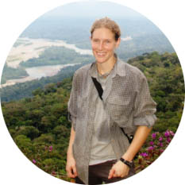
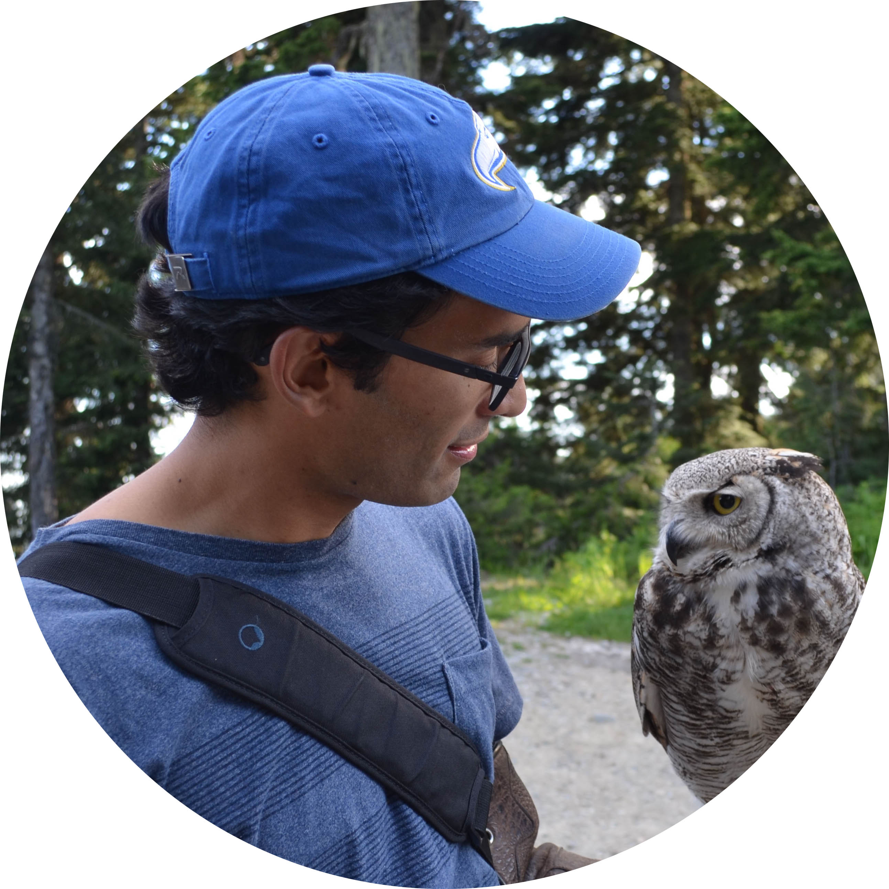

## Dr. Jill Jankowski
 Jill  is a tropical ecologist in the Zoology Department at UBC. Her research focuses on questions of species diversity and distributions, particularly with birds in tropical regions. She has been working in Peru and other Neotropical regions for ten years. Check more of Jill's research in her [website](http://www.zoology.ubc.ca/~jankowsk/)

## Jenny M. Muñoz
 Jenny is a graduate student in the Zoology Department at UBC and member of the Jankowski Lab. She was born in Colombia and has tons of field experience in the Andes and Amazonian lowlands.

## Santiago David
 Santiago is also a graduate student in the Zoology Department at UBC and member of the Jankowski Lab. 
