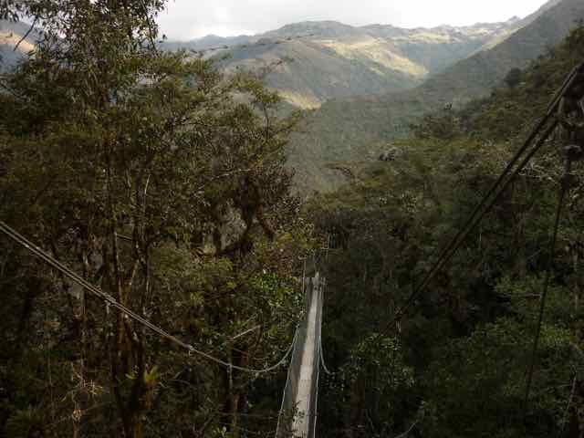
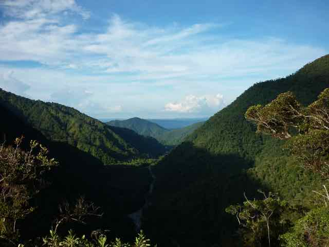
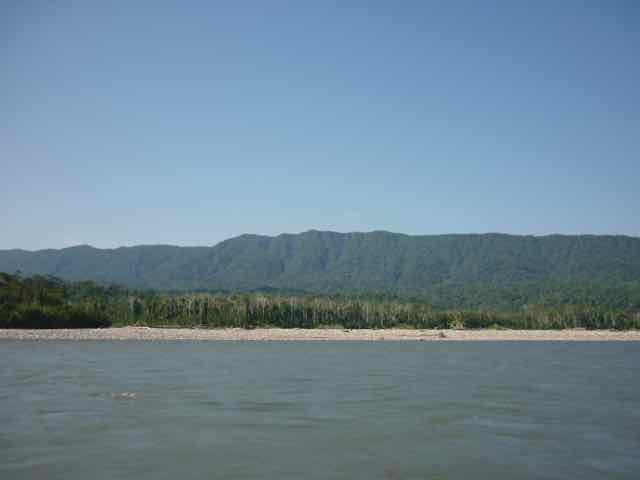

Manu Biosphere reserve is located in southeastern Peru, in the departments of Madre de Dios and Cusco. This reserve includes Manu National Park, one of the larger protected areas in South America. This National Park protects over 2 million hectares of tropical forest including a variety of habitats from Lowland tropical rain forest at 150 m above sea level to the Andean Puna Grasslands at 4200m. This topographical complexity has resulted in an exceptional array of habitats and high levels of diversity.
_**Manu National Park is considered as one of the world’s biodiversity hotspots**_! and indeed one of the most beautiful places in the planet.

## What to expect at Manu National Park
Check out this [raw footage](https://www.youtube.com/watch?feature=player_embedded&v=VuedaG61Vik) taken for one of the research volunteers of Manu project.

 

**During this field course we will be visiting four field sites along the elevational gradient, including two Biological Research stations**

## Wayqecha (2900m)
This is the highest elevation station along the gradient, located at the [**Centro de Investigación Wayqecha**](http://www.amazonconservation.org/ourwork/research_wayqecha.html). The station is found at 2900 m elevation, in the upper extent of cloud forest along the gradient.  Daytime temperatures can be quite warm, between 20-25 ºC, and nighttime temperatures can drop to 0 ºC or just below.Wayqecha is located directly on the Manu road, about 4-5 hours from Cuzco. The trail systems aroun the station range from 2300 - 3000 m elevation.  This station includes mature humid upper montane forest as well as recovering scrub habitat, and different forest types in various successional stages with intermediate vegetation structure.

 

## San Pedro (1400m)
This station is located at 1400 m elevation in lower montane forest, or the lowest extent of cloud forest along the eastern Andean slope in what is known as the Kcosñipata valley.  Daytime temperatures are generally as high as 25 ºC, and nighttime temperatures typically drop to 15 ºC.We have established a trail system that covers a range of elevations between 1200 - 2100 m. Within this range one can find montane forest, river edge forest, as well as Guadua and Chusquea bamboo habitats.

 

## Pantiacolla (400m)
This station is located in the lowland Amazon rainforest at 400 m elevation, that sits near the Alto Madre de Dios River.  Here daytime temperatures are generally above 30 ºC with high humidity -- nighttime temperatures are slightly cooler.  In the late dry season, cold fronts from the south, also known as "friajes" occassionally move through the area, bringing a day or so of heavy downpours followed by several days of cooler temperatures such as those found above 1200 m in the Andes.  Pantiacolla is reached by traveling from Cuzco down the Manu road to one of the towns of Atalaya, Shintuya, or Itahuania and then hiring boat transport to the station.  We use the trail system which includes over 600 hectares of mature growth lowland forest across floodplain and terra firme habitats, Guadua bamboo patches, successional Tessaria and Cercropia habitats moving away from river edges, and some areas on outlying Andean ridges up to 1000 m elevation. 

 

## Cocha Cashu Biological Station (to be confirmed)
[The Cocha Cashu Biological Station](http://cochacashu.sandiegozooglobal.org) (CCBS) is a well known internationally tropical field station. This station is situated in a vast region minimally impacted by man, providingg critical insights into the biodiversity and processes of a healthy, intact rainforest. 

## Manu videos
[Enjoy some videos of Manu project](http://www.zoology.ubc.ca/~jankowsk/Manu_Videos.html)

[Other relevant information](http://www.zoology.ubc.ca/~jankowsk/)

