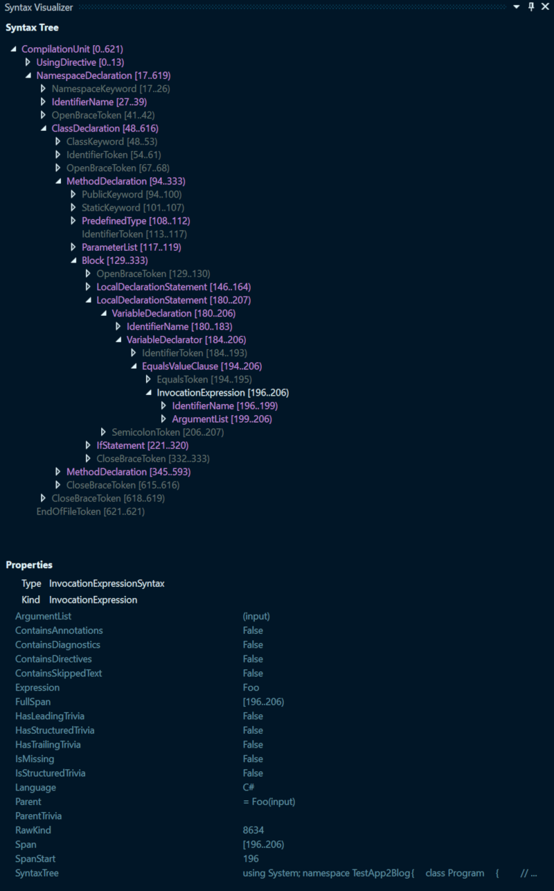

I recently started reading up on the subject of the .NET Compiler Platform
(aka Roslyn) and all the things you could do with it in terms of
code quality, analyzers and code fixers.

There is a lot of materials on Roslyn out there more specifically on the official
Microsoft Docs, so there is no need to go into more details here besides the following couple
of points that should serve as an introduction for the remainder of the post:

- Roslyn is a set of API's and Services that allow us to access the .NET
  Compiler pipeline and have access to a lot of information about a lot of
  aspects of our projects and code while we are working on them.
- Compilers are a complex subject that's interesting to think about, but
  maybe hard to understand.
  - They live to understand and reason about what we are trying to tell the computer to do!
    - To do this they've done a bit of divide and conquer trick where they've organized themselves around several steps.
    - The first of which is something.
- We have access to low level `Syntax Trees` that describe how the code is
  structured
  - `Syntax Trees` are data structures that describe the syntax or structure of the code. The .NET Compiler Platform gives us access to the trees for the code we are writing or analyzing.
  - `Syntax Trees` for code are expressed with typed classes and collections of different types of nodes.
  - The example we will look at will use the `Syntax Tree`, the collections of different types of `Syntax Nodes` to determine if the problem issue is present.
  - For more information about the different types of nodes please refer to the detailed Roslyn documentation.
  - Examples of `Syntax Nodes`:
    - `IdentifierName`
    - `LocalDeclarationStatement`
    - `Block`
- We can build these `Syntax Trees` and in turn build code using the `SyntaxFactory`
- We also have access to API's and services that can tell us how the code is
  interconnected, and what it actually means and in some way does through `Semantic` analysis.
- On top of all this there are also API's that allow us to perform major changes
  that range from code refactoring to project and solution level refactoring and changes.
  - For the Code Changes this means generating New Code or Syntax that improves or replaces the original code.

> The key thing the .Net Compiler platform provides is project templates that using the API's and services above allow us to build out different types of Code Analyzer and Code Fix Providers. This article will focus on an Analyzer and Fix Provider for a very specific code smell.

For a lot more information presented in a much more better way check out
the documents
[here](https://docs.microsoft.com/en-us/dotnet/csharp/roslyn-sdk/compiler-api-model)

The next sections explains the problem and solution to the given problem using Roslyn. At the same time it introduces
some Roslyn terminology and approaches on making the analysis and fixes that are not provided with the above mentioned basic tutorial.

### Diagnostics and Fix Providers (Explain Terms)

Two key terms that will be used through the article are `Diagnostic/s` and `Fix Provider` or `Fix`. These are terms of what the actual code we will be looking at is going to build.

#### Diagnostics

Diagnostics are what we use to refer to the issues or problems our extension or Analyzer is going to show/report if the extension was installed in an instance of Visual Studio.

An example of a reported  Diagnostic is:

`The Variable 'VAR_NAME' is assigned but its value is never used`

Diagnostics are reported and visible on the UI with squigly lines under the relevant code.

#### Fix or Fix Providers

Fix Providers or Fixes are changes to code that can be applied to get rid of reported Diagnostics. An example of a Fix for the above Diagnostic would be:

`Remove unused variable`

Fixes are visible on the UI by "applying" quick actions to any diagnostic.


## Solution Completeness (WIP)

The Analyzer and Fix Provider at the end is not the complete solution. There are a lot of improvements that could be made and edge cases covered but it sets up a base ground on top of which the those additional features can be added!

# The Example

The problem that this basic analyzer/fixer would address was the issue of having multiple method calls
using the same parameters.

The methods all would return some data that is used across several places to either check conditions or return calculations and determine client return models based on those result.


``` csharp
// ...
public static void Main()
{

  var input = "Bar";

  if(Foo(input) != null)
  {
      Console.WriteLine(Foo(input));
  }
  
}

public static string Foo(string input){
  if(input.Length > 2){
    return "FooValue:"+input;
  }
  else{
    return null;
  }
}
// ...
```
<div class='code-example-header'>
  <b>Code Example 1</b>
</div>

Above the method `Foo(string input)` is a pure method. Every time it is called wit the same parameter the value returned is the same.

The two calls in `Main()` are therefore not needed. Even though what `Foo` does is very simple we can "save" a call by storing the value from an initial call to be processed. The "fixed" output therefore would be:

``` csharp
// ...
public static void Main()
{

  var input = "Bar";

  var fooResult = Foo(input);
  if(fooResult != null)
  {
      Console.WriteLine(fooResult);
  }
  
}

public static string Foo(string input){
  if(input.Length > 2){
    return "FooValue:"+input;
  }
  else{
    return null;
  }
}
// ...
```
<div class='code-example-header'>
  <b>Code Example 2</b>
</div>

## The Project Template

The Project Template used to create the Analyzer and Fixer is a `Analyzer with Code Fix (.Net Standard)` which out of the box creates a solution with 3 Projects.

If we create a new sample `BlogAnalyzer` solution based on the template we get the following projects created:

- BlogAnalyzer
  - The Project containing the Analyzer and Fix Provider classes:
- BlogAnalyzer.Vsix
  - VSIX are projects that build and generate Visual Studio Extensions. This one references the `BlogAnalyzer` and packages the analyzer/fix provider in an Visual Studio extension that can be installed on developer instances
- BlogAnalyzer.Test
  - Test project containing initial tests as well as a set of test helpers specifically built out to do TDD on analyzer/fix provider solutions.
  - Tests cover both Analysis and Fix aspects by providing some predefined classes and an approach to testing covered in the next section.

> The  example problem  the template is addressing is a fictional code smell of lowercase Type/Class names.

## Developing from the template using TDD and the VSIX project

### TDD

Because of the nature of the solution and the output being a Visual Studio Extension the test project is going to be key in quickly developing the analyzer and fix provider.

The template for a new Extension as mentioned above comes with a preset Test project. This project already has a lot of setup code available for us to easily get started with defining test cases and working on both the analyzer and fix provider.

The project comes with a set of predefined helpers, verifiers and other classes These are all nicely integrated with existing Roslyn classes like `Document` and the base classes for the `Analyzer` and `Code Fix Provider` that we inherit:

- Verifiers
  - `DiagnosticVerifier`
    - Used to verify/assert the diagnostics reported from the Analyzer.
  - `CodeFixVerifier` which inherits from the `DiagnosticVerifier`
    - Used to verify both the reported diagnostics and code fixes after they are applied as provided by the Fix Provider.
- Helper Classes
  - `DiagnosticResult`
    - A class we can use to create expected assertions on reported Diagnostics
  - `DiagnosticVerifier` Extensions
  - `CodeFixVerifier` Extensions

The main test file for our solution is `BlogAnalyzerUnitTests.cs` inherits from the `CodeFixVerifier`. It contains two test methods to start:

- `TestMethod1()`
  - Asserts that the Analyzer does not report issues when it should not. The test case is an empty string
- `TestMethod2()`
  - Asserts both the primary Diagnostic and Fix Provider.

`TestMethod2()` also contains the primary initial test case and expected result after the code fix is applied:

``` csharp
var test = @"
  using System;
  using System.Collections.Generic;
  using System.Linq;
  using System.Text;
  using System.Threading.Tasks;
  using System.Diagnostics;

  namespace ConsoleApplication1
  {
      class TypeName
      {   
      }
  }";

 var fixtest = @"
  using System;
  using System.Collections.Generic;
  using System.Linq;
  using System.Text;
  using System.Threading.Tasks;
  using System.Diagnostics;

  namespace ConsoleApplication1
  {
      class TYPENAME
      {   
      }
  }";

```

> Going forward we can refactor these methods to better suit our needs. The tutorial also shows how to turn the test methods to Data Test Methods where we can supply both the code input and expected output via test data parameters. When describing the Analyzer bellow we will have a look at example code on how that can be achieved.

## Additional Tools

### Visual Studio Syntax Visualizer

The Visual Studio `Syntax Visualizer Window` is available after installing the .NET Compiler SDK. It's one of the more useful tools to understand how the `Syntax Trees` are built.

As most of the work of the Analyzer we are going to build is going to be traversing the `Syntax Tree` to decide if certain rules have been broken we are going to use the `Syntax Visualizer` extensively to both determine what we need to be looking at and to also get familiar with the different types of `Syntax Nodes` that the Roslyn API exposes.

An example of the `Syntax Visualizer` for `Code Example 2` would be:




### Roslyn quoter

Another useful too which I found out about very late in this process is the [Roslyn Quoter](http://roslynquoter.azurewebsites.net/)

It's a web tool where you can paste any piece of valid C# code and it would generate the Roslyn Code to generate the snippet. For example we can take the `Foo()` method from our Code Examples so far and paste it in the editor window, select `Parse as Member` and `Get Roslyn API calls to generate this code file!`

This would give us the Roslyn Calls starting with `MethodDeclaration` to build out the `Foo()` method! This is using the  [SyntaxFactory](https://docs.microsoft.com/en-us/dotnet/api/microsoft.codeanalysis.csharp.syntaxfactory?view=roslyn-dotnet) class to build out the code.  

One of the options we can tick to see how the `SyntaxFactory` is used is to tick the `Do not require 'using static Microsoft.CodeAnalysis.CSharp.SyntaxFactory;'` option.

``` csharp
public static void Main()
{
  SyntaxFactory.MethodDeclaration(
    SyntaxFactory.PredefinedType(
        SyntaxFactory.Token(SyntaxKind.StringKeyword)),
    SyntaxFactory.Identifier("Foo"));
    // .... Rest Of The Code here
}
```

> Remember that the .NET SDK or Roslyn is a set of Services and API's which as we see include tools for building among other things code and documents (example: .cs files) dynamically.

## Bringing it all together

What has been mentioned so far are the basic terms and concepts from Roslyn and the C# Syntax. Touched upon Roslyn as a general API as well as on overview of Syntax Trees:

- Roslyn allows us to hook into the .NET Compilation pipeline at various steps.
  - It offers different levels of API's for the different aspects of Code Compilation.
  - It does this for individual code files up to solution level API's.
- With Roslyn we can access and 'visualize' and C# Code File as a `Syntax Tree`.
  - Syntax Trees are a hierarchical collection of `Nodes` composed from different C# language constructs!
- We can at the most basic level traverse and search the `Syntax Tree` to determine if we have the problem described through **Code Example 1**.
  
> Alright! So we can build an extension that will scan our code and determine the presence with multiple method calls! What do we do next?!

The next step after determining a problem is to report it. Here we, again, use Roslyn API's to achieve this. The diagnostics we report would generate the squigly lines in the Visual Studio IDE. From a single analysis run we can report 


## The Edge Cases - AT END

Methods that do not return values.

``` csharp
public static void Main()
{
  Foo();
  Foo();
  Foo();
}

public static void Foo()
{
  Console.WriteLine("test");

}
```

- Method called multiple times with different parameters.
- Method called multiple times with pairs of equal parameters
  
Example:

``` csharp
var x = Foobar("Foo");
var y = Foobar("Foo");
var z = Foobar("Bar");
var w = Foobar("Bar");
```


