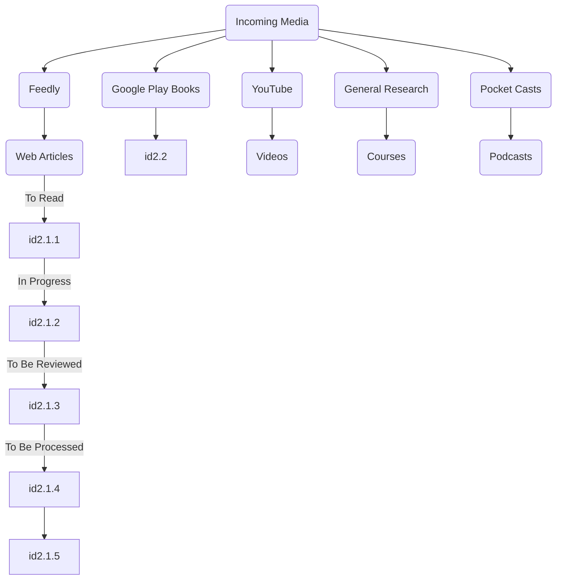
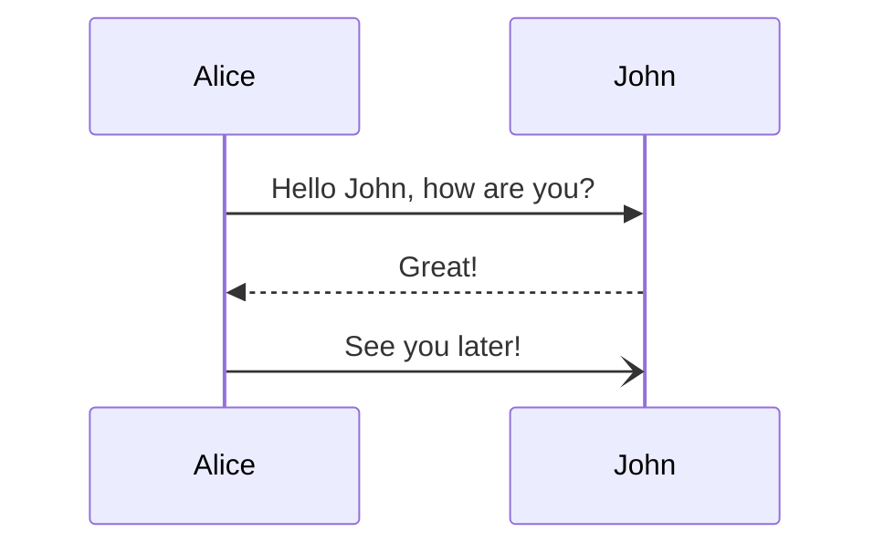

```mermaid
graph TD
id1(Incoming Media)
id1.1(Feedly)
id1.2(YouTube)
id1.3(Pocket Casts)
id1.4(Google Play Books)
id1.5(General Research)

id2.1(Web Articles)
id2.2
id2.3(Videos)
id2.4(Courses)
id2.5(Podcasts)

id1 --> id1.1 & id1.2 & id1.3 & id1.4 & id1.5
id1.1 --> id2.1
id1.2 --> id2.3
id1.3 --> id2.5
id1.4 --> id2.2
id1.5 --> id2.4


id2.1(Web Articles)-- To Read --> id2.1.1
id2.1.1 -- In Progress --> id2.1.2
id2.1.2 -- To Be Reviewed --> id2.1.3
id2.1.3 -- To Be Processed --> id2.1.4
id2.1.4 --> id2.1.5

```

```mermaid
sequenceDiagram
    Alice->>John: Hello John, how are you?
    John-->>Alice: Great!
    Alice-)John: See you later!
```
