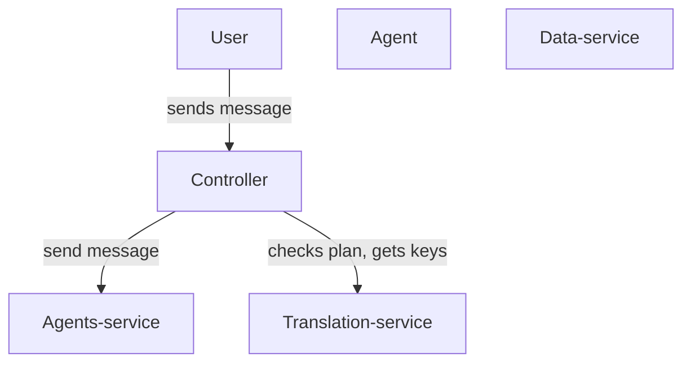

```mermaid
graph TD
	id1[User]
	id2[Agent]
	id3[Agents-service]
	id4[Translation-service]
	id5[Controller]
	id6[Data-service]

	id1-->|sends message|id5
	id5-->|send message|id3
	id5-->|checks plan, gets keys|id4
```