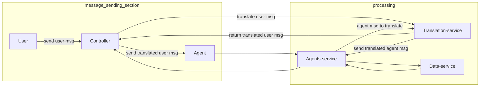

![[./media/Screenshot 2021-07-02 at 11.51.34.png]]
feature list
1. normal assignment with translation
2. autodetect
3. per message translation
4. transfer
5. previous messages translate (on lang change, on transfer)