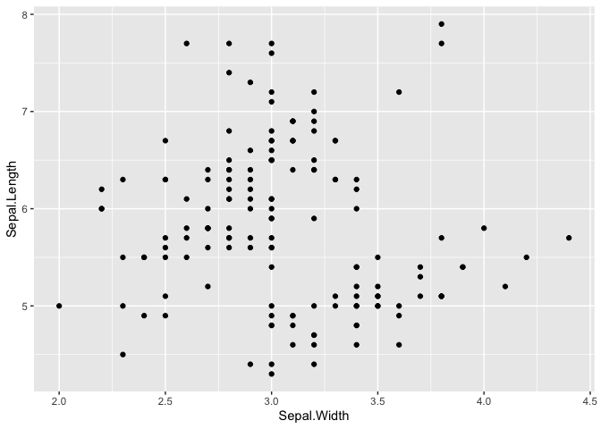

Cycling Across Canada - Route Details
================

# Template

This is a template for Rmarkdown blog posts.

``` r
iris %>%
  ggplot(aes(x = Sepal.Width, y = Sepal.Length)) +
  geom_point()
```

<!-- -->
