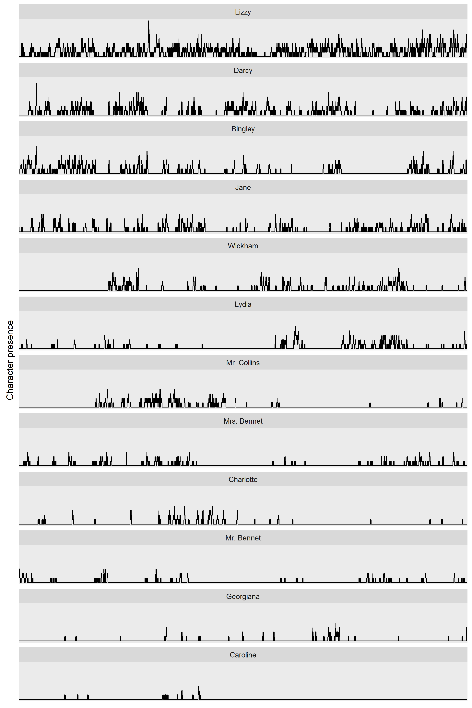

--- 
layout: post
title: "Pride and Prejudice and R"
---

One of the things I love about R, and the R community, is getting a bit of an understanding of what types of analysis other people do. While we might all work on such different areas of research or analysis, the shared language gives lots of common ground.

I've been interested over the years seeing the work done around the place in the analysis of language, which is so far removed from my own area of study (genetics). Often the kind of thing I come across is Twitter based sentiment analysis, which usually strickes me as being of limited usefulness for insight. 

So I enjoyed reading Julia Silge's [(@juliasilge)](https://twitter.com/juliasilge/) posts ([1](http://juliasilge.com/blog/You-Must-Allow-Me/) and [2](http://juliasilge.com/blog/If-I-Loved-NLP-Less/)) on sentiment analysis in Jane Austen novels. While I'm not exactly a Jane Austen afficianado, like any other right thinking human, I have seen the 1996 BBC version of Pride and Prejudice *more than once* (let's not mention the 2005 abomination). 

(As an aside, any mention of Jane Austen immediately make me remember Mitchell and Webb's effort - "A gentleman does not conga")

<iframe width="854" height="480" src="https://www.youtube.com/embed/gTchxR4suto" frameborder="0" allowfullscreen></iframe>

So, anyway, when I saw that Julia had produced a package with the text of all Austen's novels, I thought it would be an interesting exercise for a Friday night in to have a look at the data. The text is broken into lines, and there are a variety of ways of breaking these into individual words, and getting sophisticated with sentiment analysis. I thought for my initial forway into this world I would simply try to see where each character appears in the story.

A big caveat to start, I have taken a very naive approach to this. One of the challenges I didn't try to solve was that characters are referred to be different names in different contexts. Elizabeth, Lizzy, Miss Bennet, for example. However Miss Bennet could refer to any one of the sisters, so I decided for my purposes the easiest thing to do was just potter on.

So my super simplistic approach was to mark rows where a character name appears, then to take a rolling mean (over 20 rows). 

There are some interesting (though unsurprising) patterns. As you'd expect, Lizzy and Darcy are the most prominent characters, and Lizzy only drops off at one point (for those who are interested, it's when Darcy is gving Wickham's backstory). You can also see the way Lydia and Wickham's presence move together during the elopement (while Darcy and Bingley take a backseat). The relationship between Mr. Collins and Charlotte is interesting as well. I feel like it would probably not to be too difficult to develop an analysis that predicts the relationships between characters (I'm aware this probably already exists...), but it's beyond me right now!

Code for this post is available on [github](https://github.com/alexwhan/alexwhan.github.io/blob/master/_source/2016-04-15-pride-and-prejudice.Rmd)

And the figure in all its glory:

