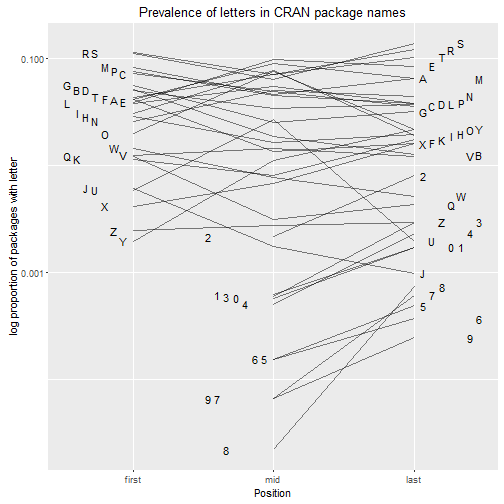
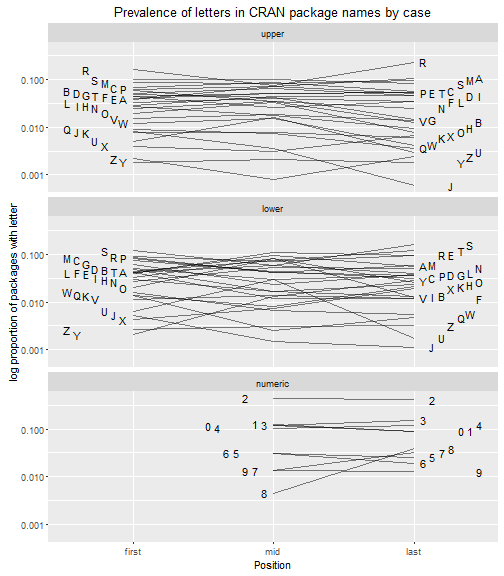

There are now more than [8000 packages available on CRAN](https://cran.r-project.org/web/packages/available_packages_by_name.html), each of them presumably lovingly designed by their respective creators. As a naive package developer, and reading Hadley's [guide to naming packages](http://r-pkgs.had.co.nz/package.html) I'm interested in how people choose names for their packages. A great package name is a beautiful thing (will anyone beat lubridate?). In a process perhaps similar to naming a child (sorry kids), I expect this is something that the parent of the package takes great pains over, but those who use the name in the future don't necessarily think about, unless it is particularly good, or bad. 

There have been a stack of great analyses of baby names (of the human variety) over the years, and thanks to [Hadley's babynames package](https://github.com/hadley/babynames) that data is interesting and accessible. I think my favourite has been Hilary Parker's famous [Poisoned baby names](https://hilaryparker.com/2013/01/30/hilary-the-most-poisoned-baby-name-in-us-history/) analysis.

While R package names presumably don't have quite the same sociological relevance as baby names, I thought it would be an interesting exercise to have a look at patterns in naming R packages that are on CRAN. 

As a very basic look at the patterns I was interested to see whether the letter R was overrepresented in package names, since sticking an R on the end of a word is a fairly common approach in the packages I use. So I set out to look at the proportion of packages with each letter at the starting position, the last position, or in the middle of the package name.

As always, the source for this post [is available on github](https://github.com/alexwhan/alexwhan.github.io/blob/master/_source/2016-04-19-package-names.Rmd). It's slightly convoluted, but there may be some value in the simplistic approach I've taken to separating the annotations for each line in the following plots. While it's quick and dirty, I've found it to be good enough for most of my purposes with fairly minimal investment.

##Some plots  

Looking firstly at letters regardless of case, you can see that R is high on the list in all positions, but by no means dominant. Also unsurprisingly, the bottom of the list is made up of the high scoring letters in scrabble (which gives me an idea, there must be a call for a [kwyjibo](http://www.imdb.com/title/tt0756593/quotes) package?). 

I should probably start referring to characters, since numbers make an appearance (although obviously not in first position, according to naming rules). Numbers are pretty unpopular, but 2 is by far the most common (ggplot2, reshape2, anyone?).

To go slightly deeper, I broke the letters up by case.

Here in the upper case panel we finally see R jump up to the top of the rankings in both first and last position.

One final oddity to pull out of this sea of excitement - notice the lonely uppercase J in last position? That represents a single package, the only singularity from the entire dataset. And the package? [RFinanceYJ](https://cran.r-project.org/web/packages/RFinanceYJ/RFinanceYJ.pdf). 

You saw it here first.
