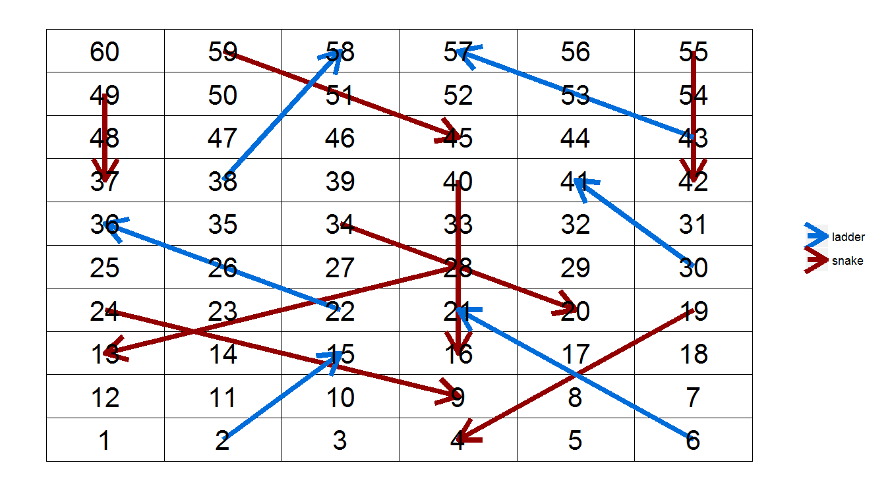
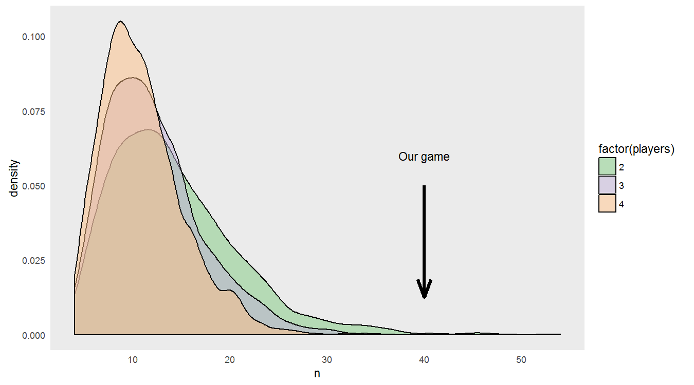
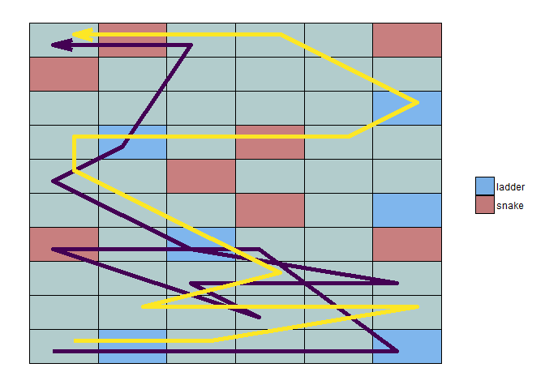
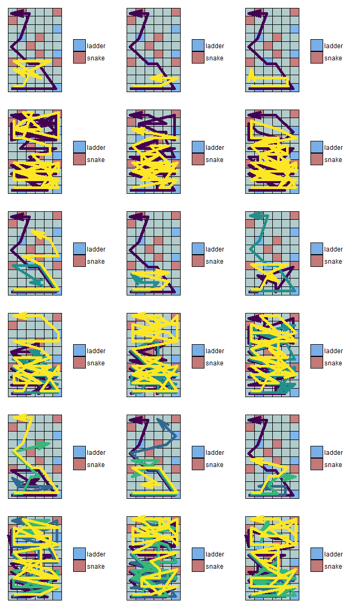

On the weekend I was playing snakes and ladders with my sons. Since it's
a game without any element of skill, and relies completely on the roll
of the dice, I haven't played the game for about as long as I can
remember. The first game we played was over pretty quickly, but the
second lasted for what seemed like an eternity, and well past the
endurance of the boys' attention span. As one of us got near the end, we
landed on the final snake.

Frustration waxed; interest waned.

Eventually I employed the parental right of rigging the dice throw so
that the game mercifully ended, and we could move on to something a bit
more interesting (like [Castle
Logix](http://www.amazon.com/Educational-Insights-2953-Castle-Logix/dp/B000NNLNW8) -
really clever design).

Anyway, I began to wonder what the probability was of playing a game
that went on that long. Since there is no human decision (skill)
involved, it should be reasonably straightforward to run some
simulations and get some answers.

I've also been wanting to get a bit of practice with
[purrr](https://github.com/hadley/purrr/), Hadley's functional
programming package. So, what follows is at times probably more complex
than it could be, but represents my learning process, and is one
approach to managing data in a bunch of nicely organised lists.

The first step was to represent the game board we were using. You'll
notice it's heavier on snakes than ladders!

Firstly to define the snake and ladder positions and effects:

    #Define the starting location of the snakes
    snakes <- data_frame(square = c(19, 24, 28, 34, 40, 49, 55, 59),
                         effect = c(-15, -15, -15, -14, -24, -12, -13, -14))
    #And the ladders
    ladders <- data_frame(square = c(2, 6, 22, 30, 38, 43),
                          effect = c(13, 15, 14, 11, 20, 14))

    snakes_ladders <- bind_rows(snake = snakes, ladder = ladders, .id = "type")

Next to define the board layout - game play progresses in serpentine
fashion (appropriately). This includes the dimensions, the order of
progression through the board, and adding the snakes and ladders.

    board_layout <- data_frame(square = 1:60, y = rep(1:10, each = 6)) %>% 
      group_by(y) %>% 
      mutate(x = ifelse(y %% 2 == 1,
                        1:6, 6:1))

    #Add snakes and ladders to the board
    game_board <- board_layout %>% 
      left_join(snakes_ladders) %>% 
      mutate(effect = ifelse(is.na(effect), 0, effect))

    #Get the finish position of snakes and ladders, and tidy
    effects_df <- snakes_ladders %>% 
      mutate(id = 1:nrow(.),
             result_square = square + effect) %>% 
      gather(start_result, square, square, result_square) %>% 
      select(square, id, type) %>% 
      left_join(game_board %>% select(-type))

To check it's all making sense, I'll compare the virtual board with the
physical one:

Maybe not a marketing success, but functionally the same.

Next I needed to make some functions to simulate the players and the
turns each players takes.

There would be lots of ways of doing this, but I decided to represent
each player as a list object made up of vectors representing the
position in which the player finished each turn, and another vector
representing the full path they took (including traversing snakes and
ladders). Each game would then be structured as a list of the player
lists.

Since I can't predict the number of turns, I can't pre-allocate the
vector length, and so we enter the second circle of the [R
Inferno](http://www.burns-stat.com/pages/Tutor/R_inferno.pdf) by growing
these objects, but since they're pretty small I hope you'll forgive me.

    #A function to make a list of players
    make_players <- function(n) {
      players <- map(1:n, function(x) list(sq = 1, path = 1)) %>% 
        setNames(paste0("player", 1:n))
    }

    #A function to represent a turn
    turn <- function(player, effects) {
      sq_i <- length(player[["sq"]])
      path_i <- length(player[["path"]])
      roll <- sample(1:6, 1)
      sq_temp <- player[["sq"]][sq_i] + roll
      effect <- effects[sq_temp]
      if(sq_temp < 60) sq_new <- sq_temp + effect
      else sq_new <- 60
      player[["sq"]][sq_i + 1] <- sq_new
      player[["path"]][path_i + 1] <- ifelse(sq_temp > 60, 60, sq_temp)
      if(effect != 0 & !is.na(effect)) player[["path"]][path_i + 2] <- sq_new
      return(player)
    }

I'll check the functions by making a very simple simulation:

    players <- make_players(2)
    players

    ## $player1
    ## $player1$sq
    ## [1] 1
    ## 
    ## $player1$path
    ## [1] 1
    ## 
    ## 
    ## $player2
    ## $player2$sq
    ## [1] 1
    ## 
    ## $player2$path
    ## [1] 1

    #Each player starts at square 1

    turn(players[[1]], game_board$effect)

    ## $sq
    ## [1] 1 4
    ## 
    ## $path
    ## [1] 1 4

    #The function is returning player1's list after their first turn

Since the path vectors of the different players aren't necessarily the
same lengths (since it will be longer for each snake/ladder), I needed
to be able to pad the vectors with NA. This is something that doesn't
seem to have a straightforward, canon approach, so I made a little
function to deal with it.

    pad_na <- function(vec, length) {
      if(length(vec) < length) vec[(length(vec) + 1):length] <- NA
      return(vec)
    }

    pad_list_na <- function(list) {
      max_length <- max(unlist(map(list, length)))
      list_out <- map(list, pad_na, length = max_length)
    }

And now the function to actually simulate a game. This needed to take
the number of players and board layout, give each player a turn until
one of them reached the finish, and then return each player's locations
throughout the game, as well as their path.

This brings me to list columns - the element of dplyr's `do` and purrr
output that I've found most challenging in the couple of months I've
played around with them. List columns are incredibly powerful, meaning
you can store dataframes, models, figures, anything. So instead of
having a pile of lists cluttering up the workspace, these objects stay
neatly arranged with the structure from which they were created.

That being said, trying to deal with those columns has made me feel
like:

And I'm clearly not the only one, given some of the conversations that
have happened in \#rstats
(<https://twitter.com/JennyBryan/status/653766755010019329>)

<blockquote class="twitter-tweet" data-lang="en">

<a href="https://twitter.com/noamross">@noamross</a>
<a href="https://twitter.com/polesasunder">@polesasunder</a> I am
actually planning to teach dplyr::do() tomorrow and I'm, like, what do
people do with these list-columns?!? 😯

— Jenny Bryan (@JennyBryan)
<a href="https://twitter.com/JennyBryan/status/653766755010019329">October
13, 2015</a>
</blockquote>

So far I have relied more or less completely on
[broom](https://github.com/dgrtwo/broom) (which is brilliant in lots of
situations) for dealing with list output from `dplyr::do()`, but there's
often a lack of flexibility. I think this is where purrr is the knight
in shining armour.

In this game simulation function each player's list takes a turn until
one of them reaches the finish. The lists are then transposed to allow
each players position and path to be made into a dataframe, and these
dataframes are then returned in a list. Using `mutate` lets me add the
list for each simulation into a new column.

    sim_game <- function(n, board) {
      players <- make_players(n)
      while(max(unlist(flatten(players))) < max(board$square)) {
        for(i in 1:n) {
          players[[i]] <- turn(players[[i]], board$effect)
        }
      }
      players_tr <- players %>% 
        transpose()
      sq_df <- players_tr[["sq"]] %>%
        as_data_frame %>%
        gather(player, square) %>%
        mutate(player = sub("player", "", player))
      path_df <- players_tr[["path"]] %>% 
        pad_list_na %>% 
        as_data_frame %>% 
        gather(player, square) %>% 
        mutate(player = as.numeric(sub("player", "", player)))
      # return(sq_df)
      return(list(sq = sq_df, path = path_df))
    }

The structure of the complete simulation can then be setup in dataframe,
where each row represents the parameters to be used for each game. I'll
run 2500 simulations for 2, 3, and 4 players. I get the output column
(recall it's a list of two dataframes), and then separate these out into
their own columns. That's inefficient, but convenient in this case. I'm
also calculating the number of turns for each game and making a new
column for that as well.

    game_df <- data_frame(game = rep(1:2500, 3), players = rep(2:4, each = 2500)) %>% 
      rowwise() %>% 
      mutate(output = map(players, sim_game, board = game_board),
             sq = list(sq = output[[1]]),
             path = list(path = output[[2]]),
             n = nrow(sq)/players - 1)
    game_df

    ## Source: local data frame [7,500 x 6]
    ## Groups: <by row>
    ## 
    ##     game players    output              sq            path     n
    ##    (int)   (int)     (chr)           (chr)           (chr) (dbl)
    ## 1      1       2 <list[2]> <tbl_df [18,2]> <tbl_df [22,2]>     8
    ## 2      2       2 <list[2]> <tbl_df [62,2]> <tbl_df [80,2]>    30
    ## 3      3       2 <list[2]> <tbl_df [22,2]> <tbl_df [26,2]>    10
    ## 4      4       2 <list[2]> <tbl_df [48,2]> <tbl_df [62,2]>    23
    ## 5      5       2 <list[2]> <tbl_df [34,2]> <tbl_df [42,2]>    16
    ## 6      6       2 <list[2]> <tbl_df [32,2]> <tbl_df [42,2]>    15
    ## 7      7       2 <list[2]> <tbl_df [36,2]> <tbl_df [44,2]>    17
    ## 8      8       2 <list[2]> <tbl_df [18,2]> <tbl_df [22,2]>     8
    ## 9      9       2 <list[2]> <tbl_df [38,2]> <tbl_df [44,2]>    18
    ## 10    10       2 <list[2]> <tbl_df [48,2]> <tbl_df [64,2]>    23
    ## ..   ...     ...       ...             ...             ...   ...

So I now have a dataframe with the outcomes from 7500 snakes and ladders
simulations, as well as general satisfaction with how I've spent the
last several hours.

Obviously the next step is to take a look at how those probabilities
have turned out:

    ggplot(game_df, aes(n)) + geom_density(aes(fill = factor(players)), alpha = 0.5) +
      scale_fill_brewer(type = 'qual') +
      theme(panel.grid = element_blank(), axis.ticks = element_blank(),
            axis.line = element_line(size = 1, colour = "black")) +
      geom_segment(aes(x = 40, xend = 40, y = 0.05, yend = 0.0125), arrow = arrow(angle = 20), size = 1.5) +
      annotate(geom = "text", x = 40, y = 0.06, label = "Our game")

I guess it's pretty much as you'd expect based on the game's format -
there's a minimum possible number of turns required, giving the left
censoring, and no theoretical upper limit. It turns out there's a
semi-interesting [Wikipedia
article](https://en.wikipedia.org/wiki/Snakes_and_Ladders), with a
section about the mathematics of the game, if you're dying to go into
this further.

I'm more interested in using the dataframe structures to be able to
extract useful information from this type of exercise. Because we've got
all the simulation and output data organised in this way, it's actually
pretty straightforward.

As an exercise, I'll plot the games with the three highest and lowest
number of turns for each number of players.

First I'll make a function to produce a figure describing the games
(along with creating some offsets so that player paths don't overlap so
much)

    #Define the offsets for each combination of players
    offsets <- map(2:4, 
                   function(x) return(data_frame(player = 1:x, players = x))) %>% 
      bind_rows() %>% 
      group_by(players) %>% 
      mutate(offset = scales::rescale(player, c(-0.15, 0.15)))

    make_game_p <- function(game, game_board, offsets) {
      path_dat <- game %>%  
        mutate(players = length(unique(player))) %>% 
        left_join(offsets) %>% 
        left_join(game_board)
    p <-  ggplot(game_board, aes(x, y)) + 
        geom_tile(aes(fill = type), colour = "black", alpha = 0.5) +
        geom_path(data = path_dat, 
                  aes(x = x + offset, y = y + offset, colour = factor(player)), 
                  arrow = arrow(angle = 15), show.legend = FALSE, size = 2) +
        scale_color_viridis(discrete = TRUE) +
        scale_fill_manual(values = c("#006DDB", "#920000"), na.value = "#669999") +
        theme(panel.background = element_rect(fill = "transparent"),
              axis.text = element_blank(), axis.ticks = element_blank(),
              axis.title = element_blank(),
              legend.title = element_blank())
    return(p)
    }

I can test it by applying it to random game:

    game_df %>% 
      ungroup %>% 
      filter(row_number() == 123) %>% 
      select(path) %>% 
      unnest() %>% 
      make_game_p(game_board, offsets)

<!-- -->

Seems to be working pretty well. Onto the exercise. Here is an example
of storing the figure output in a list column:

    extremes <- game_df %>% 
      group_by(players) %>% 
      arrange(n) %>% 
      filter(row_number() %in% c(1:3, (n() - 2):n())) %>% 
      group_by(players, game) %>% 
      mutate(path_figure = purrr::map(path, make_game_p, game_board = game_board, offsets = offsets))

    extremes %>% 
      select(game, players, path_figure) #Otherwise the output is too wide

    ## Source: local data frame [18 x 3]
    ## Groups: players, game [18]
    ## 
    ##     game players     path_figure
    ##    (int)   (int)           (chr)
    ## 1    546       2 <S3:gg, ggplot>
    ## 2    598       2 <S3:gg, ggplot>
    ## 3    840       2 <S3:gg, ggplot>
    ## 4    241       2 <S3:gg, ggplot>
    ## 5    690       2 <S3:gg, ggplot>
    ## 6    297       2 <S3:gg, ggplot>
    ## 7     37       3 <S3:gg, ggplot>
    ## 8    177       3 <S3:gg, ggplot>
    ## 9    230       3 <S3:gg, ggplot>
    ## 10   307       3 <S3:gg, ggplot>
    ## 11   575       3 <S3:gg, ggplot>
    ## 12  1400       3 <S3:gg, ggplot>
    ## 13     3       4 <S3:gg, ggplot>
    ## 14   120       4 <S3:gg, ggplot>
    ## 15   133       4 <S3:gg, ggplot>
    ## 16  1151       4 <S3:gg, ggplot>
    ## 17   180       4 <S3:gg, ggplot>
    ## 18   725       4 <S3:gg, ggplot>

By looking in the path\_figure column, you can see I've now got a figure
per row, which you'll remember represents one simulation.

This is obviously something of a contrived example, but I think I'll
find plenty of use for this functionality. It's probably worth
mentioning that it's not necessary to use `mutate()` to add the data to
the dataframe. A separate object can be created, or other functions like
`walk()` can be used for their side effects, such as saving each plot.

In this case, we can use the figure column to pass directly into
`arrangeGrob()`, for example, to arrange:

    extreme_plots <- gridExtra::arrangeGrob(grobs = extremes$path_figure, nrow = 6)
    grid::grid.draw(extreme_plots)

<!-- -->

This is clearly not an ideal format, but let's leave that for another
day.

While this exercise took me longer than I thought, at the end of it I
think I'm much more comfortable working with list columns, and can see
that I'll be applying them much more in my work.
