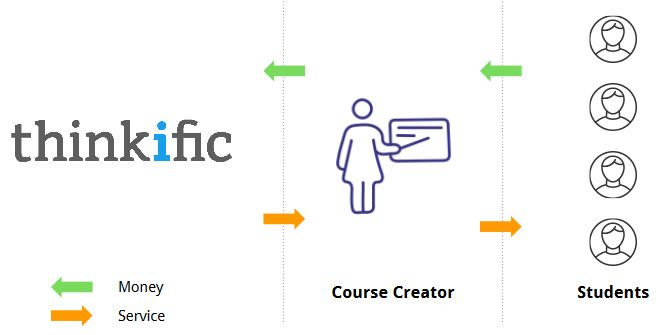
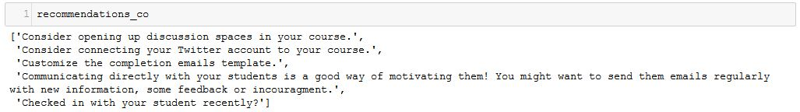

For the past three months, I was on a team of UBC [Master of Data Science](https://ubc-mds.github.io/) (MDS) students working on our MDS capstone project. Our team developed a data science product to help the course creators on the [Thinkific](thinkific.com) e-learning platform to improve their online courses. Unsurprisingly, working on the improvement of online learning was a great learning experience for ourselves. Therefore, to share some of my experiences, and as a reminder to my future self, in this post I will summarize the six most important lessons I learned during the project. But first, to give some context, I'll quickly describe the client and the project.

### The project

[Thinkific](thinkific.com) is Vancouver-based technology startup offering a web platform that gives anyone the opportunity to create online courses. The image below describes Thinkific's business model:

Our project was to give data-driven advice to course creators based on the current features of a course. In this context, the target variable was "student-success". Our package's recommendations should boost student success and have a positive impact on Thinkific's customers by attracting more students. Thinkific would also benefit from increased satisfaction among its course creators.

To approach the described problem, we created a Python package which (conceptually) works as follows:

Using the percentage of content-completion as our measure of student-success, we predicted this target variable using [sklearn's Gradient Boosting Regressor](http://scikit-learn.org/stable/modules/generated/sklearn.ensemble.GradientBoostingRegressor.html) with around 50 features that describe the "current state" of a course. Next, we predicted student success *given an incremental increase in one of the features*. By iterating over all the possible feature changes and calculating their respective predicted success score we identified the most successful strategy for each course. Finally, given a "course_id" our package returns the action with the highest increase in predicted student success.

Here's an image of a sample output of our package:

### Lessons learned

Here is what I learned while working on this project. 

#### 1. Communicate with your team

Make sure everyone is on the same page - ideally on a daily basis. Both the distribution of daily tasks as well as the understanding of conceptual ideas related to the project should be discussed among the team members frequently. This way, the team is more productive when working towards the common goal while making a good impression towards the client in meetings. Although we generally did a good job at this, there were a few misunderstandings that became clear in meetings with the client. This could have been prevented by better communication.

#### 2. Listen to the client and domain experts

Frequently meet with the project's stakeholders and adjust your plans according to their feedback, especially in the early stages of the project. From our experience in the past months, more feedback is always better. For example, after presenting the conceptual framework of our project, one of Thinkific's team members mentioned that our measure of student success might be biased towards early chapters in a course (rating early chapters as more successful). This was something we had overlooked until this point but could be fixed with a slight adjustment.   

#### 3. Know the database(s)

Get an overview of the database and where things can be found - whether they are directly related to the project or not. At the very beginning of our project, Maud, one of our team members, spent two days creating a database schema. Throughout the project, her knowledge was extremely useful to the team and, at times, I wished I had spent two days scanning the database myself.

#### 4. Wrangle data in SQL

Do as much data wrangling as possible in SQL to decrease processing times and memory usage. We initially did a lot of the data wrangling in Python, which turned out to be very time-consuming and would sometimes fail because the imported data was too big. Later, we turned as many data wrangling tasks as possible into the SQL queries, which significantly reduced the runtime of our scripts.

#### 5. Keep an open mind

If your initial plan does not work out, don't panic! Stay creative and flexible, and adjust to changes. Throughout the  project, we had several moments in which our conceptual framework seemed to fail. For example, we had initially planned to follow a linear regression approach due to the easy interpretability of weights as feature importances. However, this led to disappointing validation accuracy scores. At the same time, we noticed that non-linear approaches such as a random forest regressor and gradient boosting regressor performed significantly better. 

#### 6. Be aware of your assumptions and communicate them

Any model is based on assumptions - make sure that the client is aware of them. Generally, it is dangerous if the end-user of a data science product has no intuition as to how the results are produced. In our model, one fundamental assumption is that the current features of a course determined the current level of student success. This is a strong assumption. Consider a successful course creator who has never used any video content for her courses. Now, this course creator adds lengthy videos to her course one day before our model is trained. Our model will probably attribute the course's success partly to the new video content and may wrongly recommend adding more long videos to this course creator (and others). To prevent misunderstandings and false expectations, it is important that the end user is aware of  assumptions and their possible implications.

Surely, there are many more lessons that we have learned throughout this project, but this is a good start. What is your advice to aspiring data scientists working on their first projects? I would love to hear from you! You can find me on Twitter as @akleefel.

Finally, a big THANK YOU to my team members Esteban Angel (@estebanangelm91), Maud Boucherit, and Prash Medirattaa (@prashm16) for an exciting time together, as well as Steph Carew and Thinkific for being such amazing hosts.

---------

[Alexander Kleefeldt](https://akleefel.com/) graduated from the UBC MDS program in 2018.
