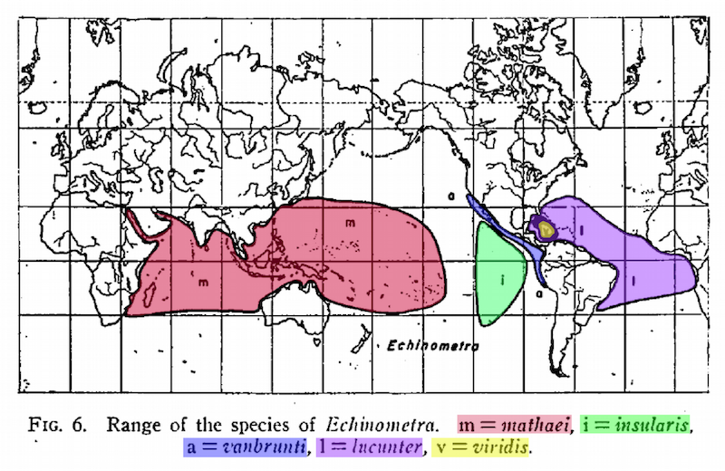

The modern synthesis of genetics and Darwinian evolutionary thought, which began in earnest in the 1930’s, has enshrined many notable biologists in the annals of science history. There were geneticists, entomologists, paleontologists, botanists, and ornithologists all involved in reconciling Mendelian genetics and the theory of descent with modification. One of these notable individuals was the systematist and ornithologist Ernst Mayr. 

Mayr was instrumental in driving the field of evolutionary biology forward. A key organizer of the Society for the Study of Evolution, he served as the first editor of the society’s journal Evolution from 1947 through 1949. Mayr was a strong advocate of the theory of speciation by geographic isolation, which states that species needed to be physically separated across geographic barriers in order to speciate, as well as the Biological Species Concept, which states that true species should be functionally reproductively incompatible. 

While the vast majority of Mayr's seminal works focused on birds, he took an odd departure from his avian study system in the early 1950's to publish one research article on the geographic speciation of 16 tropical sea urchin genera. 

Mayr begins his study with a statement that seems to still be much echoed in the marine evolutionary literature:
>>Since the ecology of marine organisms is fundamentally different from that of such typical land animals as mammals, birds, land snails, and butterflies, one might expect modes of speciation in the oceans that differ completely from the typical geographic speciation of land animals. This possibility has been suggested repeatedly within recent years; yet a thorough study of speciation patterns in marine organisms has remained desideratum.

Despite this statement, Mayr used the systematic taxonomy of the select sea urchin genera to champion his ideas about "geographic speciation" (now more commonly referred to as "allopatric speciation"). The process that Mayr proposes to explain the observed distribution of sea urchin species is recounted by Palumbi & Lessios (2005) as Mayr’s "evolutionary animation": speciation must effectively occur in a specific set of steps that forms a continuous motion towards species diversity in a range. 

The "animation" begins with the separation of two previously unified lineages, followed by the maintenance of separation for enough time that unique differences arise between the two lineages, followed finally by a remerging of ranges. If enough unique differences have accumulated during the period of separation to render the now reconnected lineages reproductively incompatible, the speciation process would be considered by Mayr to be complete. Mayr argues that the patterns of species divergence in these marine invertebrates follows concisely the patterns that is to be observed "in groups in which the universal occurrence of geographic speciation is acknowledged, as in birds, mammals, and butterflies." 

It seems that Mayr was quite motivated to validate his notions of evolution in a system that could be expected to "differ completely from the typical geographic speciation of land animals". This is perhaps best highlighted when Mayr explicitly omits _Echinometra oblonga_, which has an overlapping range in the Pacific with _Echinometra mathaei_, and states that the remaining Echinometrids "present the perfect picture of geographic speciation!"

As time has passed, there have certainly emerged clear limits to Mayr’s notion of an "evolutionary animation". A growing number of studies suggest species do not need to be geographically isolated but can in fact rise in sympatry (occupying the same geographic area), and a number of these studies explicitly focus on marine organisms (Tomaiuolo et al. 2007, Bowen et al. 2013, Śmietanka & Burzyński 2017). 

Still, the work by Mayr considering the diversity of these select sea urchin genera continues to motivate further studies and evolutionary insights, such as the discrepancy of genetic signals in genus _Tripneustes_ in the Red Sea (Bronstein et al. 2016), or the broader evolutionary relationships of the sea urchin genera _Strongylocentrotus_, _Tripneustes_, and _Echinometra_ (Láruson 2017).

With some 740 publications to his name, Mayr was certainly no stranger to broad taxonomic considerations. While the vast majority of his research was on the avian fauna of the South West Pacific, he also authored works on sea urchins, crown-of-thorns sea stars, cichlid fish, and even defended and advocated for the continuation of the name Bryozoa. 

Were Mayr’s evolutionary perspectives influenced by his primary study system? Almost certainly. Should that have precluded him from attempting to apply evolutionary theories to marine organisms? By no means. To quote Mayr’s contemporary, the social scientist Kurt Levin, "there is nothing so practical as a good theory", and the most practical way for marine evolutionary biologists to acknowledge and address systematic influence is to clearly identify the evolutionary theories being addressed in our work. By being explicit about the underlying theories motivating and informing our evolutionary perspectives (as Mayr did), as well as acknowledging the limits or specificity of these theories (as Mayr did not), studies in marine systems gain a valuable context for the continual improvement of evolutionary thinking.

### Biography
[Áki Jarl Láruson](https://akijarl.wordpress.com/) is a Postdoctoral Researcher in the lab of Dr. Katie Lotterhos, in the Department of Marine and Environmental Sciences at Northeastern University. Dr. Láruson studies approaches to detect genomic signatures of adaptation, as well as molecular evolution in marine invertebrates.

### Bibliography

* Bowen, B.W., Rocha, L.A., Toonen, R.J., Karl, S.A., ToBo Laboratory (2013) The origins of tropical marine biodiversity. Trends in Ecology & Evolution 28(6): 359-366.
* Bronstein, O., Kroh, A., Haring, E. (2016) Do genes lie? Mitochondrial gene capture masks the Red Sea collector urchin’s true identity (Echinodermata: Echinoidea: Tripnesutes). Molecular Phylogenetics and Evolution 104: 1-13.
* Láruson, Á.J. (2017) Rates and relations of mitochondrial genome evolution across the Echinoidea, with special focus on the superfamily Odontophora. Ecology and Evolution 7: 4543-4551.
* Mayr, E. (1954) Geographic speciation in tropical echinoids. Evolution 8(1): 1-18.
* Mayr, E. (1968) Bryozoa versus Ectoprocta. Systematic Zoology 17: 213-216.
* Mayr, E. (1970) Ecological upset: Crown-of-thorns. Massachusetts Audubon 55: 38-39. 
* Mayr, E. (1984) Evolution of fish species flocks: a commentary. In A.A. Echelle & I. Kornfield (Eds.) Evolution of Fish Species Flocks (pp. 3-11). Orono, ME: University of Maine at Orono Press. 
* Palumbi, S.R., & Lessios, H.A. (2005) Evolutionary animation: How do molecular phylogenies compare to Mayr’s reconstruction of speciation patterns in the sea? PNAS 102(1): 6566-6572.
* Ruse, M. (2009) The history of evolutionary thought. In M. Ruse & J. Travis (Eds.) Evolution: The first 4 billion years (pp. 1-48). Cambridge, MA: Harvard University Press.
* Śmietanka , B., & Burzyński, A. (2017) Disruption of doubly uniparental inheritance of mitochondrial DNA associated with hybridization area of European _Mytilus edulis_ and _Mytilus trossulus_ in Norway. Marine Biology 164:209.
* Smocovitis, V.B. (1994) Disciplining evolutionary biology: Ernst Mayr and the founding of the Society for the Study of Evolution and Evolution (1939 – 1950). Evolution 48(1): 1-8.
* Tomaiuolo, M., Hansen, T.F., Levitan, D.R. (2007) A theoretical investigation of sympatric evolution of temporal reproductive isolation as illustrated by marine broadcast spawners. Evolution 61(11): 2584-2595.
