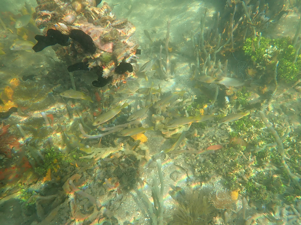
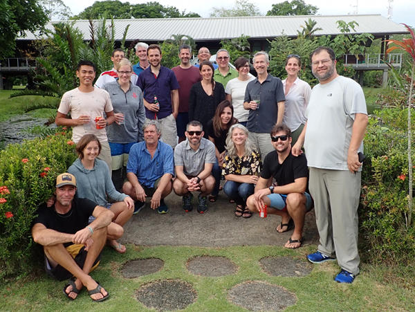
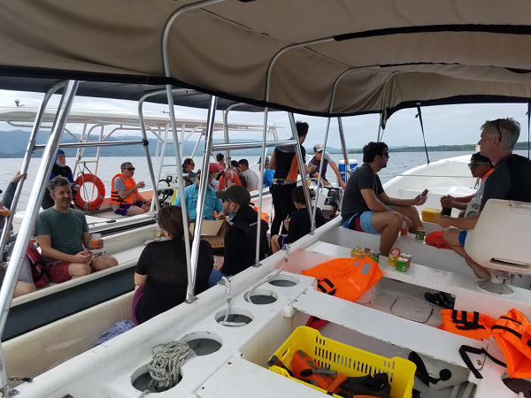
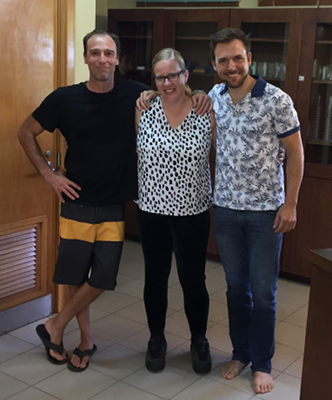
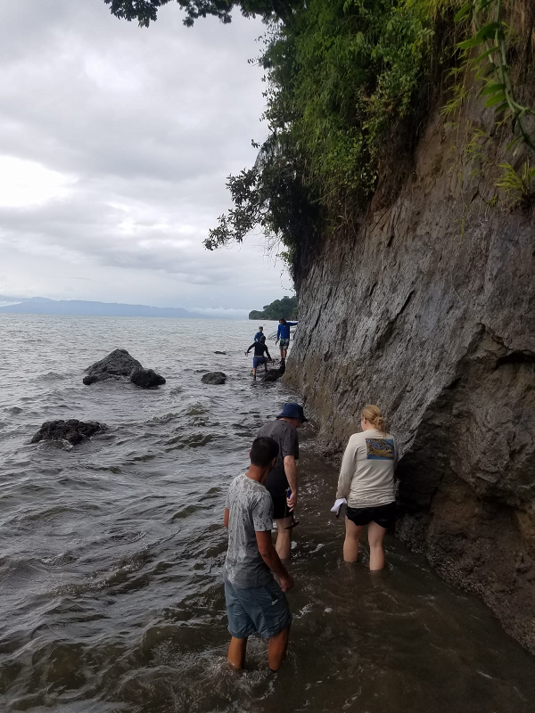
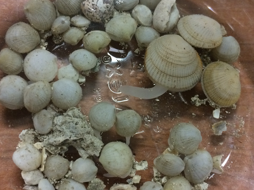

Recently, I returned from a trip to Panama. You might have noticed a storm of tweets with the hashtag #istmobiome in the first week of December 2018. ‘Istmobiome’ stands for our project and ‘we’ is a group of collaborative people in [Jonathan Eisen’s lab](https://phylogenomics.me/) at the University of California, Davis, and people in Bill Wcislo’s lab at the Smithsonian Tropical Research Institute (STRI) in Panama. We received funding from the Gordon and Betty Moore Foundation to study how the rise of the isthmus of Panama affected symbioses between marine animal hosts and their associated microbes.

\

*Snorkeling at Bocas del Toro, Panama - Can you spot some symbioses???*

### The isthmus of Panama
The isthmus of Panama provides a natural, Darwinian, and evolutionary experiment in the sea. The formation of a land bridge between North and South America divided a continuous ocean in two with significantly different geophysical characteristics1. Caribbean waters became warmer, saltier and more nutrient poor creating the ideal conditions for the growth of coral reefs. The Pacific side experiences a seasonal upwelling of deep waters. Here, temperature fluctuations are higher, the water is more acidic and nutrient rich with lower salinity from higher rain inputs2. The final separation of these two oceans dates to approximately 3 million years ago based on evidence from geology, marine paleontology, biogeography, geochemistry, and molecular evolution. The effects of the rise of the isthmus on terrestrial ecosystems, including on biodiversity, animal migrations, and even human evolution have been extensively studied3-5. More recently, studies have been extended to the marine realm6. Building on groundbreaking and elegant research at STRI (among others by Harilaos Lessios, mentioned in a previous [RCN blog post](https://rcn-ecs.github.io/2018-10-12-Laruson-EvolMarBio/) by **Áki Jarl Láruson**), we are now focusing on host-associated microbial symbionts. We are convinced that microbial symbionts are the key for understanding niche partitioning in highly diverse habitats, host evolution, and ecosystem functioning.

\

*Workshop participants of the first #istmobiome meeting 2018*

---

### The istmobiome workshop
From December 3rd until 8th 2018, we hosted a workshop at the STRI research station in Bocas del Toro, Panama. The goal of the workshop was to connect people working on different marine systems and discuss future research goals based on systems level approaches. We want to move beyond descriptive studies to synthetic eco-evolutionary dynamics. The ocean is changing fast. Anthropogenic influences, mostly climate change, pollution, and overexploitation, are reducing and altering marine environments7. Jarrod Scott (twitter handle: [metacrobe](https://twitter.com/metacrobe)), Matthieu Leray ([Matt_Leray](https://twitter.com/Matt_Leray)), and myself ([M_helvetiae](https://twitter.com/M_helvetiae)) organized the program of this workshop. We prepared questions that were discussed in small groups and then synthesized *in plenum*. First, we had to define what we mean with a microbiome, its core, whether it is healthy, and how we can detect tipping points to dysbiosis. Then we moved on to the role of microbes in host adaptation and the response of systems to change. We also discussed community assembly and metacommunity theory. On the last day, we concentrated on marine probiotics and restoration efforts. The outcomes from this meeting will be summarized in a whitepaper. This workshop was only possible thanks to generous financial support from STRI and a lot of help with the logistics from Fabiola Jenkins, Damaris Martinez, Plinio Gondola, and Urania Gonzalez. 

\

*Lunch break on the boats*

Participants were chosen to cover a broad spectrum of expertise from marine model systems to underrepresented hosts and ecosystems. Some individuals talked mostly about corals while others were in love with nematodes. We complemented each other very well and a few very brilliant minds took notes and synthesized most of our discussions. Remember, the goal was to connect experts of different systems and concentrate on the bigger picture. Discussions were passionate and fruitful. We sprinkled in a few lightning talks in between the sessions to learn more about each other’s research. A few energetic people even found time to go fishing or surfing during the breaks, taking full advantage of the marine settings. A local cook spoiled us for every meal on-site, and we made sure that there was always enough coffee and mosquito repellent. 

\

*The three main organizers: Jarrod Scott, myself, and Matt Leray*

Two half-days were reserved for excursions and networking. We brought the participants into the field for snorkeling. This was a refreshing way to familiarize themselves with the marine habitats at Bocas del Toro and to realize how mangroves, seagrasses, and coral reefs are interconnected. For the second excursion, we visited a fossil site and encouraged the participants to find specimens that are older than the isthmus itself; *i.e.*, marine hosts that lived in the ocean that connected and predated waters of the Atlantic and Pacific Oceans. This adventure was led by Aaron O’Dea. People were equipped with hammers and rubber boots, which gave us at least a bit of a professional look. This was a spectacular and memorable experience for all of us. Far away we would see the isthmus itself while hammering out old shells and corals from the cliff in front of us. As refreshments we cracked a few coconuts and took a swim in the clear water. Not even the chitras could cloud our good mood on that day.

\

*Excursion to fossil site. A cliff is lifted out of the sea and it discloses thousands of marine hosts*

---

### Luci(ni)d fieldwork

On Saturday, December 9th it was surprisingly quiet at Bocas del Toro. Most participants had left - very tired but satisfied. Matt, Jarrod, and I stayed for a couple of extra days to write a first draft of our workshop whitepaper. Before, during and after the workshop, we also did some fieldwork. I collected lucinid clams at different sites in the archipelago with the glorious help of Ben Yuen. Lucinid clams host bacterial symbionts in their gills. These bacteria live in specialized gill cells, bacteriocytes. The clams filter sulfur-rich water through their gills and the endosymbionts oxidize sulfides to fix carbon. This carbon is then consumed as nutrients by the host. Seagrass beds are very rich in sulfides and lucinid clams have evolved a three-way symbiosis with seagrass and their bacterial endosymbionts8. We are studying how this symbiosis evolved after the rise of the isthmus of Panama. We are also looking at patch effects and comparing local populations on both sides of the isthmus. Lucinid clams and their symbionts have been studied in great detail. As part of our istmobiome project, we are including more unexplored host systems to learn more about their microbial symbionts, such as the porcelain crab family, sea urchins, reef fish, and snapping shrimp. As a baseline for our project, we assembled microbial genomes in water samples in different ecosystems across an environmental gradient on both sides of the isthmus. There is a lot of exciting research underway. Check for updates on our [istmobiome website](https://istmobiome.net/)!

\

*Different lucinid clam species at Bocas del Toro*

---

### Biography
Laetitia Wilkins is a postdoctoral research scholar from Switzerland, currently working in Jonathan Eisen’s lab at UC Davis. She studies aquatic host-microbe interactions and their evolution. Laetitia cares about diversity and critical thinking and is helping researchers with families to thrive in academia. She writes regularly for [The Molecular Ecologist](http://www.molecularecologist.com/) and on her [personal website](https://laetitia.schmid.se/).

---

### Participants
Our participants included [Aaron O’Dea](https://odealab.com/), [Ross Robertson](https://stri.si.edu/scientist/d-ross-robertson), [Harilaos Lessios](https://stri.si.edu/scientist/harilaos-lessios), [Rachel Collin](https://stri.si.edu/scientist/rachel-collin), [Allen Herre](https://stri.si.edu/scientist/edward-allen-herre), and [Noelle Lucey](https://twitter.com/noellelucey) (all at STRI); [Emmett Duffy](http://www.vims.edu/research/units/legacy/marine_biodiversity/index.php) (MarineGEO & Virginia Institute of Marine Science), [Lizzy Wilbanks](https://www.wilbankslab.org/) (UC Santa Barbara), [Robert Thacker](https://thackerlab.weebly.com/) (Stony Brook University), [Rebecca Vega-Thurber](https://vegathurberlab.oregonstate.edu/) (Oregon State University), [Doug Rasher](https://www.bigelow.org/about/people/drasher.html) (Bigelow Laboratory for Ocean Sciences), [Koty Sharp](https://kotysharp.weebly.com/) (Roger Williams University), [Raquel Peixoto](https://twitter.com/peixotors) (Federal University of Rio de Janeiro), [David Coil](https://phylogenomics.me/people/post-docs/david-coil/) (UC Davis), [Tiago Pereira](https://biklab.github.io/team/tiago-pereira) (UC Riverside), [Maggie Sogin](https://www.mpi-bremen.de/en/Emilia-Sogin.html) (MPI Bremen), [Luis Mejia](https://scholar.google.com/citations?user=RwVX2qkAAAAJ&hl=en) (INDICASAT, Panama), Benedict Yuen (University of Vienna), Jennifer McMillan & Jon Kaye (Moore Foundation). [Jonathan Eisen](https://phylogenomics.me/) and [Bill Wcislo](https://stri.si.edu/scientist/william-wcislo) hosted the whole event.

---

### Bibliography

1.  O’Dea A, Lessios HA, Coates AG, Eytan RI, Restrepo-Moreno SA, Cione AL, Collins LS, de Queiroz A, Farris DW, Norris RD, Stallard RF, Woodburne MO, Aguilera O, Aubry M-P, Berggren WA, Budd AF, Cozzuol MA, Coppard SE, Duque-Caro H, Finnegan S, Gasparini GM, Grossman EL, Johnson KG, Keigwin LD, Knowlton N, Leigh EG, Leonard-Pingel JS, Marko PB, Pyenson ND, Rachello-Dolmen PG, Soibelzon E, Soibelzon L, Todd JA, Vermeij GJ, Jackson JBC (2016) Formation of the Isthmus of Panama. Sci Adv 2:e1600883. doi: 10.1126/sciadv.1600883

2.	Robertson DR, Christy JH, Collin R, Cooke RG, D’Croz L, Kaufmann KW, Moreno SH, Maté JL, O’Dea A, Torchin ME (2009) The Smithsonian Tropical Research Institute: Marine Research, Education, and Conservation in Panama. Smithson Contrib Mar Sci 73–93. doi: 10.5479/si.01960768.38.73

3.	Cody S, Richardson JE, Rull V, Ellis C, Pennington RT (2010) The Great American Biotic Interchange revisited. Ecography 300. doi: 10.1111/j.1600-0587.2010.06327.x

4.	Mann P (2007) Geologic and Tectonic Development of the Caribbean Plate Boundary in Northern Central America (book). Geological Society of America. Volume 428. doi: 10.1130/SPE428

5.	Edwards SV, Beerli P (2000) Perspective: gene divergence, population divergence, and the variance in coalescence time in phylogeographic studies. Evolution 54:1839–1854

6.	Lessios HA (2008) The Great American Schism: Divergence of Marine Organisms After the Rise of the Central American Isthmus. Annu Rev Ecol Evol Syst 39:63–91. doi: 10.1146/annurev.ecolsys.38.091206.095815

7.	Apprill A (2017) Marine Animal Microbiomes: Toward Understanding Host–Microbiome Interactions in a Changing Ocean. Front Mar Sci 4:1518. doi: 10.3389/fmars.2017.00222

8.	van der Heide T, Govers LL, de Fouw J, Olff H, van der Geest M, van Katwijk MM, Piersma T, van de Koppel J, Silliman BR, Smolders AJP, van Gils JA (2012) A three-stage symbiosis forms the foundation of seagrass ecosystems. Science 336:1432–1434. doi: 10.1126/science.1219973
