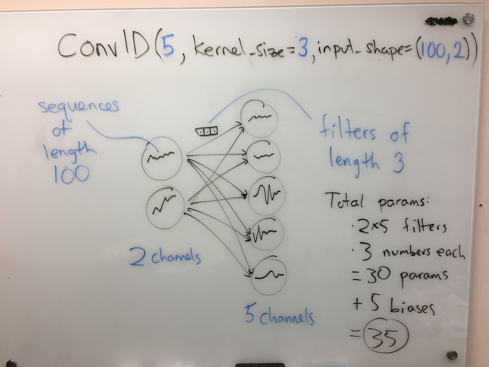
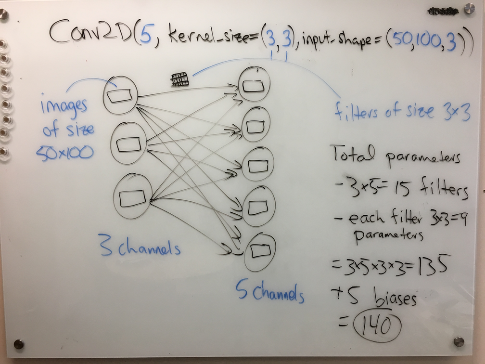

When I first learned about convolutional neural networks (also known as CNNs, or convnets), I was shown a picture much like the one below, which is from the [AlexNet paper](https://papers.nips.cc/paper/4824-imagenet-classification-with-deep-convolutional-neural-networks.pdf):

I will call this a "row-of-boxes" diagram. In my experience, this type of diagram is common in both CNN papers _and_ CNN lessons, even though the audiences are very different in those two contexts. I would argue that row-of-boxes diagrams are targeted at people who already understand CNNs, not students seeing them for the first time. Given the diagram issue and other obstacles, it took me a few iterations to fully understand CNNs when I was a student.

In this post, I will describe my approach for teaching CNNs here in the [UBC MDS program](https://masterdatascience.ubc.ca/), which I am hoping is more clear. A Jupyter notebook implementation of my lesson can be found [here](https://github.com/UBC-MDS/DSCI_572_sup-learn-2/blob/e87382c75a79eaecd3a4254077b7e58cbb2644a9/lectures/lecture7_CNNs.ipynb). My approach comprises three main principles for teaching CNNs: using circle-and-arrow diagrams, focussing on the shape of the data, and teaching 1D convnets before 2D and beyond. The post is structured around these three ideas. Note that while this post is about teaching CNNs to those who are new to the subject, this post itself presumes familiarity with CNNs.

### Circle-and-arrow diagrams

My first principle is replacing row-of-boxes diagrams with the "circle-and-arrow" diagrams that are often used to teach fully-connected (as opposed to convolutional) neural nets:

When this diagram represents a fully-connected network, each circle represents a feature (or _channel_ in CNN parlance), and each arrow represents a learnable parameter. We can generalize these diagrams so that each circle (channel) now contains a signal (1D, 2D, etc.) instead of a number, and each arrow now represents a filter (again, 1D, 2D, etc.) instead of a number. Here is an example for a 1D convolutional layer, with the corresponding Keras code at the top:

In the above diagram, one can read off the number of learnable parameters in the layer: 10 arrows, at 3 parameters each, yields 30 params; then, add the 5 biases (one per output circle, just like the fully-connected case) for a total of 35. 

A small tangent: when teaching, I like to emphasize that the number of parameters (of this layer) does not depend on the sequence length, which is 100 in this case. This is a big win for CNNs vs. fully-connected nets: by taking advantage of the structure of the data we limit the number of parameters, thus effectively incorporating our prior knowledge.

Back to the diagrams. We can draw a very similar diagram for a 2D convolutional layer:

Again, one can read off the number of parameters from the diagram with relative ease; see the right-hand side of the figure.

I like these diagrams for several reasons. First off, students are already used to these types of diagrams from learning about fully-connected networks. The main difference here is that _the base operation has changed from multiplication to convolution_. Everything else stays the same: add up the results from each of the arrows to get the result in an output node; apply a bias and a nonlinear activation at each output node; the circles contain hidden representations and the arrows contain learnable parameters; etc. Second, I like these diagrams because they work equally well for the 1D and 2D case, thus creating a framework for illustrating convnets of various types. Contrast this with the row-of-boxes diagram above, which is more specific to 2D. The diagram also clearly differentiates between the hidden representations (circles) and parameters (arrows), unlike the row-of-boxes diagram, which draws them both as boxes.

Another small tangent: a former student pointed out that these circle-and-arrow diagrams are really showing the computational graph of the layer, in which the circles are variables and the arrows/edges are computations. Computational graphs are increasingly prevalent in machine learning, for example in the contexts of automatic differentiation and probabilistic programming.

### Shape of the data

I start the lesson with a toy problem of predicting a location's suitability for, say, growing wheat from some weather data spanning several days. The data for a single location might look like this:

| Day | Temperature | Wind speed | Rainfall |
|-----|-----|---------------|-------|
|  1   | 20  | 0           |   0 |
|  2   | 10  |  5           | 4  |
|  3    | 12  | 6          |  4 |
|  4    |  12 |  1         |  0 |
| ...  | ...  | ... | ... |

In the discussion, I emphasize that the shape of one training example has gone from a vector (as in the standard supervised learning setup) to a 2D array. In other words, I would say in class, the 2D array above is just one training example, not the entire data set. I believe discussing the data's _shape_ in this way is very powerful when teaching CNNs. If you look through the [notebook](https://github.com/UBC-MDS/DSCI_572_sup-learn-2/blob/e87382c75a79eaecd3a4254077b7e58cbb2644a9/lectures/lecture7_CNNs.ipynb), you'll see a slow progression: first, applying a single convolutional layer with one feature, then multiple features, then multiple training examples, then multiple layers, and finally the idea of flattening the hidden representation before applying a fully-connected layer at the end. For each case, we carefully examine the shape of the hidden representation and also the shape of the weights, identifying the meaning of the different dimensions in any multidimensional array. For example, with a 1D convolutional layer, the hidden representations are 3D arrays (number of examples by length of sequence by number of features) and the weights are also 3D arrays (length of filters by number of input channels by number of output channels).  

Returning to the data table above, I also emphasize that the two dimensions are not interchangeable: the rows constitute an _ordered_ or _structured_ dimension, whereas the columns are an unordered set of features. This helps students establish a framework for thinking about the multidimensional arrays. It also helps explain why a 1D convnet has 2D training examples, a 2D convnet has 3D training examples, etc.

A note on the word "dimension": this is highly confusing word, because it can mean the number of axes of an array, or the number of elements in a vector; here, I am using the former meaning. See the "dimension vs. size vs. length (of a vector)" entry of our [terminology document](https://ubc-mds.github.io/resources_pages/terminology/) for more info.

### Starting with 1D convnets

As far as I can tell, 2D convnets are the most canonical and popular CNN type (by "2D" I mean that each feature is a 2D signal, i.e., an image). Perhaps because of their popularity, 2D convnets are often at the forefront of CNN lessons; indeed, the row-of-boxes diagram above represents a 2D convnet. However, I find that 1D convnets are much easier to teach and understand. Therefore, I start by teaching 1D convnets before moving on to the 2D case. 

Let's return to the example weather data above, which is "1D data" (despite being a 2D array). Consider instead starting with 2D convolutions and 2D images; the typical example is colour images with [RGB channels](https://en.wikipedia.org/wiki/RGB_color_model). I found this setting to be much more confusing. First off, many students are unfamiliar with colour spaces, and furthermore aren't used to thinking about "red", "green", and "blue" as features, whereas "temperature" and "rainfall" feel natural as features. Worse, 2D CNNs are often introduced in the context of grayscale images, leading students to mistakenly think that for 2D convnets the data shape is 2D (rows by columns) rather than 3D (rows by columns by channels). This pitfall is more easily avoided by starting with 1D convnets, where the various features are more natural than image channels. Another issue with 2D convnets is that the weights associated with a layer form a 4D array, which is hard to visualize; with 1D convnets, we only need to invoke 3D arrays, which can still be visualized/drawn. Finally, some students may have been previously exposed to the idea of "flattening" a 2D image into a vector for supervised learning, which muddies the (conceptual) waters further in the 2D CNN world. (Aside: it's also important to distinguish this sort of data flattening from the flattening of the hidden representation that happens downstream in a CNN.) 

### Quiz question

For those who are interested, here is a quiz question I created to follow this lesson, which is meant to address the distinction between structured vs. unstructured data dimensions:

> Consider using a 2D convnet for image classification. For each of the following changes to your data set, do you expect the test error would increase, decrease, or stay the same? Assume the transformation is applied before training and that the same transformation is applied to both train and test. 
> 
> 1. Shuffle the channels of your images. For example, if you had 3 colour channels for red/green/blue, then consider rearranging them to blue/red/green.
> 2. Shuffle the rows of your images. For example, the top row of your images now becomes the 7th row, and the 7th row becomes the 12th row, etc.
> 3. Rotate the images by 90 degrees. For example, if the images are 50x100 pixels then after rotating they will be 100x50 pixels. (You can assume all the filters are square.)

Here is my answer to the above question: in the first and third cases, I would expect no change because the channels are not ordered and the orientation is arbitrary (this is similar to saying the vertical and horizontal dimensions can be swapped). However, in the second case I would expect the test error to increase because the shuffling would disrupt the structure in these structured dimensions. For example, if you have 5x5 filters, a CNN might learn edge detectors and then build these edges up to curves and then objects. If the rows are shuffled, the useful pattern (an edge) is now scattered over more pixels than just a 5x5 square. So, if we're only looking at one 5x5 window of the image at a time (like in the first convolutional layer of a CNN), you may not see any useful patterns. In fact, we already know that other invertible transformations can affect test error even if they are applied to both the train and test sets; a common example is normalization of the features before running KNN. (Incidentally, these answers would probably apply to a human, and our ability to classify images, as well.)

### Concluding thoughts

The three points above summarize my main ideas about teaching CNNs. I also have developed some smaller strategies, like setting the convolution behaviour such that the inputs and outputs are the same size, which eliminates an extra potential source of confusion. If you're interested, you can check out this and more in my lecture [notebook](https://github.com/UBC-MDS/DSCI_572_sup-learn-2/blob/e87382c75a79eaecd3a4254077b7e58cbb2644a9/lectures/lecture7_CNNs.ipynb). So far I have given this lecture twice, and it seems to have been effective. Perhaps someone will find it useful!

_July 2020 update_: a video of me delivering this lecture to the 2019-20 MDS cohort is now available [here](https://www.youtube.com/watch?v=vfQ8vQHkuic&list=PLWmXHcz_53Q3KLISD8jydKjz41b9iqERC&index=6).

--------

[Mike Gelbart](https://www.mikegelbart.com/) is Option Co-Director of the MDS Vancouver program and an Instructor in the UBC Department of Computer Science.
