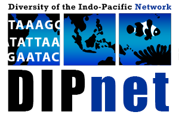

Stretching from East Africa to Easter Island (Rapa Nui), the tropical Indo-Pacific is the largest biogeographic region in the world! Like a bullseye in the middle of the Indo-Pacific, right in the Indo-Malay-Philippines Archipelago, sits the Coral Triangle: the site of highest marine biodiversity in the world. Biodiversity declines in all directions as you move away from the Coral Triangle, creating a spectacular gradient of species diversity that characterizes the whole Indo-Pacific. The processes underlying this gradient are a persistent source of inquiry for biodiversity scientists around the world, and yet, despite its massive size and diversity, the Indo-Pacific ranks fifth among major marine regions for scientific studies on marine ecology and evolution .

The clearest explanation for this disparity between scientific focus and scientific importance is simply funding. Other than Australia, there are no developed countries whose mainland borders intersect with the Indo-Pacific. However, the Indo-Pacific presents other basic challenges to research logistics. First, there is just its immense size! Sampling across the range of a single species can require an investigator to cover two thirds of the Earth's circumference! Moreover, 65 different countries claim exclusive economic zones in the Indo-Pacific, each with its own permitting process. Second is the massive diversity, both at the species and genomic scales. In other parts of the world, phylogeographers have picked exemplar species from which to generalize about processes that impacted entire communities. Can the same be done for the thousands and thousands of marine species in the Indo-Pacific? In the end, ecological and evolutionary research ends up being an uncoordinated mishmash, with scientists from developing countries "parachuting" in to get their samples without interacting much with local researchers.

Based on my graduate and postdoctoral experiences in the Indo-Pacific, I co-founded The Diversity of the Indo-Pacific Network [(DIPnet)](http://diversityindopacific.net) in 2012 with [Dr. Cynthia Riginos](http://www.cynthiariginos.org/wordpress/) at University of Queensland. From 2012 to 2015 we ran a NESCent working group which resulted in a [special issue in Bulletin of Marine Science](https://www.ingentaconnect.com/content/umrsmas/bullmar/2014/00000090/00000001%3bjsessionid=yhpkq541xogx.alice) on the current status of and best practices for research in the Indo-Pacific. In 2015, together with [Rob Toonen](http://tobolab.org) at University of Hawaii and [Michelle Gaither](https://sciences.ucf.edu/biology/faculty/michelle-gaither/) at University of Central Florida and others we received a Research Coordination Network grant from the NSF to:

1) Create an open access database of genetic data and accompanying metadata from the Indo-Pacific. One of our primary goals here was to make these data available to researchers in developing countries who may not have funding to sample outside their borders.

2) Promote strong collaboration among Indo-Pacific researchers. To this end we have held 4 workshops in Indonesia, the Philippines, South Africa and Fiji in which students from developing countries were trained in essential skills for modern biodiversity science.

3) Collaboratively address fundamental research topics, including:
	a. Understanding patterns of marine biodiversity across multiple levels of organization 
	b. Indo-Pacific Seascapes: Delineating conservation units with molecular data 
	c. Community Phylogeography: Shared ecological and evolutionary processes
	
In future posts I will discuss our successes in moving research forward in the beautiful Indo-Pacific. 

### Biography
[Eric Crandall](http://www.ericcrandall.org) is an Assistant Professor at California State University Monterey Bay. His research focuses on the evolutionary consequences of larval dispersal in marine organisms, with a particular focus on defining population structure. 
	
