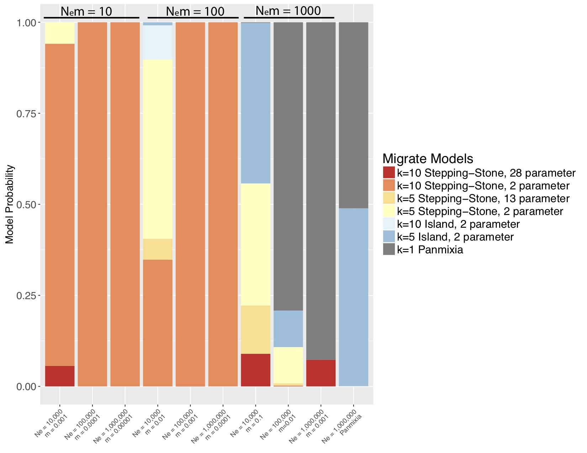

The median Phi_st that we estimated in the Indo-Pacific fall right in line with what Robin Waples reported from his review of the literature over 20 years ago in his influential "Separating the Wheat From the Chaff" paper: right around 0.02. Waples' persistent point was that with such low values of F_st, the noise from sampling error will often drown out the signal. Traditionally, without reliable estimates of F_st, we are unable to resolve either the number of populations or how much gene flow occurs between them. This is certainly what we experienced in the paper I discussed in my last post. It arises because marine metapopulations occupy a portion of population genetic parameter space with large effective population size and high gene flow (Figure 1, from Gagnaire et al. 2015)  This problem has plagued marine population genetics for so long that I think many have given up and/or are looking for structure at adaptive loci.

Population delimitation is not just a problem in marine species. In 2006, Robin Waples and Oscar Gaggiotti addressed the the question of "What is a population?". The suggested several criteria based on the exchange of individuals between populations: either less than 1,5 or 25 effective migrants per generation, or under the ecological paradigm, the fraction of migrants, m < 0.1. They simulated data from an island metapopulation and then tested several different methods for their ability to distinguish population structure. However, they didn't simulate into the Waples Zone. The largest simulated population size was 500 effective individuals.

Marine populations may actually conform quite well to the standard coalescent model, where N_e >> N_em >> mu. Although they exchange many migrants per generation, their total population size is also large, such that m might be quite small. [I wanted to tackle the Waples Zone](https://onlinelibrary.wiley.com/doi/full/10.1111/eva.12712), so I simulated data for a stepping-stone model with fixed population sizes and fixed migration between populations. I simulated mitochondrial data from nine combinations of m and Ne (figure 1) such that 3 simulations yielded Nem = 10 migrants per generation, 3 yielded 100 migrants per generation and 3 yielded 1000 migrants per generation. I also simulated a panmictic population. I then used the model-selection feature of Peter Beerli's migrate-n to test a variety of population genetic hypotheses, including panmixia, regional structure, stepping-stone with freely varying parameters and stepping-stone with fixed parameters (the true model). I was amazed by my results (Figure 2). For N_em of 1000, migrate-n had poor results but for N_em of 10 or *even 100* migrants per generation, migrate-n was able to recover the correct model; and where it was wrong, it was only off on the number of populations, not the model of gene flow. **This result suggests that we may be able to delimit populations that are connected by gene flow of up to 100 effective migrants per generation! Even with just mtDNA data!** This is analogous to successfully resolving IBD using significant F_st values of about 0.002!

I was lucky to be invited to apply this approach to some DIPnet data from the [ToBo lab](http://tobolab.org) at the Hawaii Institute of Marine Biology. I used migrate-n to consider basically the same set of models as the simulations for 41 marine species sampled along the Hawaiian archipelago ranging from limpets to dolphins. Along a long linear archipelago, one would expect some sort of stepping-stone/IBD model to apply, but Kim Selkoe had only found evidence for such a model in 4/41 species using F-statistics. With the migrate-n analysis, while 15/41 species were ambiguous, 18 of the remaining 26 selected the full stepping-stone model with free parameters (figure 3)! 

Two things about this result: 

1. The fact that migrate-n could distinguish between the constrained model in the simulated data and the general model is extremely heartening. It is clearly not overfitting. 

2. The mtDNA data don't quite have the resolution to demonstrate this, but I believe that m between neighboring Hawaiian islands is likely to be less than 0.1, suggesting that each is a demographically independent population, as defined by Waples and Gaggiotti (2006) and should be managed as such. More loci will bring resolution to this question.  

### Literature Cited

Beerli P, Palczewski M. 2010. Unified Framework to Evaluate Panmixia and Migration Direction Among Multiple Sampling Locations. Genetics 185:313–326.

Gagnaire P-A, Broquet T, Aurelle D, Viard F, Souissi A, Bonhomme F, Arnaud-Haond S, Bierne N. 2015. Using neutral, selected, and hitchhiker loci to assess connectivity of marine populations in the genomic era. Evol Appl 8:769–786.

Waples R. 1998. Separating the wheat from the chaff: Patterns of genetic differentiation in high gene flow species. J Hered 89:438–450.

Waples RS, Gaggiotti O. 2006. What is a population? An empirical evaluation of some genetic methods for identifying the number of gene pools and their degree of connectivity. Mol Ecol 15:1419–1439.
