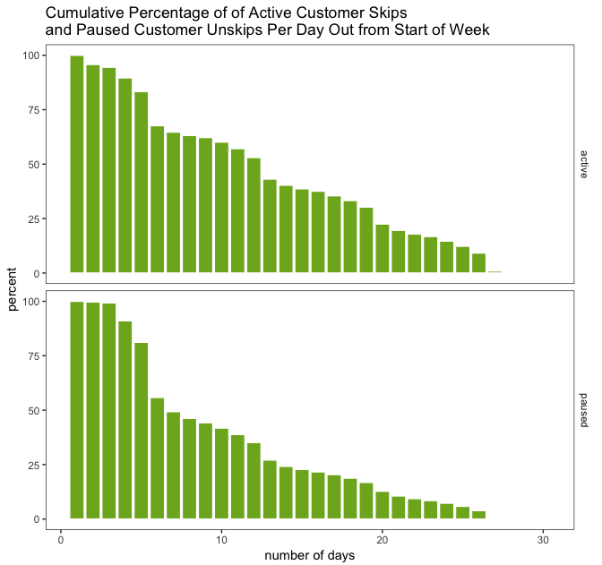
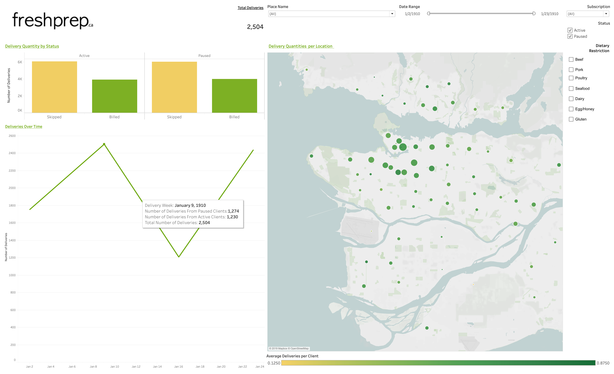

One of the things that drew to me data science is its applicability to pretty much any field you can name: technology, healthcare, finance, retail, education, government, entertainment, agriculture, real estate, etc. There's no domain too large or small and no organization that would not benefit from having a data scientist (or a team of data scientists!) on staff to solve interesting problems.

I recently completed the [Master of Data Science](https://masterdatascience.ubc.ca/) program at the University of British Columbia, a 10-month intensive program focused on computing, statistics, and machine learning. After 8 months of coursework, the program concludes with an 2-month [capstone project](https://ubc-mds.github.io/capstone/about/). My capstone team worked with Vancouver-based [meal kit](https://en.wikipedia.org/wiki/Meal_kit) company [Fresh Prep](https://www.freshprep.ca/) to build a predictive model for customer ordering. Fresh Prep can use our model to understand which of their customers are likely to order in a given week, and target their marketing strategies in an attempt to increase order rates.

## Some background about the project

Each week, Fresh Prep customers are presented with a list of meal options through a web app. When the customer orders, a Fresh Prep bag is delivered to their door. The kit includes a recipe card and the necessary ingredients, often partially prepared (e.g. onions are pre-chopped) to facilitate easy cooking. Here is a screenshot of the web app: 

The screenshot shows that my June 25 order is **billed** (meaning I ordered) and my July 2 order is **skipped** (meaning I opted out). Our task was to predict, for a given week in the future (e.g. next week), who will bill and who will skip. In practice, our model produces a probability for each customer: close to 1 means very likely to order, and close to 0 means very unlikely to order. These predictions provide Fresh Prep with not only a forecast of the total number of upcoming orders, but also the ability to focus their marketing efforts on customers for whom we are uncertain (i.e., their probability of ordering is around 0.5).

## The meat and potatoes

Our work was focused in four main areas to address the project’s objective:

1. Data Wrangling
2. Exploratory Data Analysis (EDA)
3. Feature Engineering
4. Predictive Model

In parallel with wrangling the raw data into a usable dataset, we visualized it. EDA allowed us to uncover a series of insights. For example, active customers tend to plan further out than paused customers do. This is illustrated in the following plot, which shows the number of days prior to the Sunday starting a Fresh Prep week that a customer chooses to skip or place their order:

A significant component of this project involved creating the features that were used in our model, given a rather large amount of raw data. It was necessary to determine which elements had the strongest ability in estimating a customer’s order probability. From the insights we gleaned via our EDA we built features for our model to train and predict on. After testing weights and model performance we settled on 14 features, with the most predictive ones being:

- **smoothed billed order rate:** Each customer's historical billed order rate up to a given order, smoothed with an [empirical Bayes method](http://varianceexplained.org/r/empirical_bayes_baseball/) to account for newer clients with a small number of orders in their histories.
- **weekly billed rate:** To capture seasonality, this weekly billed rate is the average rate for the corresponding week the year prior. We made an assumption that there is no trend, from last year to this year, in the billing rate.
- **lag one:** Whether or not the customer ordered 1 week prior. In our work we discovered that customers do have a tendency towards their same behavior from the previous week.
- **number of email types:** The number of different email categories a customer is subscribed to.

There is a simpler question and a more difficult question at play here. The simple question is: _**how many**_ orders will there be each week? The harder question, which is the problem we tackled, is: _**who**_ will order each week? Answering the harder question also provides a solution to the easier one.

We trained two [Logistic Regression](https://towardsdatascience.com/logistic-regression-b0af09cdb8ad) models on the data – one for active customers and one for paused. We chose this type of model because it provided more interpretable weights as well as more trustworthy probabilities than other models. This decision was key as it allowed us to explain to our partner what was driving the predictions.

The models output a probability of ordering for each customer and these are summed up to provide the expected number of orders for a given week. Our model gives predictions for one, two, or three weeks out, and thus allows Fresh Prep to plan for ingredients, delivery drivers, and other factors accordingly.

The performance of the model is visualized in the following figure:

Our model has 4.6 mean absolute percentage error ([MAPE](https://www.dataquest.io/blog/understanding-regression-error-metrics/)) on the total number of actual orders from June 2018 to June 2019. What this translates to: for a week in which Fresh Prep expects 1000 orders, the error is around 46 orders. If we concentrate on dates only in 2019 the model has just 1.5 MAPE. These later predictions have the benefit of being trained on more data. Translation: for a week in which Fresh Prep expects 1000 orders, the error is around 15 orders.

The interactive [Tableau](https://www.tableau.com/) dashboard we developed visualizes the predictions. (All credit for building the dashboard goes to my teammate [Hayley Boyce](https://www.hayleyfboyce.com/).) Fresh Prep can utilize this in their communication strategy to their customers by seeing which customers have which probabilities of ordering.

We provided a descriptive dashboard, displaying customer histories:

And we provided a predictive dashboard, displaying future predictions:

Note: the customer data presented in these images is fabricated, due to a non-disclosure agreement.

## What I learned

For me, the capstone project was the ideal opportunity to revisit many of the concepts taught in the program's coursework. It is one thing to take coursework in data science concepts such as wrangling, regression, supervised learning, or feature selection & engineering. It is a far more enlightening experience to actually apply these methods to real-world data for an actual organization. The capstone project solidified my understanding of these techniques, how to apply and interpret them, and how to choose which tools are the right ones for the problem at hand.

Throughout the 10-week project I found myself returning to lecture notes and lab work from various courses, solidifying my knowledge of what had been learned earlier, and applying it to authentic data. The pace of the program in its first 8 months is quite intense, and in some cases I hadn't fully grasped some of the material. Capstone gave me the opportunity to return to these topics, and in a real-world applicable context, reinforce them tangibly. It demonstrated how the insights our team discovered might be used by the company. Lastly, the capstone experience made me feel on the whole much more confident in my skills as a data scientist. I found the experience to be genuinely rewarding and enjoyable.

## Acknowledgements

I want to thank my team members, [Hayley Boyce](https://www.hayleyfboyce.com/), [Orphelia Ellogne](https://ellognea.github.io/), & [Maninder Kohli](https://github.ubc.ca/mani); [Joseph Goldes](https://www.linkedin.com/in/josephgoldes/) and [Philip Nelson](https://github.com/pnelson) from Fresh Prep; as well as our faculty mentor, [Mike Gelbart](https://www.mikegelbart.com/).

---------

[Rachel K. Riggs](https://rachelkriggs.github.io/about/) graduated from the UBC MDS program in 2019.
