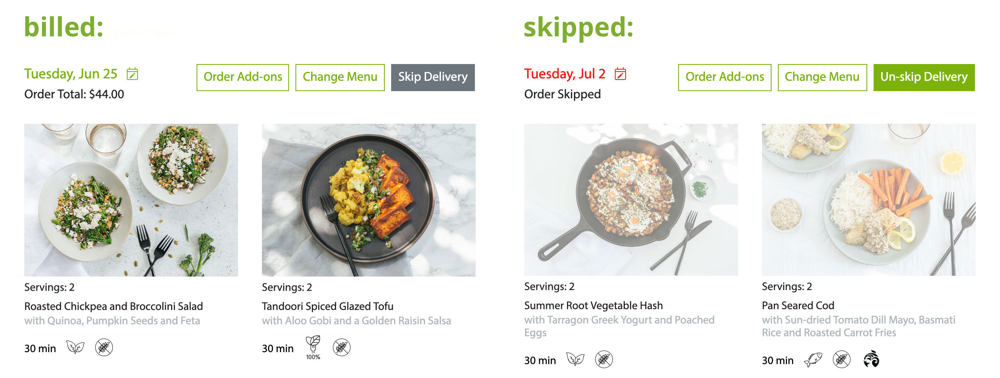
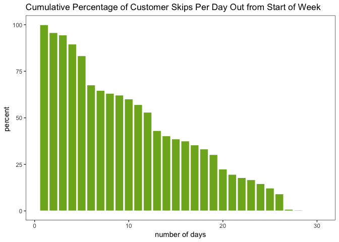
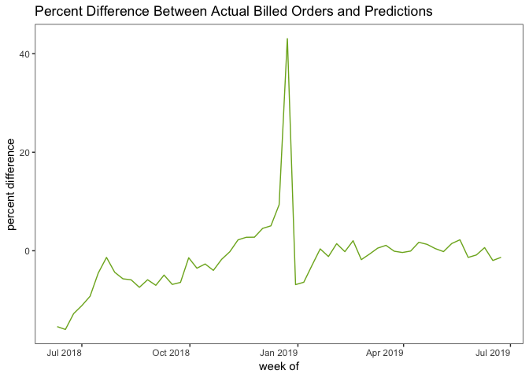
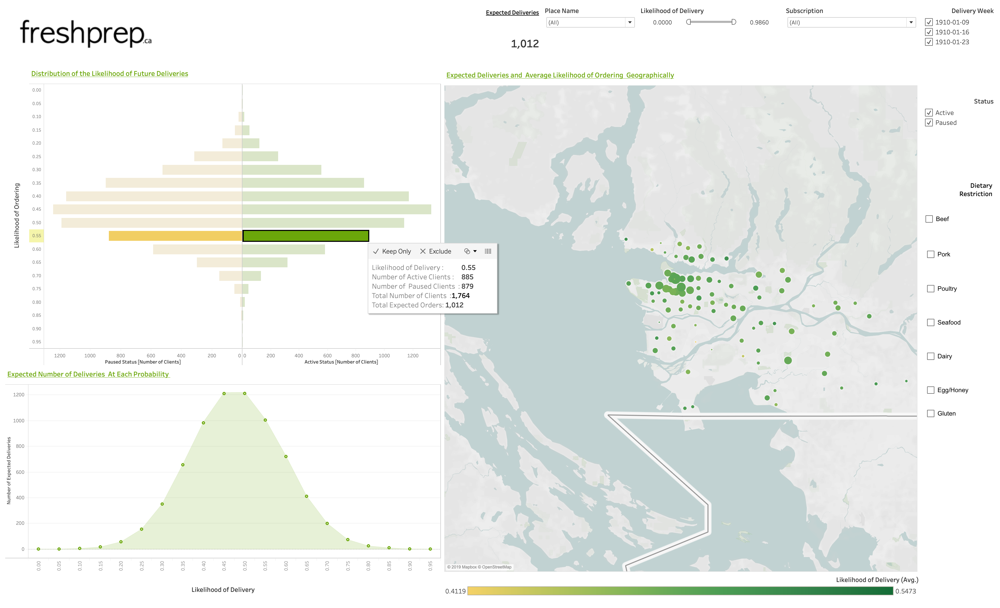

One of the things that drew to me data science is its applicability to pretty much any field you can name: technology, healthcare, finance, retail, education, government, entertainment, agriculture, real estate, etc. There's no domain too large or small and no organization that would not benefit from having a data scientist (or a team of data scientists!) on staff to solve interesting problems.

I recently completed the [Master of Data Science](https://masterdatascience.ubc.ca/) program at the University of British Columbia, a 10-month intensive program focused on computing, statistics, and machine learning. After 8 months of coursework, the program concludes with an 2-month [capstone project](https://ubc-mds.github.io/capstone/about/). My capstone team worked with Vancouver-based [meal kit](https://en.wikipedia.org/wiki/Meal_kit) company [Fresh Prep](https://www.freshprep.ca/) to build a predictive model for customer ordering. Fresh Prep can use our model to understand which of their customers are likely to order in a given week, and target their marketing strategies in an attempt to increase order rates.

## Some background about the project

Each week, Fresh Prep customers are presented with a list of meal options through a web app. When the customer orders, a Fresh Prep bag is delivered to their door. The kit includes a recipe card and the necessary ingredients, often partially prepared (e.g. onions are pre-chopped) to facilitate easy cooking. Here is a screenshot of the web app:

The screenshot shows that my June 25 order is **billed** (meaning I ordered) and my July 2 order is **skipped** (meaning I opted out). Our task was to predict, for a given week in the future (e.g. next week), who will bill and who will skip. In practice, our model produces a probability for each customer: close to 1 means very likely to order, and close to 0 means very unlikely to order. These predictions provide Fresh Prep with not only a forecast of the total number of upcoming orders, but also the ability to focus their marketing efforts on customers for whom we are uncertain (i.e., their probability of ordering is around 0.5).

## Components of the project

Our work was focused in five main areas to address the project’s objective:

1. Data Wrangling
2. Exploratory Data Analysis (EDA)
3. Feature Engineering
4. Predictive Modeling
5. Data Visualization

**Data Wrangling.** We wrangled and condensed the given relational database into a clean, useful dataset - experiencing the woes of dealing with timezones along the way.

**EDA.** Our EDA allowed us to uncover a number of insights. For example, Fresh Prep customers can decide to bill/skip an order up to 4 weeks in advance. We measured when customers were making their decisions within this 4-week window. Our results are illustrated in the following plot:

This plot shows that customers make their decisions at a fairly steady rate, with a "jump" in decision-making every 7 days. These jumps turn out to correspond to Tuesdays, which is when customers are emailed about their pending orders.  

**Feature Engineering.** A significant component of this project involved creating the features that were used in our model, given a rather large amount of raw data. It was necessary to determine which elements had the strongest relevance in estimating a customer's order probability. From the insights we gleaned via our EDA we built features for our model to train and predict on. After testing weights and model performance we settled on 14 features, with the most predictive ones being:

- Smoothed billed order rate: Each customer's historical order rate, smoothed with an [empirical Bayes method](http://varianceexplained.org/r/empirical_bayes_baseball/) to account for newer clients with a small number of orders in their histories.
- Seasonal billed rate: To capture seasonality, our model considers the average order rate for the corresponding week the year prior.
- Last week's decision: A binary feature indicating whether or not the customer ordered in the previous week. In our work we discovered that customers do have a tendency towards their same behavior from the previous week. (Note that this feature can only be used when forecasting 1 week ahead, so forecasting 2 weeks ahead is harder.)
- Number of email types: The number of different email categories a customer is subscribed to.

**Predictive Modeling.** We used [Logistic Regression](https://towardsdatascience.com/logistic-regression-b0af09cdb8ad) for our prediction. We chose this model because it provided more interpretable regression weights as well as more trustworthy probabilities than other models.

The model outputs a probability of ordering for each customer and these are summed up to provide the expected number of orders for a given week. Our model outputs predictions for one, two, or three weeks out, and thus allows Fresh Prep to plan for ingredients, delivery drivers, and other factors accordingly. The performance of the model is visualized in the following figure:

As the figure shows, our model seriously overestimated orders during Christmas and New Year's! For the entire June 2018 to June 2019 time frame, our model has mean absolute percentage error ([MAPE](https://www.dataquest.io/blog/understanding-regression-error-metrics/)) of 4.6% on the total number of orders. If we concentrate on dates only in 2019, the more recent period where the model has more training data to work with, the error is just 1.5%. In other words: for a hypothetical week in which Fresh Prep expects 1000 orders, the error is around 15 orders.

**Data Visualization.** We developed an interactive [Tableau](https://www.tableau.com/) dashboard to visualize the predictions. Below is a screenshot of the predictive pane of our dashboard (with fabricated data, to maintain confidentiality):

The dashboard's user can drill down into various demographics (e.g. vegetarians), focus on various demographic areas, and see the client IDs of interesting subsets of customers.

## What I learned

For me, the capstone project was the ideal opportunity to revisit many of the concepts taught in the program's coursework. It is one thing to take courses in data science concepts such as wrangling, regression, supervised learning, or feature selection & engineering. It is a far more enlightening experience to actually apply these methods to real-world data for an actual organization. The capstone project solidified my understanding of these techniques, how to apply and interpret them, and how to choose which tools are the right ones for the problem at hand.

Throughout the 10-week project I found myself returning to lecture notes and lab work from various courses, solidifying my knowledge of what had been learned earlier, and applying it to authentic data. The pace of the program in its first 8 months is quite intense, and in some cases I hadn't fully grasped some of the material. Capstone gave me the opportunity to return to these topics, and in a real-world applicable context, reinforce them tangibly. It demonstrated how the insights our team discovered might be used by the company. Lastly, the capstone experience made me feel on the whole much more confident in my skills as a data scientist. I found the experience to be genuinely rewarding and enjoyable.

## Acknowledgements

I want to thank my team members, [Hayley Boyce](https://www.hayleyfboyce.com/), [Orphelia Ellogne](https://ellognea.github.io/), & [Maninder Kohli](https://github.ubc.ca/mani); our partners from Fresh Prep, [Joseph Goldes](https://www.linkedin.com/in/josephgoldes/) and [Philip Nelson](https://github.com/pnelson); and our faculty mentor, [Mike Gelbart](https://www.mikegelbart.com/).

---------

[Rachel K. Riggs](https://rachelkriggs.github.io/about/) graduated from the UBC MDS program in 2019.
