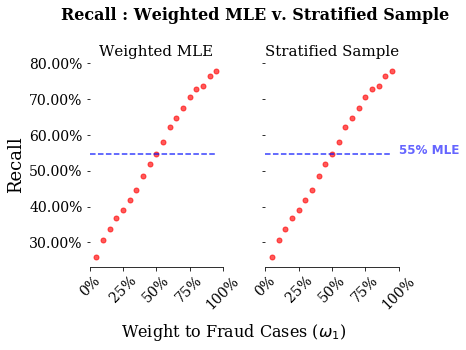
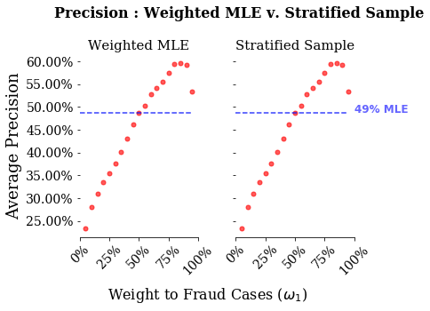

# Introduction

I previously worked on designing some problem sets for a PhD class. One of the assigments dealt with a simple classification problem using data that I took from a [kaggle challenge](https://www.kaggle.com/mlg-ulb/creditcardfraud) trying to predict fraudelent credit card transactions. The goal of the problem is to predict the probability that a specific credit card transaction is fraudelent. One unforseen issue with the data was that the unconditional probability that a single credit card transaction is fraudelent is very small. This type of data is known as rare events data, and is common in many areas such as disease detection, conflict prediction and, of course, fraud detection. 

This note is to compare two common techniques to improve classification with rare events data. The basic idea behind these techniques is to increase the discriminative power of a classification algorithm by giving more weight to rare events. One technique attempts to use sampling weights in the likelihood function itself, whereas, the other is a type of case-control design where we over-sample from the rare class. Which is preferrable depends on both predictive performance, as well as, computational complexity. In this example, we will be "fixing" computational complexity by comparing predictive performance across logistic regression models estimated using MLE. What is interesting about these techniques is they are equivalent up to sampling error. One hope of this note is show that simulation error is small. This will allow us to use this re-sampling techniques in more complex models. 

An additional motivation for this note is that looking under the hood of common ML libraries can be difficult. Given that many of methods are wrappers of C Libraries, tracking down exact implementation can be tedious. One hope of this exercise is to show exactly the equivalence between using `sample_weights` in the sklearn library and the stratified sampling procedure I create. 

All of the code and a hyperlink to the data are available on my [github](https://github.com/ryanlstevens/logistic_regression_rare_events).

# The Problem

To motivate the problem, let's simply compare our standard likelihood when our data is Bernoulli distributed with a sample weighted likelihood. 

Assume $Y_{i} \vert X_{i}$ is Bernoulli distributed, then our standard log-likelihood is simply:

\begin{equation}
    \mathcal{L}(\beta \vert Y, X) = \sum_{Y_{i}==1} ln(\pi_{i}) + \sum_{Y_{i}==0} ln(1-\pi_{i})
\end{equation}

## Weighted Maximum Likelihood

A weighted likelihood approach simply attempts to re-weight our data to account for imbalance across classes. We need a little bit of notation, we define:


<font size="+0.5"> <center> $\omega_{c}$ is the sample weight given to class $c$ </center> </font> 

In our Bernoulli case, there are only two classes, so c only takes two values, $c \in \{0,1\}$.  Thus, the weighted log likelihood is simply:

\begin{equation}
    \mathcal{L}_{\omega}(\beta \vert Y,X) = \sum_{Y_{i}=1} \omega_{1}ln(\pi_{i}) + \sum_{Y_{i}=0} \omega_{0}ln(1-\pi_{i})
\end{equation}

## Stratified Sampling

Instead of incorporating weights directly into the likelihood, we can instead re-balance our data using a re-sampling procedure. We then estimated the standard MLE in (1) on this sample. The approach this note focuses on is a form of stratified sampling. The procedure is as follows:

1. Choose a class of data with probability $\omega_{c}$
2. Within the choosen class, draw observations with equal likelihood with replacement

Because I am estimating using MLE in both approaches, these techniques are similar in computational complexity. However, as may be clear, the second technique is indifferent to the model you are estimating. This same procedure can be used for SVMs, Neural Networks and more complex models. Furthermore, it is flexible and additional stages of sampling or decision rules for inclusion in the sample can be changed. My next note will focus on an extension of this stratified procedure that attempts to create matched samples based on "closeness" of observations across the classes.

To summarize, this exercise will compare predictive performance using two seperate ways to re-weight our data. Given some pre-chosen weights, $(\omega_{0},\omega_{1})$:

1. Weighted Maximum Likelihood : minimize weighted likelihood (2)
2. Stratified Random Sampling : stratify random sample then minimize standard likelihood (1)

# Data Analysis 

We read in our data and split the dependent and independent variables from one another. Here the independent variable is defined as "Class". We can see in the graph below that there are only 492 transactions that are fraudelent out of 284,807 total transactions.


```python
import pandas as pd
import numpy as np
import matplotlib.pyplot as plt

# ~ Read in our data ~ #
path_to_data='/home/ryan/Downloads/creditcard.csv'
df=pd.read_csv(path_to_data)

# ~ Split data into dependent and indepent variables ~ #
df=df[[x for x in df.columns if x!='Time']]
iv=df['Class']
dv=df[[x for x in df.columns if x!='Class']]
```

<details>

```python
# ~~ Create frequency plot of transactions by fraud type ~~ #
def make_frequency_plot(iv):
    # Initialize figure 
    fig = plt.figure(figsize=(8,6))
    ax = fig.add_subplot(111)

    # Sum fraud/non-fraud cases
    y_values=[sum(iv==0),sum(iv==1)]
    x_range=[0,0.25]

    # Create bar plot
    plt.bar(x_range,
            y_values,
            width=(0.50)*(x_range[1]-x_range[0]),
           alpha=0.65)

    # Hide the right and top spines
    ax.spines['right'].set_visible(False)
    ax.spines['top'].set_visible(False)

    # Set axis tick values
    ax.tick_params(axis=u'x', which=u'both',length=0)
    plt.yticks(fontsize=14,fontname="Serif")
    plt.xticks(x_range,
               ['Non-Fraudelent',"Fraudelent"],
               fontsize=18,
               fontname='Serif')

    # Set axis labels #
    plt.ylabel('Number of Transactions',
               fontsize=16,
               fontname='Serif')

    # Create Title #
    plt.title('Number of Transactions \n by Fraud Status',
              fontsize=18,
              fontname='Serif',
              y=1.08)

    # Add labels above bar plot
    ax.text(x_range[0]-0.07, y_values[0]+10000, '{0:,.0f} Cases'.format(y_values[0]), 
            color='black', 
            fontweight='bold',
            fontsize=18)
    ax.text(x_range[1]-0.05, y_values[1]+10000, '{0:<} Cases'.format(y_values[1]), 
            color='red', 
            fontweight='bold',
            fontsize=18)

    # Show plot
    plt.show()
```

</details>


```python
make_frequency_plot(iv)
```


## Defining our stratified sampling method

I am doing all this in python. While sci-kit learn has a K-Fold class, that produces K-splits of the data, my specific task requires the following sampling procedure:

1. Split data into K-folds defined as $k \in \{1,..,K\}$
2. Within a training set in fold $k$, run our stratified sampling procedure

In order to accomplish this, I extend the KFold class creating the `oversample_KFold` class. This new class requires a sample weight to sample from each class. 


```python
from sklearn.model_selection import KFold
import sklearn.model_selection

class oversample_KFold(KFold):
    '''Extends KFold class for binary datasets to allow for 
        stratified sampling (or over-sampling) of the positive
        class
        
       Methods:
           yield_sample (list) : yields train/test indices after stratified 
                                 sampling using sample_weight as the probability
                                 of choosing observations from the positive class

    '''
    
    # ~ Initialize ~ #
    def __init__(self,*args, **kwargs):
        '''Add sample_weights keyword argument to KFold class'''
        
        self.sample_weight=kwargs.pop('sample_weight')
        super(oversample_KFold, self).__init__(*args, **kwargs)
        
    # ~ Extend KFold class to allow oversampling ~ #
    def yield_sample(self,df):
        '''Run KFold split, within the training dataset use a stratified sampling and yield
           test and train indices using this sampling procedure.
           
           Inputs:
             df (dataframe) : data used in model estimation
             
           Outputs:
             stratified_train_ix, test_ix (tuple) : tuple of training and test indices (same as 
                                           KFold class)
           
           Note: 
           
            To form the stratified_train_ix we use the following sampling procedure goes as follows.
            Create a sample of size df.shape[0]. Within each row, we draw a pair of random numbers:
            
            1. Draw Z from a uniform random. 
               If Z <= sample_weight : in step (2) sample from the negative class (class = 0)
               If Z >  sample_weight : in step (2) sample from the positivie class (class = 1)
            
            2. Draw W from a discrete uniform distribution with size = number of observations in
                the class being drawn from.
               
               For example, if:
                              sample weight=0.5
                              Z = 0.3
                              Number Obs in Class 0 = 10
                              Number Obs in Class 1 = 20
                            then: 
                              W is drawn from discrete uniform with size = 10 (i.e. each observation
                                has a 1/10 probability of being drawn)
               
          These pairs (Z,W) create a new set of indices for our test dataset. 
        
        '''
        # ~ Indices for 0 and 1 class ~ #
        class_0_ix=set(df.loc[df['Class']==0].index.values)
        class_1_ix=set(df.loc[df['Class']==1].index.values)
        for split in KFold(n_splits=self.n_splits,random_state=self.random_state).split(df):
            # ~ Get train/test indices ~ #
            train_ix = split[0]
            test_ix = split[1]
            # ~ Split training data into class 0 and 1 training ~ #
            class_0_train = [x for x in train_ix if x in class_0_ix]
            class_1_train = [x for x in train_ix if x in class_1_ix]
            # ~ Draw a random variable to determine which class to sample ~ #
            select_class_draws = np.random.uniform(size=len(train_ix))<=self.sample_weight
            n_class_0 = sum(select_class_draws==0)
            n_class_1 = sum(select_class_draws==1)
            # ~ Within each class, draw a random number to select each index ~ #
            oversample_train_index = ([class_0_train[x] for x in np.random.randint(low=0,high=len(class_0_train)-1,size=n_class_0)] +
                                     [class_1_train[x] for x in np.random.randint(low=0,high=len(class_1_train)-1,size=n_class_1)])
            # ~ Yield indices for train and test data ~ #
            stratified_train_ix=np.array(oversample_train_ix)
            yield stratified_train_ix, test_ix


```

## Model Pipeline

We create a model pipeline that has the following steps:

1. **Seperate categorical and numeric variables**

2. **Standardize (or one hot encode) variables**

3. **Concatenate columns together**

4. **Create full pipeline with data transformations and logistic regression model**


```python
# ~~~~~~~~~~~~~~~~~~~~~~~~~~~~~~~~~~~~~~~~~~~~~~~~~~~~~~~~~ #
#                  Setup Model Pipeline                     #
# ~~~~~~~~~~~~~~~~~~~~~~~~~~~~~~~~~~~~~~~~~~~~~~~~~~~~~~~~~ #

# ~~~~ Pipeline + Data Transform Libraries ~~~~ #
from sklearn.preprocessing import StandardScaler, OneHotEncoder
from sklearn.impute import SimpleImputer
from sklearn.compose import ColumnTransformer
from sklearn.pipeline import Pipeline
from sklearn.linear_model import LogisticRegression

# (1) : Seperate numeric and categorical variables
# (2) : Create transforms (imputation + standardization) for both types
numeric_features = list(dv.dtypes[((dv.dtypes=='int64') | (dv.dtypes=='float64')) ].index.values)
numeric_transformer = Pipeline(steps=[
    ('imputer', SimpleImputer(strategy='median')),
    ('scaler', StandardScaler())])

categorical_features = list(dv.dtypes[((dv.dtypes=='object')) ].index.values)
categorical_transformer = Pipeline(steps=[
    ('imputer', SimpleImputer(strategy='constant', fill_value='missing')),
    ('onehot', OneHotEncoder(handle_unknown='ignore'))])

# (3) : Concatenate columns together and apply transformations
preprocessor = ColumnTransformer(
    transformers=[
        ('num', numeric_transformer, numeric_features),
        ('cat', categorical_transformer, categorical_features)])

# (4) : Create pipeline with preprocessing + estimation steps
clf = Pipeline(steps=[('preprocessor', preprocessor),
                      ('classifier', LogisticRegression(solver='lbfgs',max_iter=1000))])
```

## Model Estimation

This is the meat of this exericse. What we will do is estimate both a weighted logistic regression and a standard logistic regression with stratified random sampling. We will then plot three relevant model score metrics: accuracy, recall and precision. What we will see is how bad accuracy is for predictions of rare events. We will then see how recall and precision for both of the models are basically the same, which will allow us to use the sampling procedure for more complicated models. The model pipeline will use a 10 fold cross validation.


```python
# ~~~~~~~~~~~~~~~~~~~~~~~~~~~~~~~~~~~~~~~~~~~~~~~~~~~~~~~~~~~~~ #
# ~ Run logisitic regression using Weighted MLE v. Stratified ~ #
# ~~~~~~~~~~~~~~~~~~~~~~~~~~~~~~~~~~~~~~~~~~~~~~~~~~~~~~~~~~~~~ #

# ~~ Model estimation + selection libraries ~~ #
from sklearn.model_selection import cross_validate, KFold
from sklearn.metrics import accuracy_score, recall_score, average_precision_score, f1_score, make_scorer

# Set up 10 fold cross-validation with specified random seed
seed=1
n_splits=10

# Initialize KFold Object
kfold_obj = KFold(n_splits=n_splits, random_state=seed)

# Lists to hold scores for model runs
accuracy_list=[]
recall_list=[]
average_precision_list=[]
f1_weighted_list=[]

# Loop through weights
weights=np.arange(0,1.05,0.05)
for sample_weight in weights:
    # ~ Model with no weighting ~ #
    if sample_weight==0:
        scores = cross_validate(clf,dv,iv,cv=kfold_obj,
                        scoring={'accuracy':make_scorer(accuracy_score),
                                 'recall':make_scorer(recall_score),
                                 'average_precision_score':make_scorer(average_precision_score)})
        # ~ Calculate different scoring rules ~ #
        mean_accuracy_weighted=np.mean(scores['test_accuracy'])
        mean_recall_weighted=np.mean(scores['test_recall'])
        mean_avg_precision_weighted=np.mean(scores['test_average_precision_score'])
        mean_accuracy_oversample=mean_accuracy_weighted
        mean_recall_oversample=mean_recall_weighted
        mean_avg_precision_oversample=mean_avg_precision_weighted

        

    # ~ Model with weighting ~ #
    else:
        # ~ Weighted Likelihood ~ #
        weighted_scores = cross_validate(clf,dv,iv,cv=kfold_obj,
                        scoring={'accuracy':make_scorer(accuracy_score),
                                 'recall':make_scorer(recall_score),
                                 'average_precision_score':make_scorer(average_precision_score)},
                       fit_params={'classifier__sample_weight':[[1-sample_weight,sample_weight][x==1] for x in iv]})
        
        # ~ Calculate different scoring rules ~ #
        mean_accuracy_weighted=np.mean(weighted_scores['test_accuracy'])
        mean_recall_weighted=np.mean(weighted_scores['test_recall'])
        mean_avg_precision_weighted=np.mean(weighted_scores['test_average_precision_score'])

        
        # ~ Stratified Sample ~ #
        oversample_kfold_obj = oversample_KFold(n_splits=n_splits,random_state=seed,sample_weight=sample_weight)
        oversampling_scores = scores = cross_validate(clf,dv,iv,cv=oversample_kfold_obj,
                                        scoring={'accuracy':make_scorer(accuracy_score),
                                                 'recall':make_scorer(recall_score),
                                                 'average_precision_score':make_scorer(average_precision_score)})
        
        # ~ Calculate different scoring rules ~ #
        mean_accuracy_oversample=np.mean(weighted_scores['test_accuracy'])
        mean_recall_oversample=np.mean(weighted_scores['test_recall'])
        mean_avg_precision_oversample=np.mean(weighted_scores['test_average_precision_score'])
        
    # ~~~ Append data to list ~~~ #
    accuracy_list.append((sample_weight,mean_accuracy_weighted,mean_accuracy_oversample))
    recall_list.append((sample_weight,mean_recall_weighted,mean_recall_oversample))
    average_precision_list.append((sample_weight,mean_avg_precision_weighted,mean_avg_precision_oversample))
    
# ~~~ Form data frame of scores ~~~ #
scoresDF=pd.DataFrame([(x[0],x[1],'precision','wmle') for x in average_precision_list],
                      columns=['weight','score_value','score','estimator'])
scoresDF=scoresDF.append(pd.DataFrame([(x[0],x[2],'precision','stratified') for x in average_precision_list],
                         columns=['weight','score_value','score','estimator']))
scoresDF=scoresDF.append(pd.DataFrame([(x[0],x[1],'recall','wmle') for x in recall_list],
                      columns=['weight','score_value','score','estimator']))
scoresDF=scoresDF.append(pd.DataFrame([(x[0],x[2],'recall','stratified') for x in recall_list],
                         columns=['weight','score_value','score','estimator']))
scoresDF=scoresDF.append(pd.DataFrame([(x[0],x[1],'accuracy','wmle') for x in accuracy_list],
                      columns=['weight','score_value','score','estimator']))
scoresDF=scoresDF.append(pd.DataFrame([(x[0],x[2],'accuracy','stratified') for x in accuracy_list],
                         columns=['weight','score_value','score','estimator']))


# ~ Scores dataframe ~ #
scoresDF=scoresDF.loc[scoresDF['weight']!=1]
scoresDF.head()
```


<div>
<style scoped>
    .dataframe tbody tr th:only-of-type {
        vertical-align: middle;
    }

    .dataframe tbody tr th {
        vertical-align: top;
    }

    .dataframe thead th {
        text-align: right;
    }
</style>
<table border="1" class="dataframe">
  <thead>
    <tr style="text-align: right;">
      <th></th>
      <th>weight</th>
      <th>score_value</th>
      <th>score</th>
      <th>estimator</th>
    </tr>
  </thead>
  <tbody>
    <tr>
      <th>0</th>
      <td>0.00</td>
      <td>0.486922</td>
      <td>precision</td>
      <td>wmle</td>
    </tr>
    <tr>
      <th>1</th>
      <td>0.05</td>
      <td>0.233179</td>
      <td>precision</td>
      <td>wmle</td>
    </tr>
    <tr>
      <th>2</th>
      <td>0.10</td>
      <td>0.280194</td>
      <td>precision</td>
      <td>wmle</td>
    </tr>
    <tr>
      <th>3</th>
      <td>0.15</td>
      <td>0.310600</td>
      <td>precision</td>
      <td>wmle</td>
    </tr>
    <tr>
      <th>4</th>
      <td>0.20</td>
      <td>0.335632</td>
      <td>precision</td>
      <td>wmle</td>
    </tr>
  </tbody>
</table>
</div>


## Model Performance 

We have three different performance metrics: accuracy, recall and precision. The blue lines in each plot are the metrics value for the standard MLE with no sample weights. The x-axis are the sample weights given to the rare events, or $\omega_{1}$ in our notation above. As you increase this sample weight, you give more weight to rare event options. 

There are two things to note from these graphs. First, both our weight maximum likelihood and our stratified sampling procedure produce the same results. This is good as it motivates using this sampling procedure in more complicated exercises. Second, accuracy is a very poor measure for rare events cases. This makes sense because if your classifier simply predicted that every transaction was not fraudelent, it would be right 99.99% of the time. 

This dovetails nicely with thinking about the exact loss function you are trying to pin down in this problem. Who are the stakeholders for this sort of algorithm, that would be a bank or credit card company. For a credit card company, missing an instance of fraud is much worse than calling an instance of non-fraud a fraudelent activity. The bank is on the hook for fraudelent charges, so they want to minimize those as much as possible. With that in mind, they may want to detect all the cases of fraud, regardless of the cases of non-fraud. To me, this sounds like recall, the closer to 1 the better. If we just cared about recall, then we should only train on the fraud cases, as the classifiers are monotonically increasing as you increase weight towards the fraud cases.

However, there is some cost to a credit card company from rejecting too many charges, and that is customer experience. If you are a customer of a credit card company that denies all your charges, then you would probably get another credit card. In this case, you probably also care about minimizing false positives. With this in mind, we can look at precision. As makes sense, we no longer want to put all our weight on the fraud cases when training the algorithm.  


```python
import matplotlib.pyplot as plt
from matplotlib import font_manager

# ~~~ Plot accuracy ~~~ #

def plot_scores(df,score):

    # Keep only score we want to plot
    subsetDF=df.loc[df['score']==score]
    
    # ~ Create figure ~ #
    fig,ax=plt.subplots(1,2,sharey=True)
    for i,axes in enumerate(ax):
        # ~ Plot average precision by weight ~ #
        if i==0:
            estimator='wmle'
        else:
            estimator='stratified'
        
        # ~ Get data to plot ~ #
        plotDF=subsetDF.loc[subsetDF['estimator']==estimator]
        
        # ~ Plot data ~ #
        axes.plot(plotDF.loc[plotDF.weight!=0,'weight'],
                plotDF.loc[plotDF.weight!=0,'score_value'],
                '.',
                markersize=10,
               color='red',
               alpha=0.65)

        # ~ Plot horizontal line with average preicsion for weight = 0 ~ #
        axes.axhline(float(plotDF.loc[plotDF.weight==0]['score_value']),
                 xmin=min(plotDF.loc[plotDF.weight==0].weight),
                 xmax=max(plotDF.loc[plotDF.weight!=0].weight),
                 linestyle='--',
                 color='#030ffc',
                 alpha=0.8)
        
        if estimator=='stratified':
            if score=='accuracy':
                axes.text(max(plotDF.loc[plotDF.weight!=0].weight)+0.05, float(plotDF.loc[plotDF.weight==0]['score_value']), 
                     "{0:.3%} MLE".format(float(plotDF.loc[plotDF.weight==0]['score_value'])),
                     fontsize=12,
                     fontweight=600,
                     color='blue',
                     alpha=0.6)
            else:
                axes.text(max(plotDF.loc[plotDF.weight!=0].weight)+0.05, float(plotDF.loc[plotDF.weight==0]['score_value']), 
                     "{0:.0%} MLE".format(float(plotDF.loc[plotDF.weight==0]['score_value'])),
                     fontsize=12,
                     fontweight=600,
                     color='blue',
                     alpha=0.6)

        # ~ Turn of splines
        axes.spines['right'].set_visible(False)
        axes.spines['left'].set_visible(False)
        axes.spines['top'].set_visible(False)

        # ~ Font Style ~ #
        ticks_font = font_manager.FontProperties(family='Serif', style='normal',
                                                 size=14, weight=530, stretch='normal')
        
        # ~ Change xticks ~ #
        axes.set_xticks(np.arange(0,1.25,.25))
        for tick in axes.xaxis.get_major_ticks():
            tick.label.set_fontproperties(ticks_font)
            tick.label.set_rotation(45)
        
        for tick in axes.yaxis.get_major_ticks():
            tick.label.set_fontproperties(ticks_font)
            
        # ~ Set title ~ #
        if estimator=='wmle':
            axes.set_title('Weighted MLE',fontsize=15,fontweight=500,family='Serif')
        if estimator=='stratified':
            axes.set_title('Stratified Sample',fontsize=15,fontweight=500,family='Serif')
        
        # set y and x axis as percentages
        y_vals = axes.get_yticks()
        axes.set_yticklabels(['{:.2%}'.format(x) for x in y_vals],
                            family='Serif')
        x_vals = axes.get_xticks()
        axes.set_xticklabels(['{:.0%}'.format(x) for x in x_vals],
                            family='Serif')
        
        # ~ Add label to y axis ~ #
        if estimator=='wmle':
            if score=='accuracy':
                axes.set_ylabel('Accuracy',fontsize=18,fontweight=550,family='Serif')
            if score=='recall':
                axes.set_ylabel('Recall',fontsize=18,fontweight=550,family='Serif')
            if score=='precision':
                axes.set_ylabel('Average Precision',fontsize=18,fontweight=550,family='Serif')
        

    # ~ Change axes ~ #
    fig.text(0.55, -0.05, 'Weight to Fraud Cases ($\omega_{1}$)', ha='center',
            fontsize=16,fontweight=550,family='Serif')
    
    if score=='accuracy':
        fig.text(0.15,1.05,'Accuracy : Weighted MLE v. Stratified Sample',
                fontsize=16,fontweight=750,family='Serif')
    if score=='recall':
        fig.text(0.15,1.05,'Recall : Weighted MLE v. Stratified Sample',
                fontsize=16,fontweight=750,family='Serif')
    
    if score=='precision':
        fig.text(0.15,1.05,'Precision : Weighted MLE v. Stratified Sample',
                fontsize=16,fontweight=750,family='Serif')
    # ~ Show plot ~ #
    plt.tight_layout()
    plt.show()
```


```python
# ~~ Plot all the measurements ~~ #

# ~ Accuracy ~ #
plot_scores(scoresDF,'accuracy')


# ~ Recall ~ #
plot_scores(scoresDF,'recall')

# ~ Precision ~ #
plot_scores(scoresDF,'precision')
```








# Summary

The above exercise shows that sampling error makes the difference between weighted MLE and stratified sampling almost indistinguishable. As a follow-up, I hope to show how to improve on this sampling procedure. A key place for improvement is the independence in sampling across classes. The current algorithm selects a class, then an observation from that class. However, it may be better to select an observation of interest, say an example of fraud, then select a very similar example of non-fraud to distinguish the differences between them. The underlying idea is that it is easy to spot obvious non-fraud, such as someone purchasing a cup of coffee from the same coffee shop they always buy from, however, it is hard to distinguish between non-obvious non-fraud and non-obvious fraud, such as someone making a purchase on vacation in a foreign country versus someone in a foreign country using your card. 
