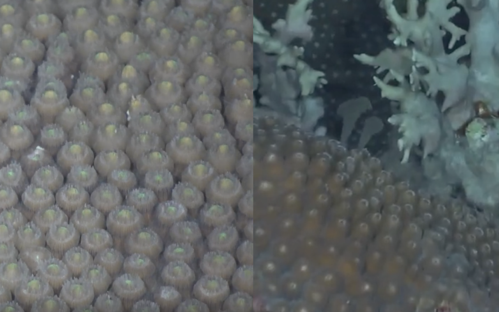

The Flower Garden Banks National Marine Sanctuary [FGBNMS](https://flowergarden.noaa.gov/) is located roughly 100 miles off the coast of Texas and harbors some of the highest coral cover in the Caribbean (over 50%). As a PhD student in the [Correa Lab](http://www.owlnet.rice.edu/~ac53/index.html) at Rice University, I have had the opportunity to assist with several research cruises that monitor these unique reefs. Most recently, I joined the [Davies Lab](http://sites.bu.edu/davieslab/) at Boston University on board the _R/V Manta_ on a NOAA Telepresence Cruise with the Global Foundation for Ocean Exploration [GFOE](https://engineeringfordiscovery.org) and FGBNMS.

As the research team for leg 2 of a 3-part telepresence cruise, we sought to document coral spawning activity beyond recreational diving limits using an ROV (GFOE’s _Yogi_), live streaming the dives to fellow scientists and the broader public to allow everyone on land to experience in real time the wonders of the synchronous coral spawning at the FGBNMS. Based on years of observation, NOAA scientists can accurately estimate when the stony corals in the shallower portions of the FGBNMS will spawn each year. However, due to logistical constraints (primarily the challenges of diving to such depths for any significant amount of time), coral spawning at the deeper depths in the FGBNMS has only been documented and reported once. We set out to: 1) document any deep (i.e. >45m) coral spawning activity, 2) determine if the deeper coral reefs have synchronous spawning with the previously documented timeframe for the shallow reefs, and 3) collect adult corals and coral spawn using the ROV, to test for thermal tolerance differences between relatively shallow (20-30m) and deep (>45m) corals.

Coral spawning generally occurs once a year in the warmest month and is timed with the lunar cycle, though some species with varied reproductive modes can spawn multiple times in a single year. In the FGBNMS, spawning usually occurs in August 7-10 days after the full moon. Individuals of hermaphroditic broadcast spawning species release sperm and egg bundles into the water column at the same time to maximize the likelihood of fertilization with other individuals. These eggs and sperm bundles float to the surface where they fertilize and become planulae. Gonochoric corals have separate male and female colonies and can also broadcast spawn. They release either eggs or sperm, and eggs become immediately fertilized by sperm in the water column to produce planulae. These planulae are then dispersed by ocean currents and, when the larvae are competent to metamorphose, eventually sink and hopefully settle on suitable substrate to start secreting their calcium carbonate skeletons. In addition to the timing with the lunar cycle, additional environmental cues such as water temperature may be involved in regulating the tight synchrony of coral spawning events.

Figure 1. Plating corals 40-50m deep at the FGBNMS. Image credit: GFOE/NOAA.

On the night of the big predicted coral spawn, we launched ROV _Yogi_ 45m down and successfully documented spawning of _Montastraea cavernosa, Orbicella franksi,_ and _Orbicella faveolata_.  _M. cavernosa_ is a gonochoric species; male _M. cavernosa_ colonies release sperm prior to the females releasing their bundles of eggs, and scientists think that the presence of sperm serves as one of the signals for the females to spawn. _O. franksi_ and _O. faveolata_ are both hermaphroditic species, and each colony releases bundles containing both egg and sperm. Normally, when we are scuba diving during coral spawning, we have to be strategic in determining the timing of the dive to maximize how much coral spawning activity we can observe. With ROV _Yogi,_ we were able to document a more complete window of spawning. Following our first observation of _M. cavernosa_ male spawning, ROV _Yogi_ remained in the water, watching half an hour later when the first female spawned and still a couple of hours later as females continued to spawn. This sort of data collection would be impossible to achieve using recreational scuba diving. Based on ascent rates of gamete bundles from the ROV footage, we are hoping to determine how likely it is that gamete release is timed so that deeper water corals can mix and fertilize with gametes of shallower water corals. This information, along with any information we gain about differential thermal tolerance of deep and shallow water corals, will provide context about the deep refugia hypothesis, which is the theory that deep-water habitats may serve as a refuge under climate change.

Figure 2. _Montastraea cavernosa_ eggs in the polyps on a female colony, soon to be released (left). Sperm released from a male _M.cavernosa_ colony (right). Image credit: GFOE/NOAA.

In addition to extending the time we were afforded underwater, ROV _Yogi_ and the GFOE engineers made it possible to take some unique samples during this cruise. By attaching a modified Erlenmeyer flask to the end of a suction arm on _Yogi,_ we were able to somewhat mimic the design of coral spawning tents that are traditionally used to collect gametes by research divers. _Yogi_ could hover over a spawning colony, and the buoyant egg-sperm bundles would collect in the flask and get transferred to a compartment in a rotating rosette. 

A couple of days before spawning, we also used _Yogi_ to collect samples of adult corals from the deeper coral reef depths, which we brought on deck of the _R/V Manta_ to spawn. We collected eight colony fragments from separate _O. faveolata_ colonies. Coral samples were collected under a scientific permit issued by FGBNMS, and also under consultation with the National Marine Fisheries Service (NMFS), as this species is listed as threatened. Not all of the colonies brought back to the boat spawned, but the ones that did spawned at the same time as conspecific (same species) colonies previously documented at shallower depths. Not only did these individuals of the same coral species spawn according to a predicted narrow window of their shallower counterparts, but the collected fragments on the boat also spawned at the same time. Observing this incredible synchrony has to have been one of the most astounding experiences of my time in the marine sciences. 

Figure 3. ROV _Yogi_ samples a plating coral. Image credit: GFOE/NOAA.

Participating in this teleprescence cruise was an incredible opportunity to document and live stream coral spawning to the public in real time. It allowed us to showcase a natural phenomenon that makes coral reef ecosystems so unique in a time when the future of reefs looks very bleak. Excitement was high on the boat - we even had someone tweet at us “tune in now to hear some very giddy scientists!” Hopefully the information we gain from this trip, and from future spawning trips to the FGBNMS, will help us better understand how healthy reefs, like those of the FGBNMS, might serve as refugia to global change. 

