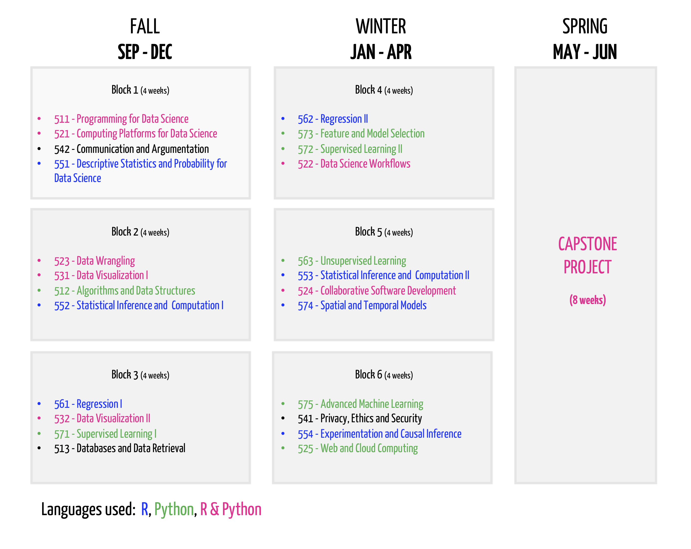
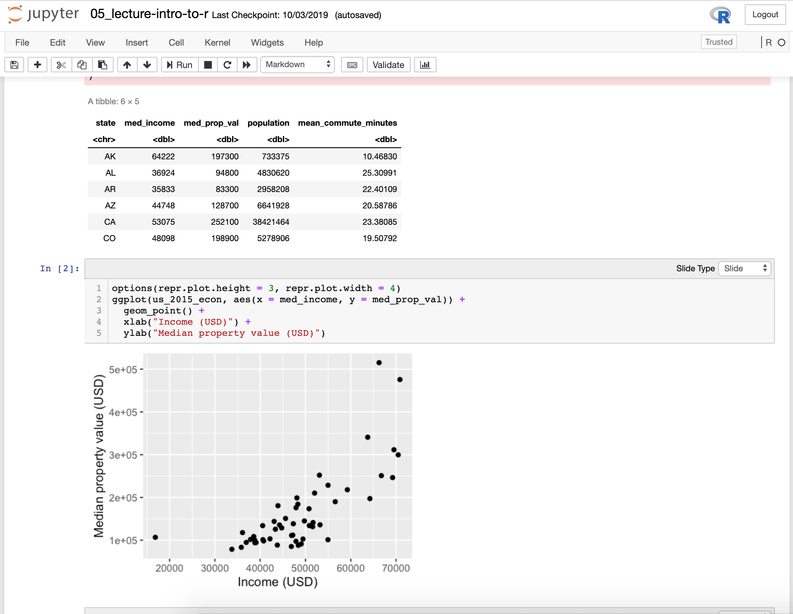
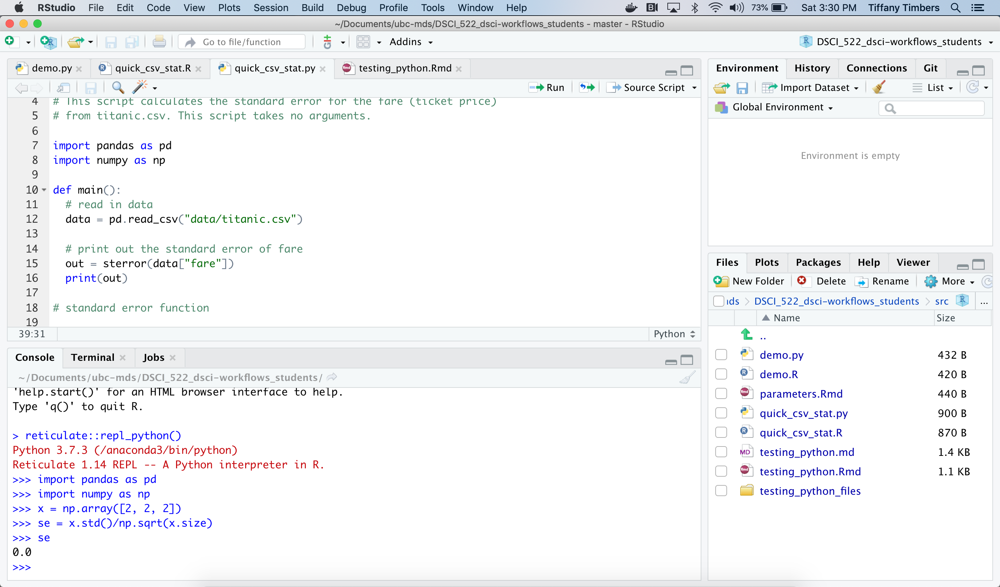
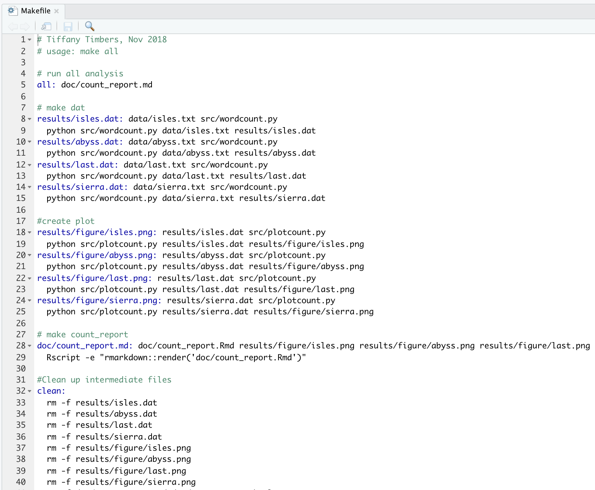

R and Python are the two leading languages used in industry and academia for data analysis. Thus, to best prepare students in the University of British Columbia's course-based, professional Master of Data Science (MDS) program to be competitive and perform on the job market we have made an explicit decision to have our program teach both the R and Python programming languages. 

Students are concurrently introduced to R and Python in the MDS in the first week of the program, and exposed and challenged to do work in both of these languages for all 8 months of their coursework. In some courses, students learn the same skills in both languages (e.g., general programming, data wrangling, visualization, software development and packaging) and in other courses we specialize in one language in order to go more deeply into that topic (e.g., statistical inference in R, and machine learning in Python). In the 2 month-long Capstone project at the end of the program, students are work with their Capstone industry, government or not-for-profit partner to choose the language that best suits the project based on the problem and the language the Capstone partner's organization uses. Below we show a breakdown of how these languages are distributed across the program:

 Distribution of the R and Python programming languages across the University of British Columbia's Master of Data Science program courses.

MDS has spent a significant amount of time considering which tools to teach to enable students to work harmoniously in both R & Python, as well as how to blend these languages within a data science project. Below we list the tools that we teach in the program for working in **both** R & Python, as well as some we specifically use for blending between the two languages within a single project:

* [RStudio](https://rstudio.com)
* [Jupyter](https://jupyter.org/)
* [knitr](https://yihui.org/knitr/) & [R Markdown](https://rmarkdown.rstudio.com/)
* [feather file format](https://blog.rstudio.com/2016/03/29/feather/)
* [reticulate](https://rstudio.github.io/reticulate/)
* [Make](https://the-turing-way.netlify.com/make/make.html)
* [Docker](https://www.docker.com/)
* [plotly Dash](https://plot.ly/dash/)

### Examples of how we use and teach these tools

In the first month of the program, students are taught to how to program in both R & Python concurrently. To reduce excessive and uneccessary cognitive load we choose to teach both of these programming lanuages using the same simple code editor - Jupyter (which also allows us to easily use automated feedback and grading on coding assignments - more on this later). This lets students quickly learn **one** simple editor, allowing them to then focus their efforts on learning the two programming languages.

Example of using a Jupyter notebook as lecture notes to teach programming in R for Data Science.

Near the end of the first month in the program, we next start moving the students into a more powerful editor - RStudio. We first have them use RStudio to edit, create and run literate coding documents using R and R Markdown. Then a month or so later in our workflows course, we teach them to use RStudio to develop and run R scripts, as well as Python scripts and R Markdown documents that use Python as the coding engine. This tool use is continued in our collaborative software development course (where they learn to package R & Python code into packages). Having one powerful interactive development environement (IDE) that can be used for both languages is very nice and efficient for the students as they only need to learn the in's and out's of one IDE and they can then do most of their data science things from one place. 

Example of using RStudio as an IDE to develop and run a Python script.

When we teach students how to automate the running of scripts in a specified order, as in a data analysis pipeline, we use and teach the tool GNU Make. Many R and Python-specific tools exist to accomplish this task (e.g., drake, snakemake, etc) but we have chosen GNU Make because it is language agnostic (it can incorporate scripts written in any programming language), it is a good introduction-level tool for pipeline automation, and it is a tool currently used in industry. Furthermore, alumni have reported that learning GNU Make in MDS has facilitated their self-learning on more advanced pipeline automation tools after MDS, such as Apache Airflow and Luigi. 

Example of a Makefile that has been written for the purpose of automating a data analysis pipeline.

In MDS, we focus on teaching the use of containers, such as Docker, to create reproducibile, sharable and shippable compute environments for data anlalysis projects. We chose to focus on containers (e.g., Docker) for a similar reasons to why we chose to focus on GNU Make - it is language agnostic, working with both R & Python (in contrast to other language specific tools like packrat and virtualenv) and is currently used in industry. Additionally, Docker has added advantages 
in remote computing compared to using a tool like conda alone (which also works with R & Python), and thus learning Docker has several additional advantages.

Example of a Dockerfile and a hosting of the resultant Docker image on Docker Hub that can be used for creating a reproducibile, sharable and shippable compute environments for a data anlalysis project.

Finally, to teach creating interactive data visualizations and dashboards in R and Python, we choose the tool plotly Dash as it is now (as of 2019) compatible with both R and Python. Our choice for plotly Dash is built upon the same rationale as why we choose to use the same IDE for both R and Python - to minimize the unecessary and extraneous cognitive load of learning different systems for different languages when it is not absolutely necessary. By focusing on the same dashboarding tool, the framework and deployment challenges remain the same, and then students can just focus on the language differences. 

Example of using R with plotly Dash to create an interactive data visualization dashboard.

### Pedagogical challenges of teaching R and Python concurrently

Teaching a data science program in two languages in 10-months does not come without its challenges however. Below we list 
the top 3 we have faced and discuss what we have done to try and address them. 

- Mixed proficiencies of previous R & Python programming skills between students
- Dual task interference
- Memory decay during breaks in practice

#### Mixed proficiencies of previous R & Python programming skills between students

Given the diverse backgrounds of our MDS students (which we see as a great strength of the program), our students begin MDS with mixed proficiencies of previous R & Python programming skills. To be accepted into the MDS program, students must satisfy our computer science pre-requisite (successfully completed at least one university-level programming course), however this course could have been in any programming language. Thus, although all our students have some foundational programming skills when they start MDS, some have never programmed in R, some have never programmed in Python, some have never programmed in either of these languages and some are proficient in both. This leads to some students needing more help at the beginning of the program to learn these languages, and to some students being "bored" because they already have experience and some level of proficiency in one or both languages.

The most effective solutions we have arrived at thus far to address this challenge are a two-pronged approach. To support the more novice R and Python learners we provide coding questions that have immediate feedback (via visible code tests) and hints within MDS homework assignments. This has the added benefit of allowing us to autograde the questions using a tool called nbgrader (which works in both R & Python). In addition to this, we share external resources, such as the `swirl` R package, where students can get more practice (with automated feedback) to further solidify and strengthen their skills. To support and motivate the more experienced R and Python learners we include more advanced optional questions in our MDS homework assignments to help improve their programming skills even further.

#### Dual task interference

When learning two programming languages concurrently, students are faced with dual task interference. Dual task interference is defined as a decrease in the performance of a task when people try to do two things at the same time. In the MDS program, this can happen as they learn the R and programming languages at the same time. This makes it easy for students to mix up aspects of the languages, such as which language counts from 0 versus 1, which uses the `type()` versus `typeof()` function for checking types, which language uses strict vs lazy evaluation when evaluating function arguments, and so on. 

To address this challenge we try to meet this head-on by including learning outcomes in our shared-language courses that communicate that we expect students will learn to compare and contrast the diffences in the course topics between the languages. By making this learning outcome expectation explicit, we communicate to the students and ourselves, the instructors, that time must be spent on these differences. Thus, we present and discuss these differences in the lectures, have students practice and apply this knowledge in the MDS homework, and finally, assess students knowledge of these differences on quizzes and projects assignments. 

#### Memory decay during breaks in practice

With any memory, both experiences and learned skills, without activation via recall and/or practice there is decay in the strength of that memory. We observed our students experience this in the first year of the program in the context of their ability to program in Python; there was a block of courses midway through the program where the students used R for all the courses and thus had no requirement to practice Python. This caused no problems within that block, however in the following block when they had courses that required them to use Python again a lot of students struggled. They were able to complete the homework, but they reported that they had a hard time remembering some of the things they had recently learned in Python, as well as that it took them longer to complete the Python homework at the beginning of that block. 

Each year thereafter, we have worked hard to keep improving the balance of the languages across all blocks of the program. We now include at least one-course worths of instruction and homework in both languages every block. This ensures that there is some amount of consistent practice on both languages for the duration of the entire program. This has the added benefit that when students take-on their first job after completing the program, they have had 8 months of practice in both R and Python and are thus primed to start work in either language, not needing time from their new employer to "get up to speed" again on a language they learned and then forgot.

### Summary

Over the last 4 years we have experimented and oberved our teaching practices and student learning in a data science program that teaches both R & Python. We believe that teaching the two leading languages used in industry and academia for data analysis provides our students with a competitive edge and more opportunities once they graduate from MDS and search for their first data science job. However, we also believe that integrating R & Python into a data science program should not be done haphazardly and care and concientiousness must be taken to do this sucessfully. We end here with our top four recommendations for those who are considering doing this for their data science programs:

1. Carefully choose tools that work well with both languages, and skip the ones that don't.

2. Expect students to have a heterogeneous knowledge base that may differ between languages, and design exercises to address this.

3. Teach the R'isms and the Python'isms and have the students compare and contrast them. Also, asses them on this!

4. Structure the program so students repeatedly practice both languages, avoid gaps in one language if possible!

--------

## Authors:
[Tiffany Timbers](https://www.tiffanytimbers.com/) is Option Co-Director of the MDS Vancouver program and an Instructor in the UBC Department of Statistics.

## Acknowledgements: 
I would like to acknowledge all the other Master of Data Science core teaching team members (current and past) and the MDS founders who have all helped shape our vision of how to effectively integrate the teaching of R & Python into the MDS program. As well as [Ian Flores Siaca](), an MDS Alumbi who contributed helpful and insightful feedback and discussion for this blog post.

### Master of Data Science core teaching team members

#### Current
- [Mike Gelbart](https://www.mikegelbart.com/) 
- [Vincenzo Coia](https://vincenzocoia.github.io/)
- [Varada Kolhatkar](https://kvarada.github.io/)
- [Rodolfo Lourenzutti]()
- [Firas Moosvi]()
- [Thomas Beuzen]()

#### Past
- [Guilio]()

### Master of Data Science founders
- [Jenny Bryan]()
- [Paul Gustafson]()
- [Raymond Ng]()
- [Gail Murphy]()
