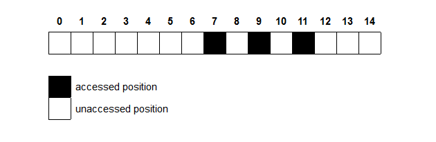
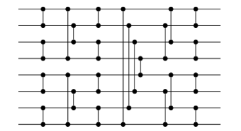
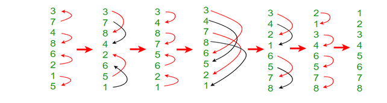
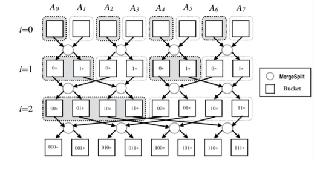
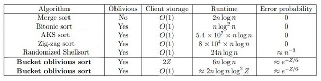
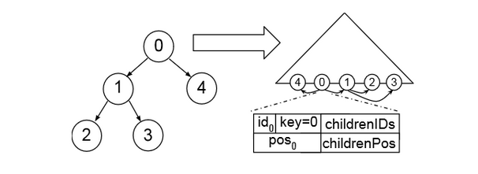
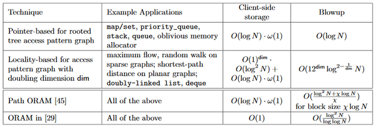

In the previous post to this blog, the authors described efficient methods for storing information obliviously, a scheme known as ORAM. They described powerful general paradigms which could store broad classes of data on an adversarial server. In this post, we will describe more specific applications of ORAM to a particular algorithm, sorting, and a particular data structure, a stack.

By narrowing the applications of our ORAM system, we can obtain substantial improvements to performance, sacrificing unnecessary generality in order to reduce the bandwidth load on the server and the amount of data which must be stored by the client.

## Motivation

You and your best friend had recently founded your dream startup Cloud Bank, the first Cloud-based bank of its kind. You both truly hedged all of your hopes and dreams on this idea, your friend even dropped out of college to dedicate their time to making sure your efforts come to fruition. So, you are determined to not cut any corners and show the world what you are made of.

Being short on cash, you decided to host all of your data on Google Cloud. Currently, your data mostly only consists of your customers' account balances, arranged in ascending order. For good measure, you also encrypted the balances so Google cannot figure out the balance of any customer’s account, even though Google might be able to make an educated guess and conclude the data is somehow sorted.

## The Problem

Currently, for every new customer you get, you upload their new balance into the correct position in your sorted and encrypted list. To do that, you use Binary Search to find the correct spot for the new customer's data. This, of course, involves repeated comparisons between the value of the new customer cn and one of the old customers ci. For each comparison, you are going to access ci on the Cloud, download it, unencrypt it locally, and compare it against cn. Eventually, you will find the correct position for cn among your uploaded data and all that is left is to encrypt cn then upload it into the correct position.

However, something still irks you. You do not trust Google, and you think they might be trying to figure out any information that they can on the balance in your customers’ accounts. You then realize that Google can look at the positions you accessed, graphed above, and correctly deduce that the balance deposited into the new account must be greater than at least half of all other accounts as no positions were accessed in the left half of your array. In other words, Google now knows that the new account balance is greater than all accounts on positions 0 through 6. In fact, if Google specifically instructed someone to deposit a specific amount of money into a new account with your bank, they can eventually figure out an accurate approximation on the balance in each of your customer's accounts.

This immediately sends chills down your spine, such a security breach is absolutely unacceptable and must be remedied immediately. You try your hand at a few other algorithms for sorting the new account in position, but find out that all lead to similar problems. Finally, you correctly deduce that as long as your access pattern to the cloud varies depending on input, then Google can learn something about your encrypted data. If you truly wanted to keep Google’s nose out of your business, you will have to make sure that the behavior of whatever algorithm you implement is independent of the input.

Unbeknownst to you, you had just independently rediscovered Oblivious Algorithms.

## Oblivious Algorithms

Ironically, you went to Google to learn more about your problem. You later learned of the term Oblivious Algorithms. There seemed to be a whole class of algorithms under that name, all sharing the trait that the way they operate is  the same - from a certain perspective - independent of the input. Different algorithms would choose different aspects to obscure, but the idea still remains constant. Initially, this Obliviousness restriction sounds too unsurmountable that you are not entirely certain anything useful can be achieved while upholding it. However, you are later convinced that oblivious sorting is possible when you encounter the following oblivious procedure to sort four numbers:\
compareAndSwapIfNecessary(0, 1);\
compareAndSwapIfNecessary(2, 3);\
compareAndSwapIfNecessary(0, 2);\
compareAndSwapIfNecessary(1, 3);\
compareAndSwapIfNecessary(1, 2);

In the above procedure, all indices will be accessed a constant number of times regardless of the input. Therefore, this does qualify as an oblivious sorting algorithm against an adversary who has insight over the number of accesses made on each position. You also learn that your problem is entirely not unique, and that researchers have worked on oblivious algorithms and devised oblivious sorting algorithms decades ago.

## Bitonic Sort

The procedure you saw above was an example of Bitonic Sort, an oblivious sorting algorithm.

It expanded to any network of size $2n$ for any integer $n$. That does not sound awfully restrictive to you, as you can always pad your data with enough dummies to get it to the nearest greater power of two. Graphed below is a Bitonic network designed for exactly eight inputs.

The eight elements start as inputs from the left hand side and proceed to the right. Each vertical line indicates a comparison between two elements and a possible swap. By the time the elements exist from the right, they are sorted after exactly 24 comparisons regardless of input. You test the network out many times, and it always holds.

## Under the Hood

Bitonic Sort focuses on the creation of Bitonic Sequences. A sequence of numbers can be called bitonic if it is first increasing then decreasing, or vice versa. Fully increasing and fully decreasing sequences are also considered bitonic. Bitonic Sort builds on the following property:

Consider a bitonic sequence $S = \langle a_0,a_1, \ldots ,a_n \rangle$ such that $a_0 \leq a_1 \leq \ldots \leq a_{n/2-1}$

Create the following subsequences:

$s_1 = \min(a_0,a_{n/2}), \min(a_1,a_{n/2+1}), \dots, \min(a_{n/2-1},a_{n-1})$

$s_2 = \max(a_0,a_{n/2}), \max(a_1,a_{n/2+1}), \dots, \max(a_{n/2-1},a_{n-1})$

It then follows that both $s_1$ and $s_2$ are not only Bitonic but also for all $ x,y $ s.t. $ x \in s_1, y \in s_2, x  < y$

Applying the same merge concept recursively on both $s_1$ and $s_2$ will then yield a sorted list. However, this builds on the assumption that the original sequence was, in fact, bitonic. To sort a random sequence, Bitonic Sort first transforms the whole sequence to a bitonic sequence then sorts that as described above.

The way the Bitonic Sort transforms a random sequence into a bitonic one is quite clever.

First, consider an input of size $2n$, that input is then split into $n$ pairs.
 Sort all pairs in odd positions (1st, 3rd, etc) in ascending order, and all pairs in even positions into descending order.
Notice that after step (2), each two consecutive pair forms a bitonic sequence which can be fully sorted as described above to create $n/4$ sorted sequences.
The process above is then repeated to create larger and larger bitonic sequences until the entire initial sequence is bitonic. At that point, the merge procedure from above could be used to fully sort it. The following example provides a good visual aid:

You notice that Bitonic Sort even when applied to a random sequence still assumes that the number of items is on the form $2^n, n\in\mathbb{N}$ or else the recursive step would not work properly. However, with some modification, Bitonic Sorting can actually be used to create a sorting network of size n not a power of 2.

## Bucket Sort

Although being the go-to example when discussing oblivious sorting algorithms, Bitonic Sort is by far not the only oblivious sorting algorithm nor is it the fastest. After some searching, you come over the following construction of Bucket Sort that takes that idea to the next level:

“The MergeSplit Procedure takes elements from two buckets at level i and put them into two buckets at level $i+1$, according to the $(i+1)^{th}$ most significant bit of the keys. At level $i$, every $2^i$ consecutive buckets are semi-sorted by the most significant bits of the keys.”

## Oblivious vs non-Oblivious Runtime

You are still somewhat skeptical, all of this obliviousness must come at the cost of runtime right?

Well, yes and no. For once, Oblivious Sorting generally, and Bitonic Sort specifically, lead themselves very nicely to parallelization. Had your Cloud Bank had a large number of computers, you could have had all the comparison and swap operations in every level of Bitonic Sort run in parallel since the result of each operation is independent from the rest. Running Bitonic Sort on parallel like so would mean that you would finish in real time linear in the number of levels.

Furthermore, by introducing a negligible error probability several algorithms manage to get very close to the $O(n\log n)$ theoretical limit of sorting. The following table is of particular interest in this regard:

What else could be oblivious you wonder? So you Google on, still unaware of the irony.

## Oblivious Data Structures

Now that you have started your company, you are extremely busy, and need a way to store a list of your tasks. You want to store your task list on a Google server, but don't want Google to have access to your data. you can encrypt your files, and Google will not be able to tell which tasks were completed, but Google will still know when you check something off the list, and you do not want to give up that information. Recalling your previous work setting up the server, you shift your attention to the world of Oblivious Data Structures.

Unfortunately, making the data oblivious will come at a steep price. Large segments of your data will need to be decrypted and re-encrypted each time you open a file. If you only decrypted the data that you need, then Google would know exactly when you had completed a task, and how many tasks remained. Therefore, you will need to encrypt a much larger segment of data in order to cover your tracks. This will take time, and because Google’s server is doing the work, it will cost you money as well.

## The Structure of Your Data

Fortunately, there is some information about your habits that you are willing to give up. In particular, you are fine with Google’s knowing that you like to do your tasks in order. Whichever task was most recently added to the list will be the first one you accomplish. To facilitate this work pattern, you store your data in a stack, a data structure which resembles a stack of chairs in an auditorium. Only the top chair can be removed safely, or else the entire stack would collapse. In addition, any chair which would be added to the stack must be added on top of the others. your access patterns are similar. you will only work on the most recently added task in the list.

Until recently, similar to how cable channels are bundled together, you would need to encrypt and decrypt far more information than you wanted to encrypt, even though this operation was hiding information that was not secret. Just as a cable bundle would force you to pay for channels that you would never watch, this encryption scheme would force you to perform far more computation than was necessary to accomplish your goal.

## Using This Structure

You can recall the scheme used in the previous blog post for tree based ORAM. This post described a scheme where the running time of an ORAM scheme could be improved by storing the data in a tree, and storing a map to each datapoint. These maps will take up less space than the original dataset, so they can be stored client side, or if the client does not have enough storage, a new ORAM can be created on the server which stores the position data. This can be done recursively, reducing the size of the data with each new ORAM stored, but with each new ORAM, the time to access the data increases as well.

You realize that the structure of your data is much nicer than the structure of a general dataset. In particular, you do not care about the position of any datapoint except the one you most recently added. After observing this, you begin to think that it is silly to create this complex set of trees to store the positions of data points, when all you really care about is one location.

Your solution is that if task B is added before task A, then you will store the location of A with B. Afterall, you will not start on A without first finishing B, so it seems natural to give yourself a way to expedite opening A after you have accessed B.

Storing the locations in this way, you do not have to go through your entire location storage system with all the associated encrypting and decrypting each time you want a file. You are able to combine your location access step with your previous file decryption, effectively killing two birds with one stone.

This diagram shows how we might generalize this oblivious stack. Here, we assume that we will only access datapoints 1 and 4 after accessing 0, so we store the locations of 1 and 4 with datapoint 0. In order to maintain the efficiency of this system, we must ensure that the graph of potential accesses is “sparse”, that is, from a given datapoint, there are only a few possibilities for the next datapoint we access. That way, the positions of those data can be stored without blowing up the size of the previous datapoint.

The other critical assumption is that this access graph is a “tree.” That is, each node can be reached from only one other node. This way, when we update position information of a node, we only need to modify the position information in its parent (which we had already accessed recently if we are modifying its child), and we do not need to worry about inaccurate position data floating around somewhere else in the graph.

## Time and Space Comparison

Below is a table comparing these oblivious data structures to their non-oblivious counterparts. Path ORAM and ORAM are algorithms which do not require any structure in the data. “Pointer based” describes the system we used for the task list.

This is a powerful system, as it allows you to exploit the fundamental structure of your data to only encrypt the data which matters to you. You can keep a large amount of information out of Google’s hands while still storing it on their servers, and even hide the details of your access patterns.

In particular, we see that by specifying the situation to which we want to apply the algorithm, we can reduce the bandwidth blowup of the data from essentially $O(\log^2 N)$ to $O(\log N)$. This will substantially reduce computation time and reduce the amount of interaction necessary with the server.

## Conclusion

In order to store data securely on a server, not only do we need to store the data in an encrypted way. We must also store the data in an oblivious way to make sure that our adversary cannot derive any sensitive information from our access patterns. Many times oblivious calculations will be far less efficient than their non-oblivious counterparts, leading to significant time and space costs for the user. In this post, we have outlined two approaches to maintaining the security of an oblivious system while reducing the catastrophic effect on our runtime that oblivious computation can have.

In particular, we have outlined an oblivious sort, a system that can sort data stored on an adversarial server without revealing any information about the structure of the data before or after the sort is performed. Astonishingly, this computation can be performed with little to no additional overhead over a non-oblivious sort.

In addition, we have outlined the construction of an oblivious stack. These structures use a clever technique to exploit the structure of the data to hide information about the user’s access patterns without needing to do the enormous computations necessary to run a full oblivious RAM.
