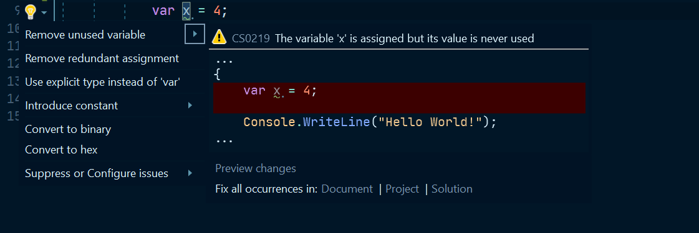

I recently started reading up on the subject of the [.NET Compiler Platform and SDK](https://docs.microsoft.com/en-us/dotnet/csharp/roslyn-sdk/)
(aka **Roslyn**) and all the things you could do with it in terms of
code quality, analyzers and code fixers.

First of all there there is a lot of materials on Roslyn out there from the
official Microsoft Docs to collections of blogs, Github repositories and open
source projects, so this article wont go into details beyond trying to give some
high level context for the rest of the post.

So what is the .NET Compiler Platform known as Roslyn all about?!

- Roslyn is a set of APIs and Services usable through an individual SDK, that allow us to access the .NET Compiler pipeline and have access to a lot of information about lots of aspects of our projects and code.
  - It also includes APIs that enable us to make changes to the code or projects via our own implemented refactoring actions.  
- The .NET Compiler pipeline breaks down the code compilation in several steps. Roslyn allows us to hook in each of those and access different types of information.
- We have access to low level `Syntax Trees` that describe how the code is
  structured
  - `Syntax Trees` are data structures that describe the syntax or structure of the code.
  - The `Syntax Tree` is expressed through types classes and collections of different types of nodes.
  - The example we will look at will use the `Syntax Tree`, the collections of different types of `Syntax Nodes`, `Syntax Tokens` and `Syntax Trivia` to determine if the problem issue is present. More
  - More Information [Here!](https://github.com/dotnet/roslyn/wiki/Roslyn%20Overview#working-with-syntax)
- We can build or modify our own `Syntax Trees` which means building and modifying code using the `SyntaxFactory` and other Roslyn API constructs.
- We also have access to APIs and services that can tell us how the code is
  interconnected, and what it actually and how it is interpreted beyond just the syntax through the `Semantic` analysis APIs.
- On top of all this there are also APIs that allow us to perform major changes
  that range from code refactoring to project and solution level refactoring and changes.

{: .box-note}
Another aspect of the .Net Compiler SDK are the project templates which we can use to implement our own tools that utilize the SDK. The output of these projects are Visual Studio Extensions that can be installed and used during development.
{: .box-note}

The primary goal of this set of articles is to go over the implementation of a basic code analysis tool that comes with a simple fix for the issue it's reporting.

What we are essentially therefore building is a`Visual Studio Extension` others can install, that notifies us if our code has specific issue and offers automatic refactoring to get rid of the problem.

For a lot more information presented in a much more better way check out
the documents [here.](https://github.com/dotnet/roslyn/wiki/Roslyn%20Overview#introduction)

### Term and Concept Introductions

Two key terms that will be used through the article are `Diagnostic/s` and `Fix Provider` or `Fix`.

#### Diagnostics

Diagnostics are what we use to refer to the issues or problems our analysis tool  or Analyzer is going to show/report if the extension was installed in an instance of Visual Studio and if the problem we are analyzing the code for is present.

Visual studio and tools like ReSharper already come with a large set of Analyzers that report different types of diagnostics.

An example of a reported  Diagnostic in the VS IDE is:

`The Variable 'VAR_NAME' is assigned but its value is never used`

Diagnostics are reported and visible on the UI with squiggly lines under the relevant code and actions (and quick actions) on the left hand side to apply the fixes.

#### Fix or Fix Providers

Fix Providers or Fixes are changes to code that can be applied to get rid of reported Diagnostics. An example of a Fix for the above Diagnostic would be:

`Remove unused variable`

Fixes are visible on the UI and can be "applied" via quick actions to any diagnostic.



## The sample problem

The problem that our basic extension will address is a potential code smell of having multiple method calls using the same parameters in the same block of code.

{: .box-warning}
For the purposes of the example we make some initial assumptions about the methods and the code. The example analyzer and fixer therefore are not complete and can further be extended to cover a large set of edge cases we will touch upon in the later articles.
{: .box-warning}

The simple example that illustrates the issue:

``` csharp
// ...
public static void Main()
{

  var input = "Bar";

  if(Foo(input) != null)
  {
      Console.WriteLine(Foo(input));
  }
  
}

public static string Foo(string input){
  if(input.Length > 2){
    return "FooValue:"+input;
  }
  else{
    return null;
  }
}
// ...
```

<div class='code-example-header'>
  <b>Code Example 1 - Problem Code</b>
</div>

The data the method returns for the same `input` is used in several places in the `Main` code block. If the method did something that was quite expensive for the program it would be better to have a single call and store the result instead of making multiple calls.

Additionally `Foo(string input)` is a pure method. Every time it is called with the same parameter the value returned is the same.

Because of all this the two calls in `Main()` are therefore not needed. Even though `Foo`  is very simple we can "save" a call even in this simple program by storing the return value from an initial call in a variable. The "fixed" output therefore would be:

``` csharp
// ...
public static void Main()
{

  var input = "Bar";

  var fooResult = Foo(input);
  if(fooResult != null)
  {
      Console.WriteLine(fooResult);
  }
  
}

public static string Foo(string input){
  if(input.Length > 2){
    return "FooValue:"+input;
  }
  else{
    return null;
  }
}
// ...

```

<div class='code-example-header'>
  <b>Code Example 2 - Fixed code</b>
</div>

This is exactly what our sample analyzer and code fixer will do!

## The Project Template

We will now look at the Project Template we use and go over the solution it creates. As mentioned installing the SDK for Roslyn allows us to use the templates it provides to create the Extension that will contain the our analysis and fix provider code.

We will use the  `Analyzer with Code Fix (.Net Standard)` which out of the box creates a solution with 3 Projects.

If we create a new sample `BlogAnalyzer` solution based on the template we get the following projects created:

- BlogAnalyzer
  - The Project containing the Analyzer and Fix Provider that already register with the Roslyn APIs and contain initialization code that can be configured to address our specific problems.
- BlogAnalyzer.Vsix
  - Vsix are projects that build and generate Visual Studio Extension Installers. This one references the `BlogAnalyzer` and packages the Analyzer and Fix provider in an Visual Studio extension that can be installed in Visual Studio
- BlogAnalyzer.Test
  - Test project containing initial tests as well as a set of test helpers specifically built out to follow a TDD approach for our extension.

{: .box-note}
The example problem the default template project is addressing is a fictional code smell of lowercase Type/Class names.
{: .box-note}

## Developing from the template using TDD and the Vsix project

Because of the nature of the solution and the output being a Visual Studio Extension the test project is going to be key in quickly developing the analyzer and fix provider.

The test project comes with a set of helpers, asserters and other classes. These are all nicely integrated with existing Roslyn classes like [`Document`](https://docs.microsoft.com/en-us/dotnet/api/microsoft.codeanalysis.document?view=roslyn-dotnet) and others used for verifying our extension code.

An overview of the test project setup and the key pieces:

- Verifiers
  - `DiagnosticVerifier`
    - Used to verify/assert the diagnostics reported from the our Analyzer.
  - `CodeFixVerifier` which inherits from the `DiagnosticVerifier`
    - Used to verify both the reported diagnostics and code fixes after they are applied as provided by the Fix Provider.
- Helper Classes
  - `DiagnosticResult`
    - A class we can use to create expected objects on the `Diagnostics` reported by our Analyzer
  - `DiagnosticVerifier.Helper`
    - Additional helpers and extensions for the Diagnostic Verifier
  - `CodeFixVerifier.Helper`
    - Additional helpers and extensions for the Diagnostic Verifier

The main test file for our solution is `BlogAnalyzerUnitTests.cs` which inherits from the `CodeFixVerifier`. It contains two test methods as a starting point:

- `TestMethod1()`
  - Asserts that our extension does not report issues when it should not. It asserts this with a simple empty string.
- `TestMethod2()`
  - Asserts that the extension both reports the diagnostics and that the code fix is valid. The test case is a simple class declaration.

{: .box-note}
Remember the template code issue being analyzed is a fictional one where we assume a convention of Class/Type names being all uppercase.
{: .box-note}

The text case used and expected result used in`TestMethod2()`:

``` csharp
var test = @"
  using System;
  using System.Collections.Generic;
  using System.Linq;
  using System.Text;
  using System.Threading.Tasks;
  using System.Diagnostics;

  namespace ConsoleApplication1
  {
      class TypeName
      {
      }
  }";

 var fixtest = @"
  using System;
  using System.Collections.Generic;
  using System.Linq;
  using System.Text;
  using System.Threading.Tasks;
  using System.Diagnostics;

  namespace ConsoleApplication1
  {
      class TYPENAME
      {
      }
  }";

```

<div class='code-example-header'>
  <b>Code Example 3 - Fix Provider Test Data</b>
</div>

Moving  forward we can refactor these methods to better suit our needs.

We can also turn the test methods to `DataTestMethods` where we can supply both the code input and expected output via test data parameters.

### VSIX Project

We can also always use the `.vsix` project to test out our extension. `Vsix` projects can run in `Debug` mode. This starts a new debug instance of Visual Studio with our extension installed.

We can use this instance to create a new project (any kind), start writing some code and introduce the issues we are looking for intentionally. We should then see our extension report the diagnostic and provide us with the quick fix actions to fix it.

This is useful to test out the UI aspects of our extension as we can define some text/string values that explain to the developers using our extension what problems were found.

For example we can define a UI string for our action: `Clear multiple method invocation` - Which is something we can visually test when we are actually using the extension.

{: .box-note}
Important to note that VSIX is a much broader project type. It can be used to implement may types of extensions for Visual Studio that go beyond
just code issue analysis and fixes. Example: VSIX can also install/extend the default project templates.
 {: .box-note}

## Additional Tools

To help us out with the analysis,  visualizing the issue try to discover as well as the fixes and new code we need to construct we can use some very useful tools.

### Visual Studio Syntax Visualizer

The Visual Studio `Syntax Visualizer Window` is available after installing the .NET Compiler SDK. It's one of the more useful tools to understand how the `Syntax Trees` are constructed, the types of nodes/tokens/trivia compose them and how they can be traversed and searched. This is all critical for the Analyzer part of our extension.

If we use the `Syntax Visualizer` for `Code Example 2` we would get the following view:


We see that our code is represented by a tree like structure of typed objects with the `CompilationUnit` as the root. `CompilationUnit` translates to a source code file.

Besides the tree structure, the visualizer offers a Properties panel where we can see additional useful details for each of the selected nodes in the tree.

We notice some interesting nodes like `InvocationExpression`, `LocalDeclarationStatement` and `Block` that we might potentially use to analyze and search for our problem code. We will look at all of these in more detail in the next article that covers the analyzer part of our extensions.

### Roslyn quoter

Another useful is the [Roslyn Quoter](http://roslynquoter.azurewebsites.net/)!

It's a web tool where you can paste any piece of valid C# code and it would generate the `Syntax Factory` Code to generate the snippet/method/expression/source file.

For example we can take the `Foo()` method from our Code Examples and paste it in the editor window, select `Parse as Member` and `Get Roslyn API calls to generate this code file!`

This would give us the Roslyn Calls starting with `MethodDeclaration` to build out the `Foo()` method! This is using the [SyntaxFactory](https://docs.microsoft.com/en-us/dotnet/api/microsoft.codeanalysis.csharp.syntaxfactory?view=roslyn-dotnet) but by default assumes SyntaxFactory has been referenced as a `using static`.

We can select the `Do not require 'using static Microsoft.CodeAnalysis.CSharp.SyntaxFactory;'` option if we want to also see the actual usage of `SyntaxFactory`

``` csharp
public static void Main()
{
  SyntaxFactory.MethodDeclaration(
    SyntaxFactory.PredefinedType(
        SyntaxFactory.Token(SyntaxKind.StringKeyword)),
    SyntaxFactory.Identifier("Foo"));
    // .... Rest Of The Code here
}
```

<div class='code-example-header'>
  <b>Code Example 4 - Syntax Factory Usage</b>
</div>

## Summary

The goal of this initial post was to try and introduce the .NET Compiler Platform SDK (Roslyn) and some of the possibilities it offers for solving code smells by looking at the given example issue.

This post also covered some of the basic tools we can use to achieve the goal:

- The `SyntaxTree` is the `tool` we use to identify the issue.
- The `SyntaxFactory` is the `tool` we use to fix the issue and generate new code.
- The `Syntax Visualizer` is going to help us identify the syntax nodes involved in our code smell.
- The knowledge of `Roslyn APIs` that integrate with the Compiler Pipeline allowing us to hook in the developer experience and run code that reports diagnostics and provides fixes.
- Bringing all of this together is the job of the  `Analyzer with Code Fix (.Net Standard)` template.
  - The projects it generates are the umbrella that brings everything together as a VS Extension project.

The next parts of this article series will look at  `how`  we use the above tools to both analyze, report and fix our example code smell!

If this all sounds interesting and you want to find out more please have a look at this collection of appropriately named "awesome" list or Roslyn resources:

- [Awesome Roslyn!](https://github.com/ironcev/awesome-roslyn)
