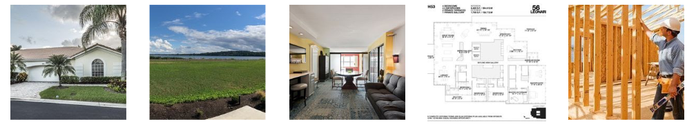
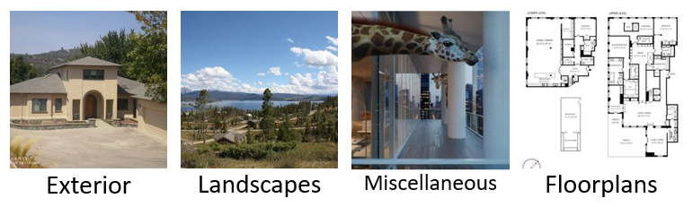
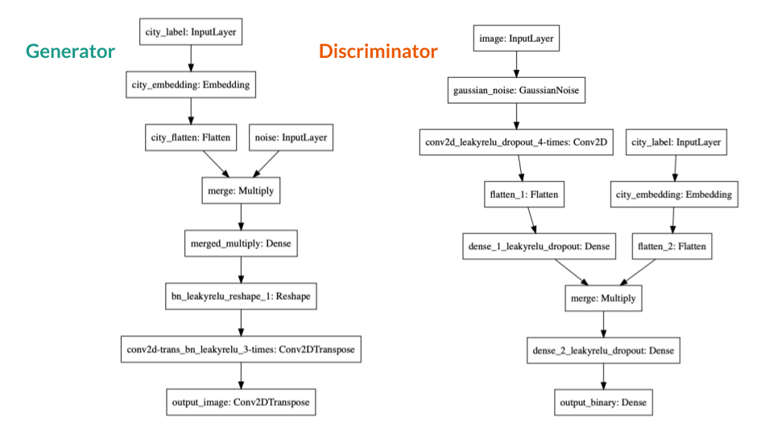
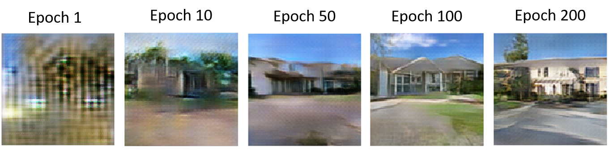
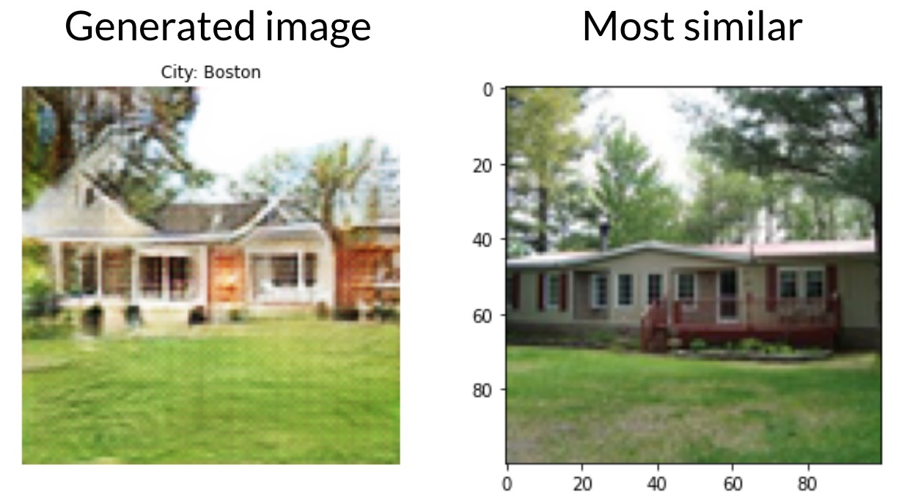
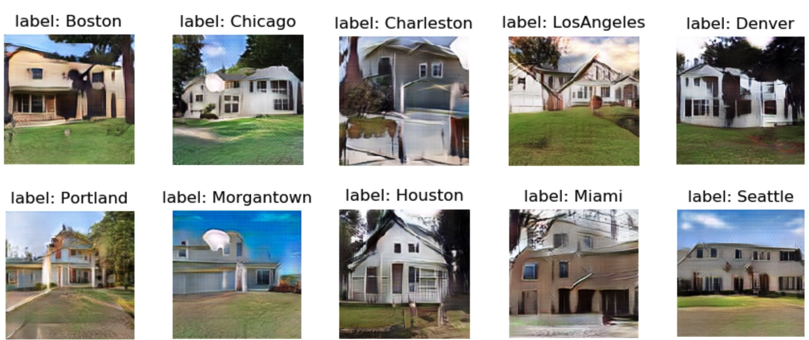

Before starting, I wanted to give a brief introduction to the project, as well as give a special thanks to the team I worked with. This project was done for [realtor.com](https://www.realtor.com/) as a UBC MDS [capstone project](https://ubc-mds.github.io/capstone/about/). The team -- [Braden Tam](https://github.com/bradentam), [Florence Wang](https://github.com/fsywang), [Hanying Zhang](https://github.com/HanyingZhang) and [me](https://github.com/AndresPitta) -- was given the task of using image generation to generate realistic pictures of neighbourhoods. The solution will address the issue of having empty thumbnails for some specific pages of the website. It is also worth mentioning that the images are not related to house postings (because we cannot sell a house that does not exist), but it is more related to the aesthetics of the website. Now that we know what the project is about, let's start.

### GANs

Image generation is a field that has become very popular recently. The task of the models in this field is to generate new images based on an existing dataset. The image generation technique I am going to focus on this post is called [Generative Adversarial Networks](https://en.wikipedia.org/wiki/Generative_adversarial_network) (also known as GANs on the streets). This framework is built with two opposing networks: one is called the Generator and the other one is called the Discriminator. The idea of the Generator is to generate realistic images, and the idea of the Discriminator is to classify whether these images are real or not. The Generator tries to improve by trying to fool the discriminator, while the Discriminator tries to improve by not being fooled. During the training phase, the Generator and the Discriminator will iteratively get information from the source dataset until the Generator is able to generate images that are realistic enough to fool the Discriminator.

Here's an image from the Tensorflow documentation that illustrates this idea:

If you want to learn more (and see where the image was taken from), see [here](https://www.tensorflow.org/tutorials/generative/dcgan). It's Tensorflow's tutorial on GANs.

### The data

Our capstone partner provided us with around 200,000 images. Some examples are shown below:   

Most of the pictures contained your typical American house with a big front yard and a family of 8. 
However, in the dataset we also had images that contained interiors and floorplans. Here's one of my favorites:

And I know that giraffes are really cool. Nonetheless, if our GANs are supposed to generate images of houses, we really just want images of houses in our dataset. It seems like when images are not cohesive enough, GANs try to generate images that resemble all of the elements in them. Thus, our team believes that having a floorplan in the same dataset as an exterior image will result in noisy generated images. 

To solve this problem, we labelled 2,000 images into four categories (Exteriors, Interiors, Floorplans, and Miscellaneous) using an annotation packages called [pigeon](https://github.com/agermanidis/pigeon). This may sound time-consuming but pigeon helped speed things up. Later, we trained a classification model using the embeddings of a pre-trained model known as [VGG16](https://neurohive.io/en/popular-networks/vgg16/). Some sample results are shown here:

For this model, for cohesiveness, we used about 100,000 images from the exteriors class only. This is because these images resemble the images that are already on the realtor.com website.

### The work

This bit is a little more technical, for those of you who want a little more detail. As mentioned in the previous post, GANs are made of two opposing networks: The Generator and The Discriminator. The Generator is in charge of generating images and the Discriminator is in charge of judging whether these images are real or not. The networks are trained for several epochs, in which for each epoch, the networks become better at doing their job. The goal is that, after several epochs, the Generator generates images realistic enough to fool the Discriminator.

For this model, we used a conditional GANs, which means that the input is a city and the output will be a generated image of that city. The architecture we used for the model is the following:

The final model was run for 200 epochs using a GPU optimized instance in [AWS](https://en.wikipedia.org/wiki/Amazon_Web_Services). Which in a few words means that we had to spend almost 20 hours to train a model.

### The results

Finally, the results. I promise this part is going to be more interesting. As I mentioned before, the network was trained for 200 epochs. For each epoch, the generator became better and better at generating never-seen-before images. Here is an illustration showing how the generated images improve with more epochs:  

As you can see, by epoch 200 the model learned to generate a pretty plausible (but fictional!) house.

We also checked whether the model was generating novel images, instead of simply copying images from the dataset. To test this, we used cosine similarity to find the image in the dataset that is closest to a generated image. Here is an example:

In the figure, we can see a generated image on the left and its closest **real** image on the right. As you can see, the image on the left still has a few features from the image on the right. However, it looks different enough to be considered a new house that no one has seen before.

Once we knew it was generating new images, we tested the generation process for each city. Here are the results:

As you can see, the images look fairly realistic. Some of the images still have white spots and blurry edges that make the image lose some credibility. However, these results made me really happy. 

### Conclusions

As you can see, this project was successful at generating realistic images of exteriors. Further improvements could include trying to refine the edges by doing more post-processing or incorporating pre-trained networks to improve the quality of the images. 

If you're interested in learning more about GANs, here are some references we found useful: [How to Develop a Conditional GAN (cGAN) From Scratch](https://machinelearningmastery.com/how-to-develop-a-conditional-generative-adversarial-network-from-scratch/), [Image Generator - Drawing Cartoons with Generative Adversarial Networks](https://towardsdatascience.com/image-generator-drawing-cartoons-with-generative-adversarial-networks-45e814ca9b6b), [Conditional DCGAN+CNN using 32 Images](https://towardsdatascience.com/image-generator-drawing-cartoons-with-generative-adversarial-networks-45e814ca9b6b), [Conditional DCGAN+CNN using 32 Images](https://www.kaggle.com/joashjw/conditional-dcgan-cnn-using-32-images), and [CDCGAN_mnist_eager Kaggle post](https://www.kaggle.com/xxc025/cdcgan-mnist-eager).

Or you can contact me through my [LinkedIn](https://www.linkedin.com/in/andrespitta19/).

---------

[Andres Pitta](https://www.linkedin.com/in/andrespitta19/) graduated from the UBC MDS program in 2020.

The post was originally posted on Andres's blog [here](https://andrespitta.github.io/Realistic-Neighbourhoods/).
