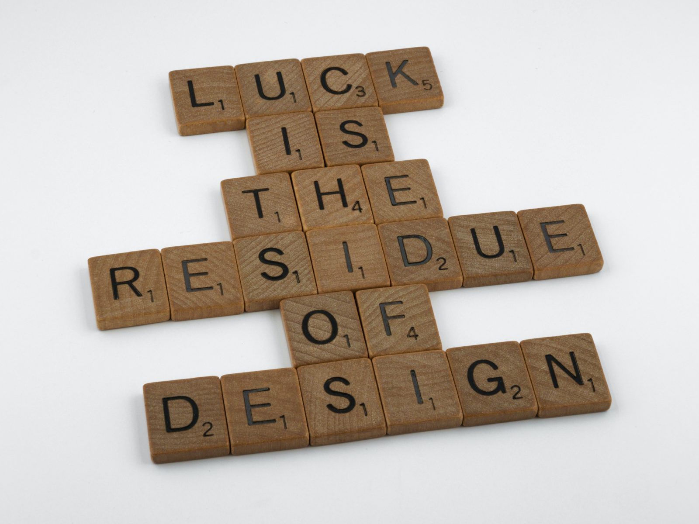
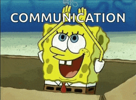
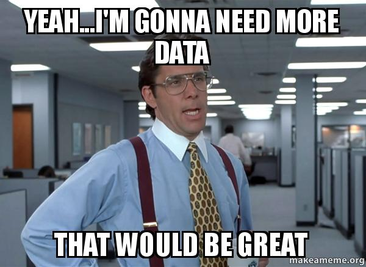
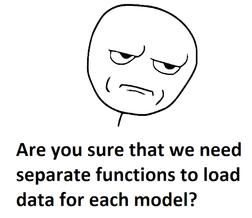
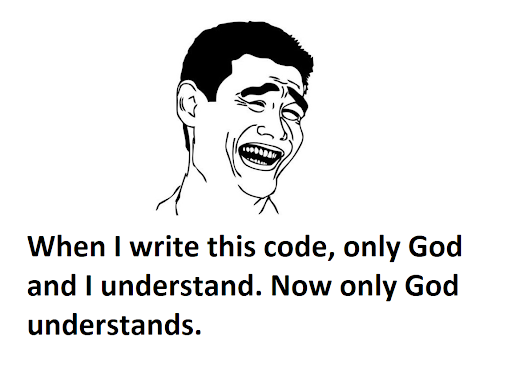
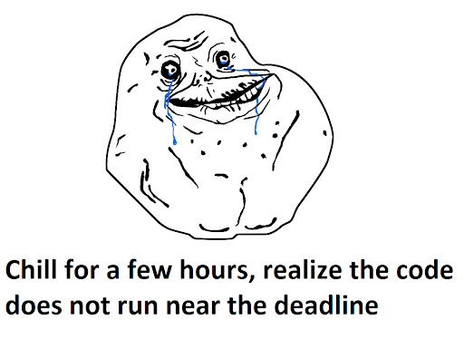
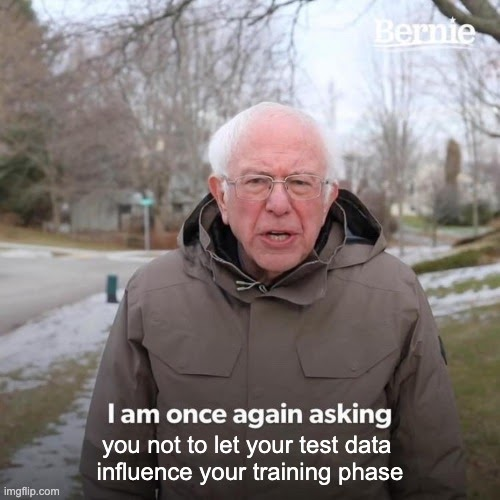
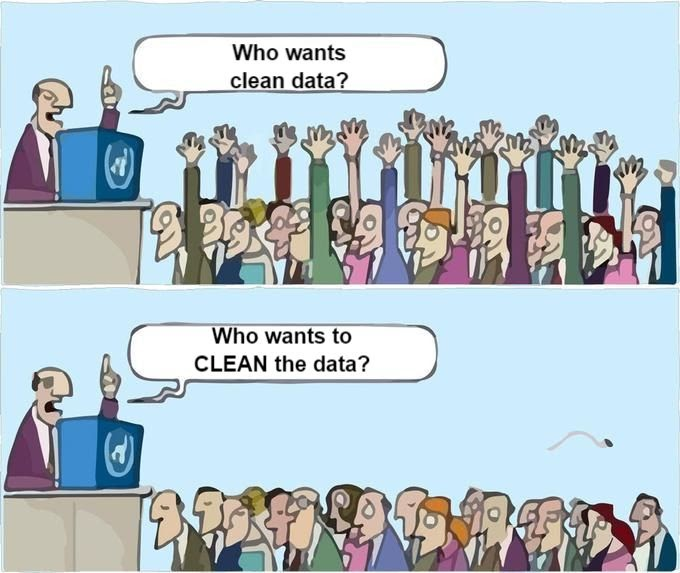

---

layout: post
title: "MDS Capstone via Zoom: A lookback"
subtitle: by Alex Truong Hai Yen, Ifeanyi Anene, Tran Doan Khanh Vu and Tanmay Sharma

---

This post aims to share some of our learnings from our MDS Capstone project in 2021. If you're a new student or a current student reading
this after completing your block 6 coursework, congratulations! We wish you the very best in your capstone journey and hope that some
of the following tips might serve you well during your project. 

## Project Management
### Have a realistic timeline, give a buffer for your intended timeline

8 weeks for capstone projects is double the time of your earlier group projects in MDS, and you may think you have more time.
However, more often than not, people tend to overestimate their productivity. Furthermore, from our experience, the first week for the
hackathon and the last two weeks for presentation, testing & documentation went by much quicker than we realized, hence the core time
for the project development was actually around 5 weeks.

</img>

[Photo obtained from Unsplash](https://unsplash.com/photos/oYmxe7sCitg)

Therefore, having a realistic timeline is key to a successful and engaging capstone experience. This involves having an honest and open
discussion on what your team can realistically accomplish in the middle 5 weeks at the very start of the project, which may result in
moderating the intended scope set by the Capstone partner. Also, don't feel compelled to fulfill all of the partner's requirements. We
believe Capstone partners will appreciate that you spent time thinking about attainable objectives. This worked out well for us.
 
Moreover, since unexpected requirements or analyses may arise as you progress through your project development phase, our next tip is that you should also consider adding a buffer to your intended timeline. For our project, we always tried to set a benchmark
timeline with a buffer based on initial estimates and continuously track our progress and adjust them along the way.

Finally, given the short time frame, we recommend that you focus on the main part of your project such as the data science workflow, rather than nice-to-haves.

### Have an agenda and a meeting moderator for each meeting with the faculty mentor/Capstone partner

</img>

[Photo obtained from Unsplash](https://unsplash.com/photos/RLw-UC03Gwc)

You'll be surprised at how quickly time flies in your weekly meetings. Moreover, both your faculty mentor and Capstone partner have a full-time work schedule to keep up, so make those minutes count when you get to meet them. Our approach was to prepare and send
out agendas to those involved before each meeting, and stick to the agenda during the meeting. We also ordered the discussion points by
priority so the crucial points get to be discussed and resolved first in case we do not have time to address all items during the
meeting. In addition, our team members took turns moderating and making sure the discussions moved along. Productivity: check, professionalism: check!

### "If you want to go fast, go alone; but if you want to go far, go together."

</img>

[Photo obtained from Unsplash](https://unsplash.com/photos/Dph00R2SwFo)

This African wisdom applies beautifully to our capstone experience. As team members come from different backgrounds with various skill sets,
one person's weakness can be someone else's strength; thus we are stronger as a unified team. For example, members with more programming
experience can guide and assist others with less experience to reduce individual struggle and increase team productivity. Similarly,
those who are familiar with project management can shed some light on best practices which the rest can learn from. Our team found
that leveraging all our members' skills not only brought us together but also
allowed us to "go farther" in terms of learning during our capstone project. 

## Communication

### Agree with the Capstone partner on expected products

Be clear with your partner from the beginning. Have a well thought out project plan and clearly defined
deliverables and ensure that the Capstone partner agrees and consents to the same by the end of the first week. For projects which have
evolving goals, ensure that the team's vision is aligned with the capstone partner’s expectations through continuous communication. 

</img>

[Photo Source](https://giphy.com/explore/communication)

### Ask for more data if needed 

During the EDA stage, if you observe that the data provided is unrealistic or insufficient for your model, do not hesitate to clarify
with the Capstone partner and ask for more data if needed. Though it is harder to gather more data during later stages of the project,
make sure to continue to evaluate your data needs during model development. Having sufficient and appropriate data is crucial for
obtaining robust results. 

</img>

[Photo Source](https://makeameme.org/meme/yeahim-gonna-need-c45pbd)

## Coding

### Plan and refactor your code on a regular basis

</img>

**Make your code DRY, meaning Don’t Repeat Yourself**: More often than not, you will encounter pieces of code that appear repetitively
throughout the project. The same lines of code used to initialize or tune hyperparameters for a Ridge model can be used for
random forest, XGBoost, etc. By writing DRY code, you can significantly reduce the amount of code written, and
subsequently the time to review and test the same. Our team chose to approach this through object-oriented programming and inheritance.
For our models, we first defined a base model class with the necessary methods, with all other child classes inheriting
from this base class. 
There are other ways to make your code DRY as well. In general, reviewing and removing redundant code makes your code easier to follow during the project
and easier for your Capstone partner to maintain in the future.

**Develop a habit of splitting your code into notebooks and scripts separately**: Although Jupyter notebooks are useful for displaying your
results and plots, they are extremely challenging when it comes to testing, merging or reviewing the code. 
On top of that,
putting a lot of code in a notebook can distract a reader from the main flow of the analysis as they may want to pay more attention
to the result, rather than the specific details on how it was done. As a result, you should include only the highest-level code -- mostly, calling functions and displaying results -- in yours
notebooks, and abstract your major functionality into Python/R scripts.

### Make your code maintainable

</img>

**Write simple documentation or tests at first**: Documentation helps users understand how to use your functions, and tests help verify
that the functions are working as expected. Without the existence of these two components, future users will be puzzled and get lost in
your maze of code, increasing the chance that they give up on your code base and start from scratch. Having said that, we don't recommend writing
fully detailed documentation and complicated tests from the beginning, as this is time-consuming and the code may need to be modified frequently. 
Hence start simple first, and try to add more details to documentation and tests as the project progresses.

**Have another teammate review your code**: Your code may be intuitive to you, the author; yet, it might be an insurmountable task for
another person to comprehend. Hence, your teammates can play the role of future users to provide feedback in case your code takes too
much time to digest. On top of that, they can help identify bugs or mistakes in those lines of code, which definitely help your team in
the long run. We recommend enabling main branch protection to make sure that another teammate needs to review your code before it can be
merged into the main branch.

### Rerun code often to discover errors early, and commit often.

</img>

**Run tests in the branches to make sure they pass, merge approved code into the main branch, pull down the latest change and run tests again**: You may never know if that single tiny innocent line of code can do a ton of damage to the whole project, especially if it
affects the data used for downstream analysis. 
Besides, a change in one file can have an unintended effect on another file. As a result, the only
way for us to find out is to run pytest tests in those branches first to make sure they do not break the main code. Once the tests all
pass, merge this code into the main branch and test them thoroughly via your automated testing framework one more time.

**Make use of free time to rerun the whole project regularly**: Sometimes, code takes a long time to run, especially if your dataset is
huge or the simulation is massive. Your team can write an automated script to rerun the whole project from scratch and just let it run,
while you can still do errands in the meantime. If needed, these automated scripts can be let to run overnight or over the weekend.
Even if your team finishes the whole project well in advance, just spend some more time rerunning it again to avoid any last minute
panic.

## Gotchas

In this section, we go through pitfalls that occurred during our project to prevent you from succumbing to the same fate. Due to confidentiality, we are using a hypothetical supervised learning problem, which is predicting the salary of a job posting based on the following features: a Data Science job title, the job's characteristics (e.g. experience with python), applicant’s age, years of experience etc. 

### Pay careful attention to the train-test split

</img>

Splitting the data into train and test sets is one of the first things you learn about undertaking
machine learning project. It's easy to neglect the importance of this step, but extreme care needs to be taken when doing this so that
you avoid leakage of information between the splits. For example, a job can be listed multiple times with the same feature values.
Therefore, we need to ensure that if a job is in the test dataset, it should not also be in the training dataset. 

### Understanding the data well

</img>

[Photo Source](https://www.linkedin.com/posts/calvindewilde_analytics-activity-6816703694743183360-yBRo)

Real data is messy. It's really just as simple as that. Your instructors, faculty mentors, and experienced data scientists will
say this a lot, but unless you experience it, you won't understand the frustration and joy behind working with real data. Sometimes the
data will contain obvious outliers, such as a person with 100 years of work experience. Other times it will contain nebulous outliers;
for example, having 20 years of experience on its own is not strange, but if this person is only 25 years old, then we need to think
about that critically. In these situations, don't fret! Instead, leverage the abundant wealth of knowledge and experience available to
you in the form of your faculty mentor and Capstone partner to understand how to approach these problems.

### Investigate strange findings

The capstone experience might sometimes feel like a constant race against time, such that when something strange happens -- especially something positive -- 
you may want to ignore it and move on. For example, we observed that our error was halved by removing 0.01% of the
dataset. Halving our error - this sound great! But, can removing 0.01% of the data really cause such a change in the result!? Definitely not possible! Spurred on by our faculty mentor, we decided to investigate why this happened. 

In the end, we discovered an inadvertent sorting of data during preprocessing, which resulted in non-random splits during cross-validation.
However, during the process of removing the 0.01% of data, we shuffled the data again,
which improved the result since it was then calculated from properly randomized folds. 

Our clue, upon investigation, was that the cross-validation scores were particularly poor for the first and last folds. With data sorted by the target value, these folds will have training data that is very different from the validation data, resulting in poor performance. From here, we figured out the bug.

Issues like this are more likely to happen than not. The only solution is to meticulously go through your entire pipeline, ensuring
that things work the way they ought to. Be pedantic. It's arduous, but it's better to thoroughly understand everything happening in
your analysis and try your best to adhere to accurate data science practices. In our case, we uncovered a critical error in our analysis.

### C'est la vie 

Finally, some things are just out of your control, and you can't really fight it; you just have to live with it. 
The model hyperparameters that you spend days tuning, may not improve your score at all.
The features that took you one week to come up with, may not be used in the final model. These things happen.
Having said that, don't be discouraged, it is really more about the journey. And most importantly, be positive!

C'est la vie! 

--------

## Authors:
[Alex Truong Hai Yen](https://www.linkedin.com/in/alextruong91/), [Ifeanyi Anene](https://www.linkedin.com/in/ifeanyianene/), [Tran Doan Khanh Vu](https://www.linkedin.com/in/tdkhanhvu/) and [Tanmay Sharma](https://www.linkedin.com/in/tanmaysharma19/) are recent grads of the 2020-2021 MDS cohort.
