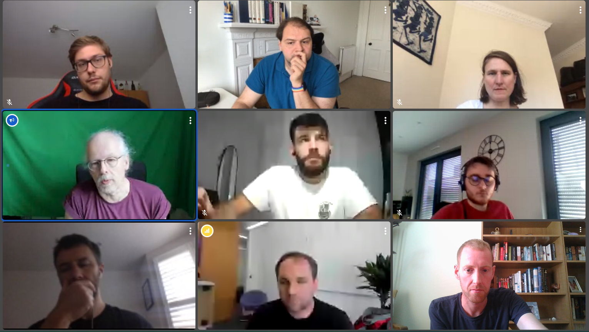

We held our project kickoff meeting today to mark the official start of the project and discuss the plan for the next three years. The intention was to set short term project goals and discuss the initial activities that must be undertaken by the team. We are very excited to be working on this specific topic, with Tobias and Michel already having worked extensively with MLIR and have existing project work that will form a basis for our starting point when looking to connect MLIR with Python. We were also busy in August planning our initial knowledge exchange activities, and have a number of planned events which we will advertise in the coming months.

We strongly believe that the development of a common DSL eco-system could be transformative for the HPC community and will benefit different sub-communities in different ways. The most obvious beneficiaries will be the application developers who will be able to select the most appropriate programming abstractions to suit their scientific domain, safe in the knowledge that there is a mature and well supported underlying toolchain. We also believe that DSL developers will benefit greatly from the advances that we expect to make in this project, as they will not have to reinvent the wheel when looking to develop a new domain specific abstraction. Currently such tools tend to be heavily siloed, sharing little common code and representiving a significant investment on behalf of the developer to get a working and reliable system. We believe that our eco-system will free DSL developers to concentrate on their abstractions and could signfiicantly increase the number of DSLs available.

It's certainly exciting for there to be so much potential, and we will be posting regular updates and organising numerous events during the project lifetime.
