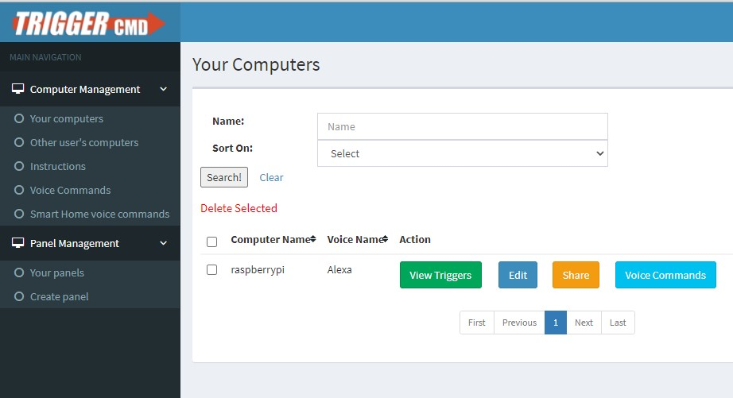

Outro dia conversando com o Fernando, ele comentou sobre uns scripts que estavam sendo executados por comando de voz, pela sua Alexa. Eu fiquei curioso, pois já havia tentado mas na época não funcionou bem (o middleware não cumpriu o desejado). Então ele me apresentou o [TRIGGERcmd](https://www.triggercmd.com), e este funcionou muito bem. É ele que irá fazer o meio de campo entre o seu hardware e a sua Alexa.


Sem mais delongas, vamos ao how-to.

## Instalação do TRIGGERcmd
1. Primeiro passo é criar uma conta no site.
2. Depois, vamos ao download. Acesse a página [https://www.triggercmd.com/user/computer/create](https://www.triggercmd.com/user/computer/create) (tem que estar logado), e baixe o agente conforme sua plataforma. O meu rpi não tem interface gráfica, então nossa instalação será feita via CLI (como tudo nesse blog...)
```shell
dpkg -i https://s3.amazonaws.com/triggercmdagents/triggercmdagent_1.0.1_all.deb

```

3. Ainda nessa página, observe uma extensa linha em vermelho. É o seu token. Vai precisar na próxima etapa.

4. Após a instalação, execute o comando `triggercmdagent`. Em determinado momento ele irá aguardar você colcar o token. Cole e prossiga a instalação.

5. Com isso, provavelmente seu rpi já estará visível no {TRIGGERcmd pela web}(https://www.triggercmd.com/user/computer/list).



{: .box-warning}
**Atenção:** Ah, ponto importante: Coloque para que ele seja executado como serviço. Assim não vai precisar ter executar manualmente quando seu rpi reiniciar.
```shell
systemctl enable --now triggercmdagent
```

## Maravilha! Mas... E agora?
Bem, a segunda etapa é você **acessar seu app Alexa, e conectar com a skill TRIGGERcmd**.
Após isso, ele pedirá para conectar na sua conta, e então sua Alexa irá descobrir que seu rpi existe.

## OK! E como eu adiciono meus comandos personalizados?
No meu rpi, toda a estrutura do TRIGGERcmd está dentro do diretório /root/.TRIGGERcmdData. Lá temos o arquivo `commands.json`, que possui uma sintaxe bem simples.

Qualquer dúvida, vocês podem recorrer também ao [fórum](https://www.triggercmd.com/forum), que é bem rico.

**Até a parte 02!**