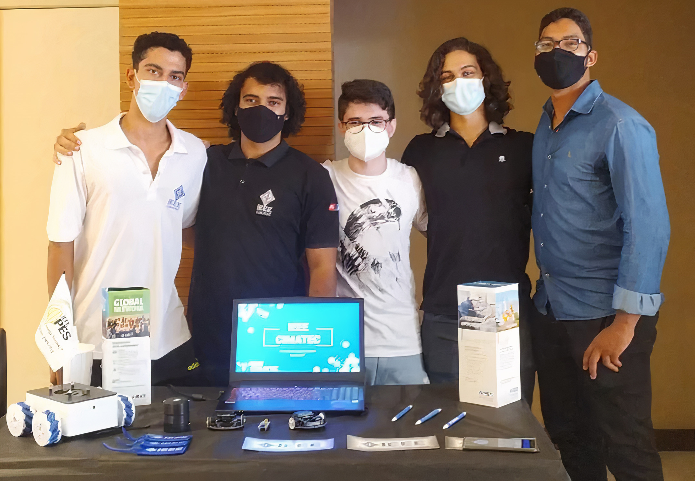

No dia 18 de fevereiro, ocorreu, no Cimatec, o Acolhimento aos Calouros, um evento presencial promovido pelo próprio Cimatec para dar boas-vindas aos novos ingressantes. Dentre as atividades, ocorreu uma Visita pelo Campus, um Stand-up com um aluno veterano (Como sobreviver no Cimatec), palestras, e uma Exposição das Iniciativas Estudantis. E, é claro, nós não poderíamos deixar de participar!

A Exposição das Iniciativas Estudantis ocorreu no Foyer do Cimatec 3 (local em frente aos auditórios, no térreo), em formato de feira científica. Cada Iniciativa Estudantil teve um espaço para que pudesse se organizar e divulgar suas atividades para os novos alunos. Foi um momento excelente para trocar ideias e experiências com as outras Iniciativas Estudantis do Cimatec, tirar muitas fotos, e, é claro, divulgar o IEEE para muitas pessoas!

#### Fotos e vídeos do evento aqui

E nós não pudemos deixar de levar nosso mascote, o [I3E-D3](project-i3e_d3), para conhecer e interagir com o pessoal! Ele fez sucesso com os calouros, e fez questão de tirar uma foto com cada Iniciativa Estudantil!

<!-- Fotos com as Iniciativas Estudantis -->

  

    

      <table class="table-borderless highlight">
        <thead>
          <tr>
            <th><a href="https://www.instagram.com/cimatecjr/">

</a></th>
            <th><a href="https://www.instagram.com/aichecimatec/">

</a></th>
          </tr>
        </thead>
      </table>
    

  

E aí, gostou do evento?
Siga nossas redes sociais e continue acompanhando nosso site, para manter-se sempre bem informado!

