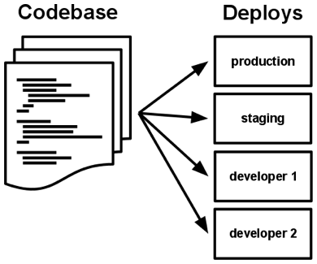
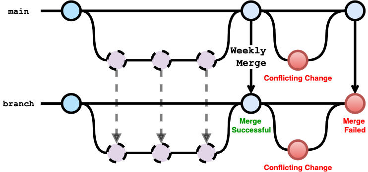

Although simple, this is a very powerful and core concept in developing SaaS. Before I jump right in, I wanted to define
what a **codebase** is.

**A Codebase is a collection of source code that is used to build a software system, app, or component.**
([1](https://en.wikipedia.org/wiki/Codebase))

12-Factor further adds:

**A codebase is any single repo, or any set of repos who share a root commit.** ([2](https://12factor.net/codebase))

I was working on an IBM ECommerce Website in 2013 that violated this rule early in the development cycle. The
business requested a second version of their Ecommerce site for a recent business partnership. A quick decision was made
to create a second **branch** in the same codebase rather than to **fork** it. This made the stand-up of the second
website easy. It allowed the business logic and deployment to remain the same, but the UI could be maintained
independently. Our engineers would develop business logic on the main branch, while our web designers split their work
between the new branch and main.

As new business logic was being added to the original website, all the changes were expected to be ported to the new
site. Our engineering team was in charge of merging down changes from the main codebase to the second branch. The UI
team, although not intentionally, would often modify business logic in the second branch. This lead to merge conflicts
and several meetings about what sections of code should be maintained by which teams.

Yikes!

By violating '_A codebase is... a set of repos (that) share a root commit_', we had caused a maintenance nightmare.
**Branching** created a second **codebase**, violating this rule and requiring us to constantly curate the competing 
commits between the two branches.

If we had shared a **codebase**, feature parity would have been infinitely easier. With two 'root' commits in the mix,
we suddenly had many more decisions to make.

_Which version of a conflicting change should win?_\
_Who determines which changes should win?_\
_Should we have both changes exist independently of one another?_

It was a lot of rework that could have been avoided by maintaining one 'root' commit.

One thing I didn't touch on as much as I wish I had is how **deploys** relate to **codebase**. I have a feeling this
will come up again in an upcoming article on [config](https://12factor.net/config), so stay tuned!
