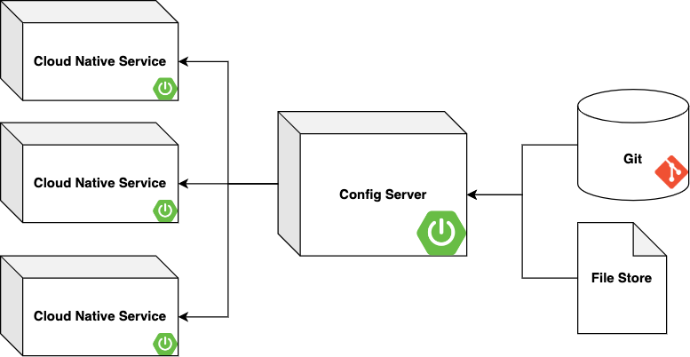
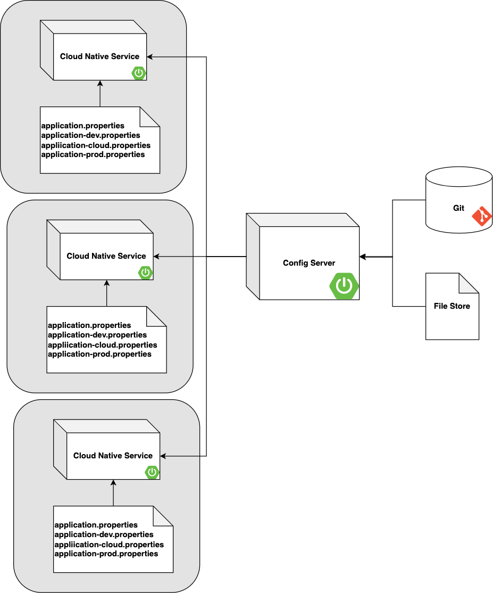

[Spring Cloud Config Server](https://cloud.spring.io/spring-cloud-config/reference/html/) is a wonderful tool when
developing Spring Boot apps. It can externalize all of your application configuration into one location, and even
provide a layer of security with its secret store. However, not all of this is a good thing.

**Moving all of your application's initialization configuration into the Config Server creates a few problems for the
average developer.**

- **_Applications now have a hard dependency on the Config Server to startup._**\
  Developers will have to concern themselves with a dependent service, something we want to avoid as much as possible
  developing 'Cloud Native' apps.

- **_Configuration overrides have to go through the config server._**\
  [Here](https://docs.spring.io/spring-boot/docs/1.0.1.RELEASE/reference/html/boot-features-external-config.html#boot-features-external-config)
  is the order Spring considers configuration during application startup. You'll notice, local configuration (#6,
  internal) is below the precedence for the Config Server (#5, external) and will always be overwritten. Developers lose
  the ability to add local application properties without having the Config Server override them.

**Solving this requires categorizing your configuration into the following:**

- **_Initialization Config_ - Any config that is common in all environments.** Should never be externalized and should
  live in the '_application.properties_' file in the '_src/main/resources_' directory inside the application.

- **_Environment Config_ - Any config that is environment specific.** Should never be externalized and should live in
  the '_application-{environment}.properties_' files in the '_src/main/resources_' directory inside the application.

- **_Overwriting Config_ - Any config that is needed during an emergency fix or during testing of a non-local
  environment.** This should live on the config server during a short period of time, and eventually re-categorized into
  the other categories.

This uses the Spring property injection order to its advantage while also removing the Config Server as a hard
dependency. It's not even required for development anymore, and can be excluded locally!  The Config Server can still be
used in the upper environments, using its most powerful ability, to overwrite config on the fly. But the biggest win is
the Developers job is now easier, no longer having to maintain a Config Server to develop the application!

**Cloud Platform teams should have one goal, make development easier for developers**. I focus mainly on Spring Boot
here, but this can apply to any other development experience. Application development is complicated, so is configuring
it. Use the tools to your advantage, not against you. Check out the
sample [config](https://github.com/gleasonsean/spring-boot-cloud-native/tree/main/src/main/resources)
and [tests](https://github.com/gleasonsean/spring-boot-cloud-native/tree/main/src/test/java/gleason/tech/boot/properties)
on github to see it in action!