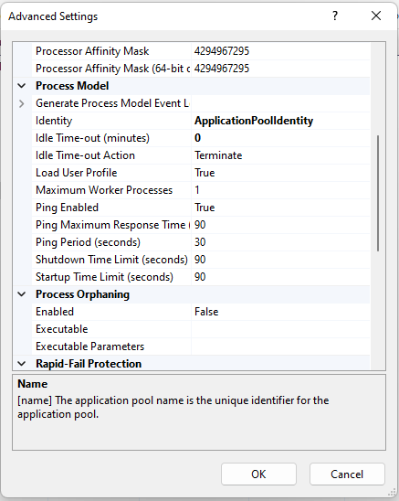

In Q1, this year, the company I앐 working for, started a new general Kaisen program. At the same time, in a coincidence, I led the migration of our code from TFS to Git, witch saves a lot of time on daily routines. All togheter, made me paing attention for some anoing stuft that we get used to on our workig rotines. One of those things I got used to was the 20 minutes aplication pool recicle, a default configuration on IIS that recicles the application pool when you have 20 minutes without any traffic then the app pool will terminate so that it can start up again on the next visit. The problem is that the first visit to an app pool needs to create a new w3wp.exe worker process which is slow because the app pool needs to be created, ASP.NET or another framework needs to be loaded, and then your application needs to be loaded. That can take a few seconds.

It압 common on  developers machine, at least on the kind of job I앐 doing now, to get 20 minutes without any traffic on the application. Imagine half a minute each time a recicle occours then you realise that maybe 10 minutes in a day of work is waisted. But I bet it압 more than that, because each time a recicle occours and you need to wait this half a minute to go back on a debbug for example, there압 a chance you may loose focus, so for sure this half minute can become 5 minutes or so.

I앐 not saing we are robots that must work 8 hours with no breaks, breaks are important to "refresh our minds"; with refreshed focus, we can even delivere more than 8 hours with no breaks, but those breaks need to be conscious to count. 

Today, after work, I decided to research and I think I manage to found a very simple solution to this problem. Basicaly, what you need to do is to set the property Idle Time-out on the advanced settings of the application pool to 0. It will make the application pool to not terminate after the 20 minutes time. Combinade with a once a day recicle policy, you manage to get your environment better to work. Here, I앐 not going to discuss production environments, each environment has its own needs, but it압 clear to me that this default configuration seems not to be the best for most environments.

I앐 using IIS 10, but I believe these configuration should work starting on ISS 7. Here the link to the material I found most of the resolution to this problem. (https://weblogs.asp.net/owscott/why-is-the-iis-default-app-pool-recycle-set-to-1740-minutes). By the way, I believe it's worth reading Scott Forsyth's blog where he tells the history behind the default 29 hours value for the app pool recycling setting.