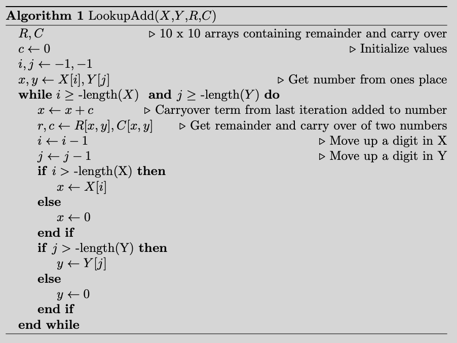
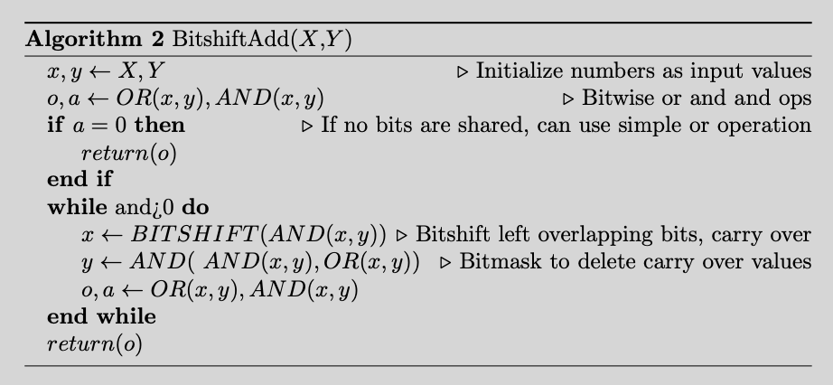
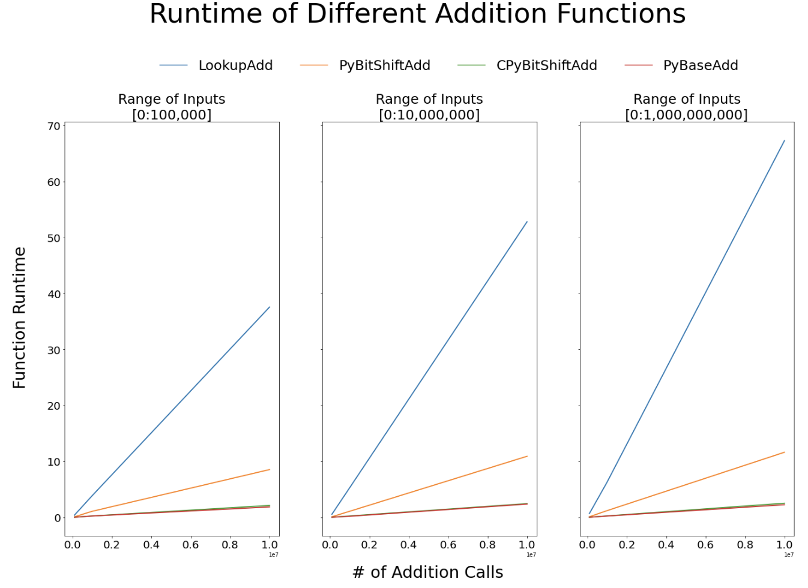

## TLDR    
I walk through an algorithm to do addition using Python. Using bitshifting and bitmasking and C++ extension modules results in nearly on-par performance with base python addtion.

## Background

I've recently been dealing with bytes and bits a lot. I thought I'd revisit some of the old algorithm problems I remember seeing back in the day. One classic problem is this:

<center>
Create an integer addition '+' operator. Assume you can not use multiplication, division or subtraction
</center> 

To make things a bit easier, we will assume the inputs can only be non-negative integers. 

Let's first think of a simple naive solution to this. One way to do this would be to replicate long addition, but optimize it using some simple memoization. 

## Method 1: Lookup Addition

For long addition you align the two numbers you want to add. Starting on the far right (first digit), you keep adding and carrying over terms if the two terms you've added are greater than 9. 

We describe the algorithm in pseudo-code, then walk through a simple example.

### Pseudo-Code

<center>
    
</center>

### Simple Example

Let's take an example for adding the two numbers 23 and 48. We first align the numbers, the go right to left. At each position, we will only be adding two single digit numbers (such as 4+5). We will need to determine two things:
1. Determine the remainder term 
2. Determine carry over term

We discuss what they mean in this example. 

**Position 0**
* Start with two terms: (3,8)
* Remainder Step: remainder(3,8) = 1 -- beacause 3+8 = 11 mod 10 = 1
* Carryover Step: carryover(3,8) = 1 -- because 3+8 > 9
* Output Array: [1]

**Position 1**
* Start with two terms: (2, 4)
* Bring forward remainder term from prior step: (2+1, 4)
* Remainder Step: remainder(3,4) = 7 
* Carryover Step: carryover(3,4) = 0
* Output Array: [7, 1]

**Final Step**
* Once each array is exhausted, then simply concatenate and return output array: 71

What we see is that in position 0, the remainder step gives us the digit in the output, whereas the carry over step will increment the digits in the next position. We repeat this process, appending an output array using the remainder step until we have exhausted both arrays.

### Speeding up performance using memoization

We can memoize the remainder and carryover steps, by defining lookup arrays: **Remainder** and **Carryover**. **Remainder** looks like the following  

<center> <b> Remainder </b> 

| . | 0 | 1 | 2 | 3 | 4 | 5 | 6 | 7 | 8 | 9 |  
| --- | --- | --- | --- | --- | --- | --- | --- | --- | --- | --- |
| 0 | 0 | 1 | 2 | 3 | 4 | 5 | 6 | 7 | 8 | 9 |
| 1 | 1 | 2 | 3 | 4 | 5 | 6 | 7 | 8 | 9 | 0 |
| 2 | 2 | 3 | 4 | 5 | 6 | 7 | 8 | 9 | 0 | 1 |
| 3 | 3 | 4 | 5 | 6 | 7 | 8 | 9 | 0 | 1 | 2 |
| 4 | 4 | 5 | 6 | 7 | 8 | 9 | 0 | 1 | 2 | 3 |
| 5 | 5 | 6 | 7 | 8 | 9 | 0 | 1 | 2 | 3 | 4 |
| 6 | 6 | 7 | 8 | 9 | 0 | 1 | 2 | 3 | 4 | 5 |
| 7 | 7 | 8 | 9 | 0 | 1 | 2 | 3 | 4 | 5 | 6 |
| 8 | 8 | 9 | 0 | 1 | 2 | 3 | 4 | 5 | 6 | 7 |
| 9 | 9 | 0 | 1 | 2 | 3 | 4 | 5 | 6 | 7 | 8 |
    

**Carryover**

| . | 0 | 1 | 2 | 3 | 4 | 5 | 6 | 7 | 8 | 9 |  
| --- | --- | --- | --- | --- | --- | --- | --- | --- | --- | --- |
| 0 | 0 | 0 | 0 | 0 | 0 | 0 | 0 | 0 | 0 | 0 |
| 1 | 0 | 0 | 0 | 0 | 0 | 0 | 0 | 0 | 0 | 1 |
| 2 | 0 | 0 | 0 | 0 | 0 | 0 | 0 | 0 | 1 | 1 |
| 3 | 0 | 0 | 0 | 0 | 0 | 0 | 0 | 1 | 1 | 1 |
| 4 | 0 | 0 | 0 | 0 | 0 | 0 | 1 | 1 | 1 | 1 |
| 5 | 0 | 0 | 0 | 0 | 0 | 1 | 1 | 1 | 1 | 1 |
| 6 | 0 | 0 | 0 | 0 | 1 | 1 | 1 | 1 | 1 | 1 |
| 7 | 0 | 0 | 0 | 1 | 1 | 1 | 1 | 1 | 1 | 1 |
| 8 | 0 | 0 | 1 | 1 | 1 | 1 | 1 | 1 | 1 | 1 |
| 9 | 0 | 1 | 1 | 1 | 1 | 1 | 1 | 1 | 1 | 1 |

</center>

### Python Function

The code for this is below, note how long and complicated it is. There is room for optimization and clean up, but ultimately the ROI on that will be shown to be low. 

```python
def lookup_addition(
    x: str, 
    y: str,
    remainder_array: dict,
    carryover_array: dict,
    digit_array: list = '0123456789'
) -> str:
    """
    Add together two integers using lookup arrays

    Args:
        x, y (int): term to be added together
        digits_array (list): list from 0 to 9 
        remainder_array (dict): 10 x 10 array to get remainder term
        carryover_array (dict): 10 x 10 array to get carryover term when
                                      digits sum up > 9

    Returns:
        int: Two terms X and Y added together
    """
    
    x=list(x)
    y=list(y)
    carryover_term = False
    summed_term = ''
    x_empty, y_empty = (False, False)
    i, j = (-1, -1)

    while True:
        if x_empty:
            x_term='0'
            if y_empty:
                break
        else:
            try:
                x_term=x[i]
            except:
                x_empty=True
                x_term='0'
        
        if y_empty:
            y_term='0'
            if x_empty:
                break
        else:
            try:
                y_term=y[i]
            except:
                y_empty=True
                y_term='0'
            
        num_loc=int(x_term)
        if carryover_term:
            if num_loc==9:
                carryover_term=True
                num_loc=0
            else:
                num_loc+=1
            x_term=digit_array[num_loc]
        
        remainder_term = remainder_array[(x_term, y_term)]
        summed_term = remainder_term + summed_term
    
        if num_loc!=9:
            carryover_term = carryover_array[(x_term, y_term)]
        
        i-=1
        j-=1

        
    if carryover_term:
        summed_term='1'+summed_term
        
    return(
        summed_term
    )
```

## Method 2: Bitshift

Another avenue for a solution is using bitshift operators. Bitshifting is equivalent to multiplying or dividing a number by some base number. For example, in base-2 the number 4 is represented as $$100$$. Bitshifting 4 to the left is equivalent to multiplying 4 by the number 2, thus $$BitshiftLeft(4)=8=1000$$

### Pseudo-Code

<center>
    
</center>

### Simple Example 

I'll walk through the logic for how this works. Assume we want to do:

$$
    \begin{align}
        5 + 3 = 8
    \end{align}
$$

Let's put 5 and 3 into binary representation:

$$ 
    \begin{align}
        5 = 0\;1\;0\;1 \\
        3 = 0\;0\;1\;1
    \end{align}
$$

We can write this in expanded notation to make it easier:

$$
    \begin{align}
        5 = 1*2^{2} + 0*2^{1} + 1*2^{0} \\
        3 = 0*2^{2} + 1*2^{1} + 1*2^{0} \\
    \end{align}
$$

This approach attempts to find two bit sets such that they have no overlapping bits whose values are greater than 0. To do so, we alternate using bitshifts and bitmasks. The algorithm's base case defines x, y as the input values we're trying to add together:

**Iteration 1**

$$
    \begin{align}
        x=0\;1\;0\;1 \\
        y = 0\;0\;1\;1
    \end{align}
$$


*Step 1: AND Reduce and Carry over*: this step looks for bits that are shared between the two values, then bit shifts the resulting values.

The AND reduce step is very simple:

$$
    \begin{align}
        \text{AND}(5, 3) = 0*2^{2} + 0*2^{1} + 1*2^{0}
    \end{align}
$$

The carry over step is a bit shift step.Basically, when the two values you want to add share a bit, then you need to carry over a value. For example, in our example above both values have $2^{0}$ in their binary representation:


We can see that when we add these two values that we need to shift the bit left:

$$
    \begin{align}
        2^{0} + 2^{0} = 2*2 = 2^{1}
    \end{align}
$$

So this step is simply a bitshift on our and operation (setting x equal to this):

$$
    \begin{align}
        x=\text{BITSHIFT_LEFT}(\text{AND}(5,3)) = 0*2^{2} + 1*2^{1} + 0*2^{0}
    \end{align}
$$


*Step 2: OR Reduce and Bitmasking*: keep only those bits that exist in either number, removing the shared bits from step 1. Essentially, we will use the AND step as a bitmask. 

We want to reduce our two values into one value, then mask those values we've already carried over. 

The reduction step is a simple or operation:

$$ 
    \begin{align}
        \text{OR(5,3)} = 1*2^{2} + 1*2^{1} + 1*2^{0}
    \end{align}
$$

We need an intermediate step where we flip the bits in the AND step. 

$$
    \begin{align}
        y=\text{MASK(OR(3,5),~AND(5, 3))} =  1*2^{2} + 1*2^{1} + 0*2^{0}
    \end{align}
$$


**Iteration 2**

After iteration 1, we have the following values

$$
    \begin{align}
        x=0\;0\;1\;0 \\
        y=0\;1\;1\;0
    \end{align}
$$

We repeat these steps until no bits are shared between the bitsets. It turns out this is the case:

$$
    \begin{align}
        x=1\;0\;0\;0 \\
        y = 0\;0\;0\;0
    \end{align}
$$

Using a final OR(x,y) operation, yields the answer, which is 8. 

### Python Function

As can be seen, the code is very short and concise (especially compared to lookup addition).

```python
def bitshift_addition(
    x,
    y
):
    """
    Add together two integers using bitshifts and bit masks

    Args:
        x, y (int): term to be added together

    Returns:
        int: Two terms X and Y added together
    """
    
    ## Initialize bitwise and/or operations
    and_op=(x&y)
    or_op=(x|y)
    
    ## Edge case if no bits shared 
    ##  between two integers
    if and_op == 0:
        return(or_op)
    
    ## Terminate if no bits shared between values
    while and_op > 0:
        
        
        ## Step 1: Carry over
        ## Find bits shared between two values
        ##  left shift bits when both contain value
        x=(and_op << 1)

        ## Step 2: Masking step
        bitmask_op=(~and_op)
        y=(bitmask_op&or_op)
        
        ## add and or op
        and_op=(x&y)
        or_op=(x|y)
    
    return(x|y)
```


## Experiment

I do a simple experiment, varying two parameters:
* **Total Number of Samples**: use three values: 100k, 1mil, 10mil
* **Largest Possible Number**: use three values: 100k, 10mil, 1bil

I test 4 algorithms:
1. Python Base Add Opereator
2. Lookup Addition (LookupAdd)
3. Bitshift Addition - Python (PyBitshiftAdd)
4. Bitshift Addition - C++ (CPyBitshiftAdd)

I built BitshiftAdd using both native python and a [C++ extension module](https://docs.python.org/3/extending/index.html). The results for the experiment is below. 

<center>
    
</center>

Two things are clear:

* Lookup Addition is really slow : this is expected
* Bitshift Addition compiled in C++ performs very close to the Python Base Add operation, which is pleasent to see given this was a first version
