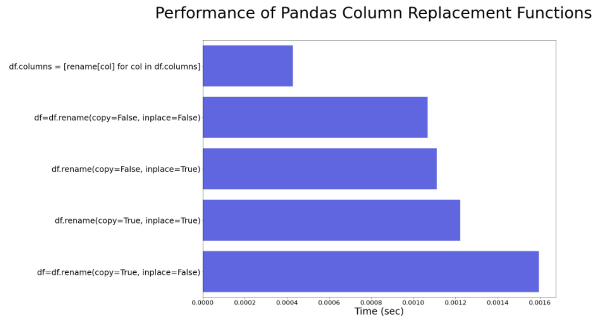

## TLDR    
Pandas performance is slowed by dataframe copying under the hood. I show that this leads to a nearly 4x performance slowdown compared with the most performant method.

## Renaming Columns in Pandas

We will accomplish two things:
* Show two ways to rename columns in pandas
* Show the most perfomant method, and why

### How to Rename Columns in Pandas

For this example, we create an examlpe dataframe with 1,000 columns and 10,000 rows:

```python
import pandas as pd
import numpy as np

## Create data
df=pd.DataFrame(
  data=np.random.uniform(
      size=(10000, 1000)
  ),
  index=np.arange(
    0, 
    10000
  ),
  columns=map(
    str, 
    np.arange(0, 1000)
  )
 )

## Dictionary to rename all columns
rename_cols={
  str(i):str(i+1) for 
  i in np.arange(0, 1000)
}
```

There are two methods to rename dataframes

**Method 1: __rename__ method**

This is the way it's most often done, a prototypical call is:

```python
df = df.rename(columns=rename_cols)
```

**Method 2: replace column attribute**

Another way is to simply set the dataframe `columns` attribute directly. 

```python
df.columns = [rename_cols[col] for col in df.columns]
```

### Improving performance

Method 2 is already optimized, however, there are two key parameters in the `rename` method. The `rename` method has two parameters, we copy straight from the documentation the description:

* `copy` : Also copy underlying data
* `inplace` : Whether to return a new DataFrame. If True then value of copy is ignored.

We will show performance of Method 1 toggling on and off these parameters, and compare that to Method 1. The results can be seen in the graph below. What is clear is the Method 2 changing the attribute directly is the fastest, whereas non-inplace copying is the slowest.

<center>
    
</center>

### Why is performance slow?

It is obvious that copying dataframes will slow down performance, so it makes sense why `copy=True` is slow, but why is turning off copying still slow, `copy=False`?

We dig a bit into the [source code](https://github.com/pandas-dev/pandas/blob/4bfe3d07b4858144c219b9346329027024102ab6/pandas/core/generic.py#L985) of __rename__ to hypothesize. While there is a lot of control-flow logic (if/else statements), there's also some hidden copying going on. Specifically , there is this (line)[https://github.com/pandas-dev/pandas/blob/4bfe3d07b4858144c219b9346329027024102ab6/pandas/core/generic.py#L1156):

```python
 result._set_axis_nocheck(new_index, axis=axis_no, inplace=True) ##Note: result is just a reference to the dataframe
 ```
 
I need to break this call down a little bit. Within `rename`, result gets set to self, meaning that result is just a copy of the dataframe. `new_index` is roughly the values of the new column names, technically it's an Axis object, with column names as an attribute. What is the key performance bottleneck? It's doing an inplace replacement on a copy of the dataframe.

In fact, `_set_axis_nocheck` has a [comment](https://github.com/pandas-dev/pandas/blob/4bfe3d07b4858144c219b9346329027024102ab6/pandas/core/generic.py#L758) explaing this:

```python
def _set_axis_nocheck(self, labels, axis: Axis, inplace: bool_t):
# NDFrame.rename with inplace=False calls set_axis(inplace=True) on a copy.
if inplace:
    setattr(self, self._get_axis_name(axis), labels)
else:
    obj = self.copy()
    obj.set_axis(labels, axis=axis, inplace=True)
    return obj
```

## Conclusion
While I don't want to claim this inplace copying and attribute setting is the only bottleneck, it teachs an important lesson about pandas and performance. Beware of the secret copying!
           
 
