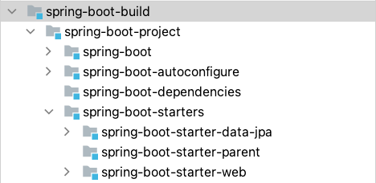

One of Spring Boot's main goals is to make development
easier.  [In my previous article](/2022-07-20-enterprise-libraries), I demoed how to layer enterprise libraries on
top of the spring boot stack. This time I wanted to show the benefits of creating libraries using this method by
developing our own in-house enterprise starter.  Let's start by defining what a Spring Boot Starter actually is.

### What is a Spring Boot Starter? ###

A Spring Boot Starter is just a dependency descriptor. If you take a look at
the [Spring Boot Github](https://github.com/spring-projects/spring-boot/tree/main/spring-boot-project/spring-boot-starters), 
you'll notice the only think included in each starter projects is 
a [build.gradle](https://github.com/spring-projects/spring-boot/blob/main/spring-boot-project/spring-boot-starters/spring-boot-starter-web/build.gradle), 
which just contains a dependency list. The magic of spring, usually attributed to the autowired startup beans,
is stored over in
the [autoconfiguration](https://github.com/spring-projects/spring-boot/tree/main/spring-boot-project/spring-boot-autoconfigure/src/main/java/org/springframework/boot/autoconfigure)
project. I'll go over both in this article since there often lumped together, but keep this separation in mind as 
we go along.

### What should be an enterprise starter?

Most Spring Boot enterprise implementations usually go with a Microservice architecture. This means alot of code
separation, but it also brings with it boilerplate concerns since alot of things need to be repeated over and over
again. Things like documentation, enterprise security, datasource access, streams; all require repeated
configuration with slight changes. If you start creating repeated configuration across multiple Spring Boot projects, 
you've probably found a good enterprise starter candidate.   

_Don't get bogged down with configuring everything, try to remember that the main goals of Spring Boot is Convention 
over Configuration. Make it easier, not harder!_

### How do we create an enterprise starter?

For this example, we will build our
own **['spring-boot-starter-web-documentation'](https://github.com/Gleason-Tech/spring-boot-gleason/tree/master/spring-boot-gleason-project/spring-boot-gleason-starters/spring-boot-gleason-starter-web-documentation/pom.xml)**
. This will include any dependencies our organization would need for documenting Web applications.

##### Create the Starter
We need to create a new module under the 'spring-boot-enterprise-starters' project. This will link it up with the Spring 
Boot dependency management, but leave the autoconfiguration on the cutting room floor. Now we just need to consolidate 
our dependencies into the dependency descriptor.

##### Define the Dependencies
For this example, I plan to use the [OpenAPI Spec](https://swagger.io/specification/), so I brought along
the [spring-doc](https://springdoc.org/#getting-started) dependency and
its [Hateoas](https://springdoc.org/#spring-hateoas-support) support. I also brought 
[Spring REST Docs](https://spring.io/projects/spring-restdocs) to complete the package and provide a nice landing page
for all our applications.

##### Set the Dependency Versions
Remember how I mentioned we linked up the Spring Boot dependency management while creating the module? Well that means
no version necessary when declaring dependencies in the starter! To set this up, we need to set the versions of these
dependencies we plan to use in
the ['spring-boot-enterprise-dependencies'](https://github.com/Gleason-Tech/spring-boot-gleason/blob/master/spring-boot-gleason-project/spring-boot-gleason-dependencies/pom.xml#L33)
project.

Don't forget to also set the version of the newly
created ['spring-boot-starter-web-documentation'](https://github.com/Gleason-Tech/spring-boot-gleason/blob/master/spring-boot-gleason-project/spring-boot-gleason-dependencies/pom.xml#L80)
too, that way no one needs to specify a version when using the new starter.

### How do we create the autoconfiguration for the enterprise starter?

The last step to creating a starter is the autoconfiguration. This requires knowledge of the frameworks you plan to use, 
but also how you plan to configure it long term. This can be its own article on its own (coming soon!), but here is an 
example of our 
['documentation autoconfiguration'](https://github.com/Gleason-Tech/spring-boot-gleason/tree/master/spring-boot-gleason-project/spring-boot-gleason-autoconfigure/src/main/java/tech/gleason/boot/documentation)
example. Since Spring REST Docs is driven through API testing, the only beans we need to autoconfigure is Swagger.

Here is the [commit](https://github.com/Gleason-Tech/spring-boot-gleason/commit/e4fb097a0f8ed7d8278b1d990d597a69440613c2#diff-5752f81e2c87fda2a60aba5fa9e94beaee2a13448b1c8bffda22b7cab6761897)
with all the code included.

### How do we use the newly created enterprise starter and autoconfiguration?

See all the action in this 
[commit](https://github.com/gleasonsean/spring-boot-cloud-native/commit/f4b117eee74d3857330f3855a92f90c905848e0c) 
on my 'spring-boot-cloud-native' microservice application.  I was able to remove my entire SwaggerConfiguration, now 
being autoconfigured through our new starter.  In addition, adding 'spring-boot-gleason-starter-web-documentation' to my 
dependencies means I no longer have to include any of the 'springdoc' or 'restdocs' dependencies since the starter now
includes 
[them](https://github.com/Gleason-Tech/spring-boot-gleason/blob/master/spring-boot-gleason-project/spring-boot-gleason-starters/spring-boot-gleason-starter-web-documentation/pom.xml).

### What are the benefits of building libraries the 'Spring Boot' way?
- Consolidates libraries for easier upgrades
- Removes common boilerplate
- BOM support for managing library versions
- 'Opinionated Default Configuration' tuned to your enterprise's needs
- Reduce development effort and increase productivity

Building enterprise libraries in this fashion gives us the same benefits of spring-boot, but opinionated for your
enterprise. A platform team can be dedicated to maintain and upgrade this library as new Spring Boot versions roll out, 
and can also construct new starters to make developing at an enterprise easier.  It builds onto the already amazing 
library structure of Spring Boot and unlocks its spring-boot-starter and autoconfiguration support for the enterprise. 

**Cloud Platform teams should have one goal, make development easier for developers**. Writing internal libraries is
hard, but using Spring Boot patterns can make them a little more manageable.