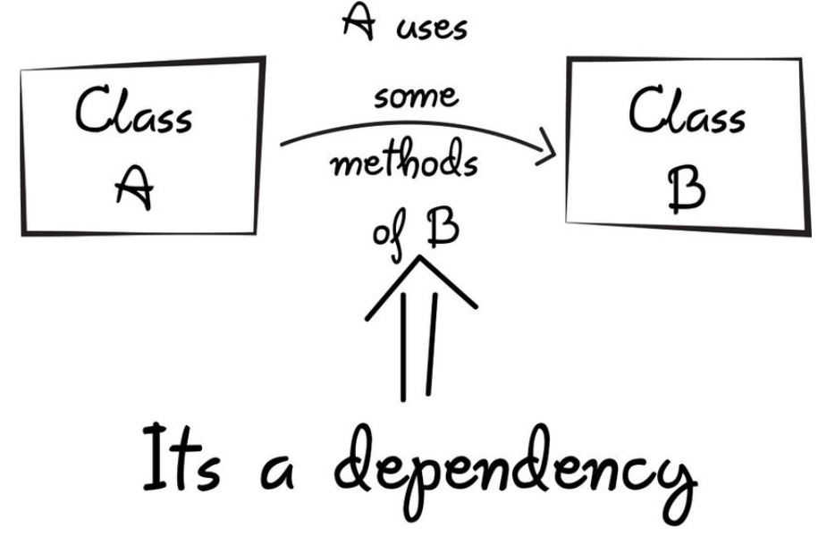

{:class="img-responsive"}

Dependency Injection (DI) is a programming concept that aims to reduce the coupling between components by decoupling the creation of dependencies from their use. In other words, instead of a component creating its own dependencies, it relies on an external entity to provide them. This external entity is usually a container or a framework responsible for managing dependencies.

In practice, this means that instead of hardcoding dependencies within a class or method, the dependencies are passed to the class or method as parameters. This way, the class or method becomes more reusable, testable, and flexible. Additionally, it promotes the Single Responsibility Principle (SRP) by allowing the components to focus on their primary responsibility without worrying about creating or managing dependencies.

For example, consider a class that sends an email. Without DI, the class may create its own instance of an email service, which creates tight coupling between the two components. On the other hand, with DI, the email service can be injected into the class as a dependency, making it more modular and decoupled.

There are several benefits of using DI in modern coding:

1. Testability: DI makes it easier to write unit tests for code components, as dependencies can be easily mocked or substituted with test-specific implementations.

2. Flexibility: DI allows for the easy substitution of dependencies at runtime, which enables the implementation of various business logic changes without affecting the code's functionality.

3. Readability: DI promotes code readability by making the code more modular and easier to understand.

4. Maintainability: DI promotes modularity and reduces coupling between components, making it easier to maintain the codebase.

In conclusion, DI is an essential concept in modern coding that promotes decoupling and modularity in code components. By using DI, developers can build more testable, flexible, readable, and maintainable code.

While dependency injection can offer significant advantages in software development, there are also some potential disadvantages to consider:

1. Complexity: Dependency injection can make the code more complex by introducing additional layers of abstraction and indirection. This can make it harder to understand and debug the code, particularly for developers who are not familiar with the codebase or the specific DI framework being used.

2. Over-engineering: Overuse of dependency injection can lead to over-engineering, where developers create unnecessary abstractions and dependencies that complicate the codebase without providing any real benefits.

3. Performance: Depending on the specific DI framework being used, there can be some performance overhead associated with using dependency injection. This is because the DI framework needs to instantiate objects and manage dependencies at runtime, which can add some overhead compared to simply instantiating objects directly.

4. Configuration: Configuring the dependency injection framework can be a complex task, particularly in larger applications with many dependencies. This can lead to configuration errors, which can be difficult to diagnose and resolve.

Overall, while there are some potential disadvantages to using dependency injection, these can generally be mitigated through careful design and implementation. By following best practices and using a well-designed DI framework, developers can enjoy the benefits of dependency injection without significant drawbacks.

Here is an example of using dependency injection in C# code:

```c#

// Define an interface for the dependency
public interface IMessageService
{
    void SendMessage(string message);
}

// Define an implementation of the interface
public class EmailService : IMessageService
{
    public void SendMessage(string message)
    {
        // Send an email with the message
    }
}

// Define a class that depends on the interface
public class MyController
{
    private readonly IMessageService _messageService;

    public MyController(IMessageService messageService)
    {
        _messageService = messageService;
    }

    public void DoSomething()
    {
        // Use the message service to send a message
        _messageService.SendMessage("Hello, world!");
    }
}

// Set up dependency injection
var serviceProvider = new ServiceCollection()
    .AddSingleton<IMessageService, EmailService>()
    .BuildServiceProvider();

// Use the dependency in the controller
var controller = serviceProvider.GetService<MyController>();
controller.DoSomething();

```

In this example, we define an interface IMessageService that represents a dependency that our MyController class needs. We also define an implementation of the interface, EmailService, which sends an email with the message.

Then, in our MyController class, we inject an instance of IMessageService into the constructor. This allows us to use any implementation of IMessageService without modifying the MyController class.

Finally, we set up dependency injection using the ServiceCollection class and add a singleton instance of EmailService as the implementation of IMessageService. We then retrieve an instance of MyController from the service provider and use it to call DoSomething(), which sends a message using the EmailService implementation.

Using dependency injection in this way allows us to write more flexible and testable code, since we can easily swap out dependencies without modifying the classes that depend on them.

Here's an example unit test for the IMessageService interface: