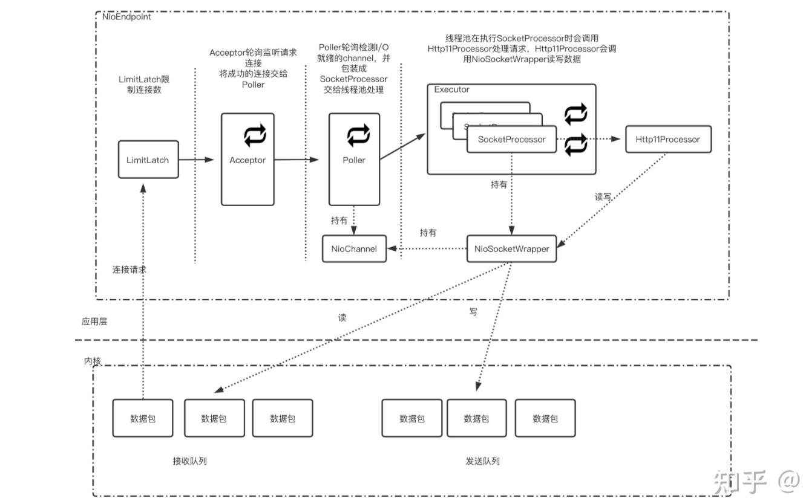

## Tomcat之NioEndpoint组件：连接处理第一站
tomcat 的 NioEndpoint 包含 LimitLatch、Acceptor、Poller、SocketProcessor 和 Executor 共 5 个组件；典型的主从Reactor多线程模型实现， 其中
1. LimitLatch负责限制连接请求：LimitLatch 用来控制操作系统接受连接个数，通过配置acceptCount来控制
2. Acceptor是主从结构中的“主”结构，仅负责接收并分发连接；控制最大连接数，是阻塞接受请求的，在
3. Poller是主从结构中的“从”结构，负责监听Acceptor分发连接的I/O事件，本质也就是Selector，当监听有I/O事件就绪后，将对应的连接封装成SocketProcessor交给线程池处理
4. SocketProcessor：具体连接的封装
5. Executor：真正处理连接的线程池

#### 资料来源：
[NioEndpoint](https://zhuanlan.zhihu.com/p/404022207)
