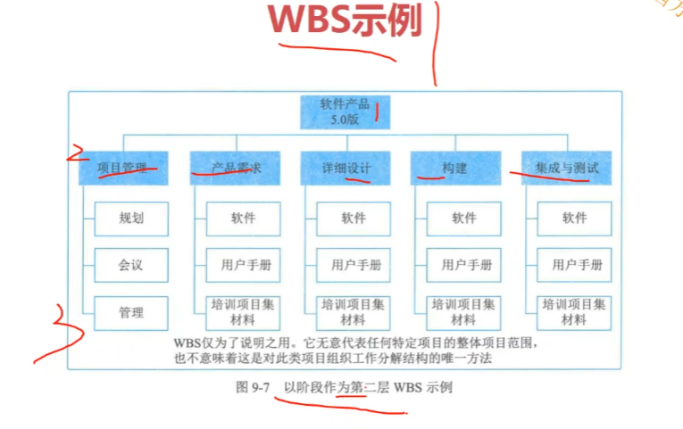

## 70 论文概述
### 评分要点
1. 切合题意
2. 应用尝试与水平
3. 实践性：（举例子）
4. 表达能力
5. 综合能力与分析能力

### 扣分要点
1. 摘要
2. 字迹潦草
3. 罗列条目、叙述理论
4. 自我吹嘘、夸大其词
5. 明显错误和漏洞
6. 项目仅属于大学生性质或研究生学习性质且应用水平较低

### 不及格
1. 虚构情节，较严重的不真实与不可信的论文
2. 未详细讨论项目开发的实践
3. 讨论的内容和方法过于陈旧。规模小，单机节点
4. 内容不切题意，内容相对空洞
5. 正文与摘要过于短小
6. 文理不通，错别字，条理不清晰、字迹潦草

### 加分项
1. 有独特简介深刻体会
2. 观点很高，符合计算机应用的发展
3. 内容详实体会中肯
4. 项目难度很高，项目质量优异

### 论文结构
1. 背景500字：**提前准备好**  
   1. 内容
      1. 主体，身份，项目名称，项目周期，项目金额，建设单位
      2. 项目目标
      3. 项目实现功能模块
      4. 技术描述  
   2. 注意事项  
      1. 内容可与摘要重复，但比摘要具体
      2. 写一点项目的it技术
      3. 不写项目结束时间
2. 过渡200字
   1. 内容
      1. 论点的重要性（承上）
      2. 要写的过程（启下）
      3. **组合论文中主过程与辅过程的关系**
   2. 注意的事项
      1. 简单扼要
      2. 可以侧面说明该管理很重要
3. 过程1200字（十大过程）
   1. 内容
      1. 要写出标题
      2. 根据题目列出所有过程
      3. 根据题目在对应过程中回答子题目
   2. 注意事项
      1. **过程一个都不能少**
      2. **过程顺序也不能错**
      3. **子问题必须在对应过程里去回答**
      4. 字数均匀
4. 结尾300字
   1. 内容
      1. 项目结束时间
      2. 达成成效
      3. 微不足道的问题
      4. 表决心
   2. 注意事项
      1. **结尾不能少**
      2. **项目收尾和论文结尾不一样**
      3. 微不足道的问题，不写严重问题。

### 项目选择事项
1. 别写涉密项目，不写机密手段
2. 最好不写公司内部项目、互联网项目、纯硬件项目
3. 新建类型，不要写升级
4. 采购管理站在甲方的角度去写
5. 剩下九大管理站在乙方项目经理角度去写，如果写甲方则使用监控角度
6. 项目验收实践：离考试实践很近，**但一定是已经完成的项目**
7. 项目金额：200w以上，1000万以下。

### 摘要
全文的总结

组成元素：
1. 主体，身份，项目名称，项目周期，项目金额，建设单位
2. 项目目标破
3. 项目实现功能
4. 验收时间
5. 项目论点

注意事项
1. 简明扼要
2. 省份、公司名称都需要做脱敏处理
3. 要写论点（管理+管理过程）
4. 组合论文的论点要把辅过程提一下

### 特别强调
1. 不能背论文
2. **时间特别紧张**
3. 提前准备好通用背景
4. **好的背景和架构非常重要**，细节决定成败，打磨自己的背景
5. **十大管理49个过程必须背诵**

## 71 单过程与组合论文
1. 写作步骤
2. 单过程论文架构
3. 组合论文架构
4. 真题解析

### 组合论文
1. 注意点
   1. 架构写好那些过程组合来写
   2. 标题体现内容
   3. 主次关系
   4. 写出两个过程之间的关系。

PDCA

## 72 整体与范围管理

### 整体管理
1. 考试轨迹
2. 历年真题
3. 口语化解释
   1. 制定项目章程：
      1. 制定和发布项目章程，正式批准项目，为项目经理授权。
      2. 项目发起人发布了项目章程，正式启动项目，为我授权项目经理。写项目章程的内容。
   2. 制定项目管理计划：和大家一起制定一个整体的项目管理计划，由谁写什么计划，编写什么子计划，在整合成整体提的管理计划。计划评审。编写计划的原则、工具、方法、步骤，然后再写具体的内容。
   3. 指导与管理项目工作：采取多种新行动执行项目管理计划，完成项目范围的明确工作。如何按照项目项目管理计划，来开展项目的指导和管理工作，只要项目中的活动都可以写，如团队组建、需求调研、按进度开发计划、变更请求、培训。（代码规范化管理，文档规范化管理，流程规范化管理，配置规范化管理）
   4. 管理项目知识：
      1. 口语化：在项目过程中总结、归纳项目过程中遇到的问题，并形成知识的过程。
      2. 思路：举例说明，在项目过程中遇到问题，解决问题并将思路转移到知识库。（gitlab自建仓库）
   5. 监控项目工作：
      1. 在执行过程中，不断监控，看下项目的绩效数据是否与基准偏离
      2. 写怎么进行监控工作的。如每周五召开会议，每个人汇报进度并报告遇到的问题。（周一例会）
   6. 实施变更请求
      1. 变更是不可避免的，当发生变更的时候，要严格按照变更流程进行项目变更。
      2. 以需求变更、进度变更举例，针对变更是怎么做的，CCB批准。（接收到用户的逻辑变更请求后，评估需要由项目领导审批，由领导和用户沟通批准后，发邮件通知相关方，并着手安排变更开发，进行系统具体业务逻辑变更导致系统开发进度和测试进度延长）
   7. 结束项目或阶段：
      1. 项目通过用户验收，交付了产品，履行了合同。召开项目总结会议，进行项目总结和项目评审。
      2. 验收的过程，输出验收报告。是怎么招考总结大会，通过这个项目我们形成了哪些组织过程资产，项目的遗留问题。 交付的文档。
4. 与其他管理的关系
5. 可能的问题
   1. 缺乏项目章程
      1. 后果
         1. 项目经理不权威
         2. 项目成员不清楚职责
      2. 原因：组织管理不健全
      3. 解决：高层领导需要加强组织项目管理学习
   2. 没有项目管理计划
      1. 后果：项目管理无章可循
      2. 原因：项目管理人员知识不足
   3. 项目管理计划的各个子计划太孤立
   4. 指导项目工作不力
   5. 没有阶段评审机制
   6. 控制变更不规范
   7. 项目收尾时没有形成有效的组织过程资产
6. 可能的子问题
   1. 通用问题
      1. 描述整合管理的过程
      2. 描述整合管理的输入、输出、工具和方法
      3. 整合管理中遇到什么问题，怎么解决。
   2. 专有问题
      1. 项目章程的内容和作用：稍微写几个，再针对某一个展开描写
      2. 项目管理计划的内容、编制步骤、原则：开发方法，生命周期，基准。PDCA。原则是团队成员的参与，循序渐进的
      3. 如何做好项目监控：例会，QA检查
      4. 绩效报告的内容：当前状态，进展的状态，预测，风险。
      5. 变更的流程：举例
      6. 收尾包含的内容，收尾包含的文档:做好验收（合同收尾）。试运行。终验。管理收尾（开总结大会）。提交的文档移交（产品文档，使用指南，维护手册，质量保证说明书，验收报告）。
      7. 如何做好阶段性的收尾：举例。需求评审收尾工作，相关干系人签字。
      8. 怎么做好项目的验收：交付项目文档，相关干系人签字验收

## 73 范围管理
1. 考试轨迹
2. 历年真题
3. 口语化解释
   1. 规划范围管理
      1. 编制范围管理计划，指导范围管理工作
      2. 我组织相关人员编制范围管理计划，写计划的输入、输出、技术和方法
   2. 收集需求
      1. 通过多种方式收集和记录干系人的需求的过程
      2. 需求的种类，业务需求，用户需求。通过什么方式获取需求，如会议，访谈，面对面沟通，原型法，问卷等。
   3. 定义范围：
      1. 收集需求后，根据项目章程中的范围目标与进度目标，对项目和产品进行描述，最后形成项目范围说明书
      2. 举例说明如何进行产品分析，一般是需求分析师根据用户需求进行分析，可以给出多种方案。
   4. 创建WBS
      1. 根据项目范围说明书，将项目交付物和管理工作进行分解，分解成较小的工作包，最后形成WBS
      2. 写分解的步骤，分解的原则，举例说明哪些东西作为第一层，哪些作为第二层。
   5. 确认范围
      1. 将阶段性的交付物与用户进行确认，确认开发的功能是否是用户需要的
      2. 举例说明如何与用户进行确认范围的，用户途中提出了什么问题，回去后进行确认整理，再进行沟通，以确认可交付物符合用户需求（ui确认，原型确认，基础数据功能确认，单个流程模块确认）
   6. 控制范围
      1. 管理范围变更，做好范围控制，防止出现范围蔓延
      2. 定期看下实现的功能与范围基准是否有偏差，出现偏离的时候怎么做，另外还可以举例说明变更控制流程。
4. 可能遇到的问题
   1. 缺乏可行的范围管理及计划
   2. 产品范围有缺陷：识别主要干系人，并用多种方法获取他们的需求，形成正确的文档，请用户确认签字。
   3. 范围说明书不严谨：定义范围时，一定要本着严谨认真的态度，把产品范围与工作范围写明白
   4. WBS分解有缺陷或不够细致：工作包太大或太小，遗漏工作包。
   5. 确认范围流于形式
   6. 范围变更控制不规范
   7. 范围蔓延
5. 可能的子问题
   1. 专有问题
      1. 范围管理计划的内容步骤原则
      2. 如何做好需求分析
      3. 需求的分类：
      4. 需求跟踪举证
      5. 范围说明书有哪些内容
      6. WBS的作用、分解的步骤、原则
      7. 画WBS分解到五层
      8. 范围确认重要性、范围确认和质量控制的区别和联系
      9. 如何做好范围确认
      10. 范围变更的原因有什么
      11. 如何做好范围控制
      12. 如何防止范围蔓延
      13. 如何做需求评审
6. 图表
   1. 
   2. 同一组件只能属于一个上层，所以这个图是错的，软件和用户手册只能属于一个上层。 

## 74 写作专题

1. 规划进度管理
   1. 过程
      1. 规划进度管理
         1. 编写进度计划管理文档，指导进度管理工作
         2. 我组织了相关人员编写进度管理计划，写输入，工具，方法，步骤
      2. 定义活动
         1. 看下项目有多少需要做的活动
         2. 写根据wbs识别项目的活动，写活动与工作包的区别，举例项目有哪些活动（需求分析，环境构建，代码开发，代码测试，代码交付）
      3. 排列活动顺序
         1. 根据活动的依赖关系，对活动的优先级进行排序
         2. 举例通过什么方法进行排列，排序的依据：依赖关系，重要性，紧急度
      4. 估算活动持续时间
         1.  在估算活动资源的基础上，估算活动需要的时间
         2.  举例说明几个活动的持续时间，通过什么方式（三点估算，参数估算，类比估算）（参考以前部署环境使用的时间，预估构建环境的时间应在正常情况在2周，最好在1周，最晚在3周，根据三点估算平均时间应该是两周左右）
      5.  制定进度计划
          1.  进度计划描述了活动负责人、活动开始时间、结束时间
          2.  通过project制定项目进度计划，需要全员参与，编写后，还需要对进度管理计划评审，评审后形成进度基线（活动编号，活动名称，开始时间，负责人，工期，前置活动）
      6.  控制进度
          1.  那项目目前的数据与进度基准进行对比，有偏差的话需要进行纠偏
          2.  写挣值分析来做进度分析，评估进度偏差对项目的影响，怎么去纠偏，另外还可以写怎么进行进度变更流程的。
   2. 问题
      1. 缺乏可信的进度管理计划，或有计划为执行：执行切实的进度管理计划
      2. 活动顺序不合理（环境搭建需要服务器到位，未估算资金审批时间，通过跟进审批节点领导来加快审批速度）
      3. 活动历时估算不合理：
      4. TODO
   3. 子问题
      1. 进度管理计划的内容（工具和技术）。步骤（PDCA）原则（所有人参与，需要评审）
      2. 举例说明项目中的重要活动（定义活动中写：序号，活动名称，活动描述，紧急程度，优先级，紧前紧后活动）
      3. 项目有哪些重要的里程碑（定义活动。立项，设计，开发）
      4. 活动和工作包的关系（活动包括多个工作包，一个工作包属于一个活动）
      5. 怎么进行活动持续时间估算的（先估算活动下工作表的时间，在汇总成活动的时间，在自下而上汇总成项目时间，最后考虑到项目相关的风险，如采购的延期到货的风险，人员变动的风险等，为项目确定一部分的管理储备）
      6. 画出项目的进度计划（甘特图，进度表格）
      7. 做计划的的时候如何考虑缓冲（制定进度计划：在对高风险的活动时，需要考虑活动进度的不确定性，应当对活动设定一定的缓冲，如本项目在引入一个新的分布式事务管理工具，在对这个新技术的难度、当前人员的了解程度等因素为该互动设定了一周左右的缓冲时间）
      8. 延期是不可避免的，如果项目出现了延期，你是如何处理的。（要求这个活动之后的部分活动赶工，并并行部分活动）

   
   

2. 成本管理
   1. 过程
      1. 规划成本管理：编写成本管理计划，指导成本管理工作。PDCA。写输入、工具方法、步骤
      2. 估算成本：对完成项目的成本做大致估算。写成本估算的重要性，成本估算的步骤（看什么东西要花钱，估算东西要花多少钱（参数估算，三点估算，自下而上的估算），找出可以替代的成本）。
      3. 制定预算：对完成项目的成本的精确预算。预算的步骤。估算成本和制定预算的区别和联系。写经过评审通过后的成本预算是成本基准。
      4. 控制成本：
         1. 那当前绩效说明与成本基准进行比较，如果有偏差则进行纠偏。
         2. 挣值分析来做成本分析，评估偏差对项目的影响，如何纠偏（集中办公，虚拟团队，内部培训）。还可以写如何进行变更流程的。
   2. 问题
      1. 缺乏可执行的成本管理计划
      2. 估算不准
         1. 经验不足
      3. 预算中没有进行储备分析
      4. 成本失控导致超出预算
   3. 子问题
      1. 成本管理计划的内容。步骤和原则
      2. 成本分类（人员成本，设备成本，软件成本，服务成本）
      3. 估算的步骤
      4. 预算的步骤
      5. 管理储备和应急储备的区别（管理储备需要进行成本变更）
      6. 成本估算和成本预算的区别（预算中写）
      7. 项目成本超支是如何处理

