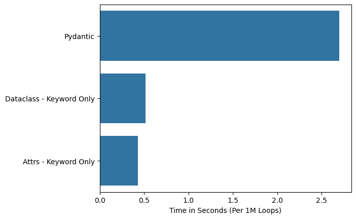
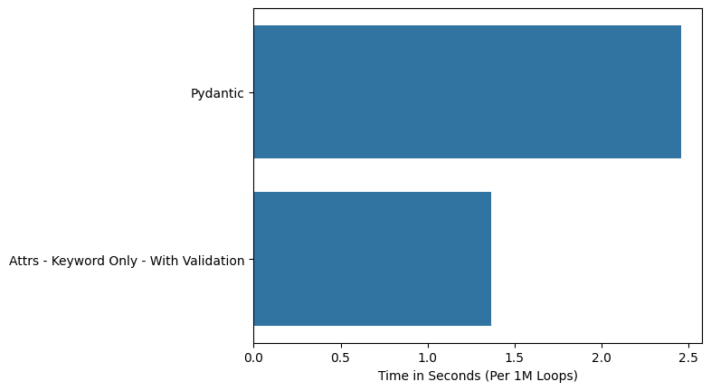
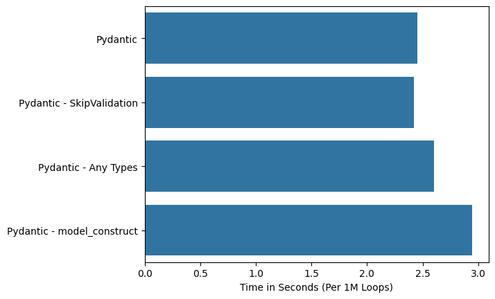
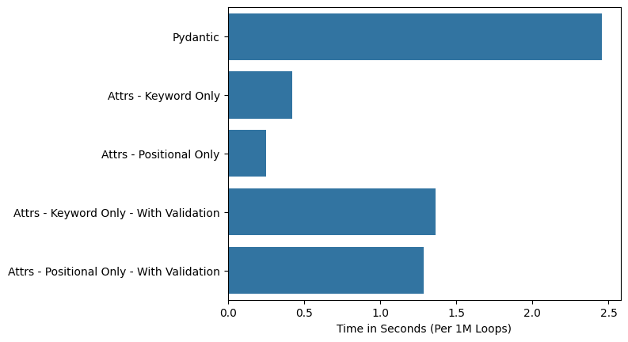
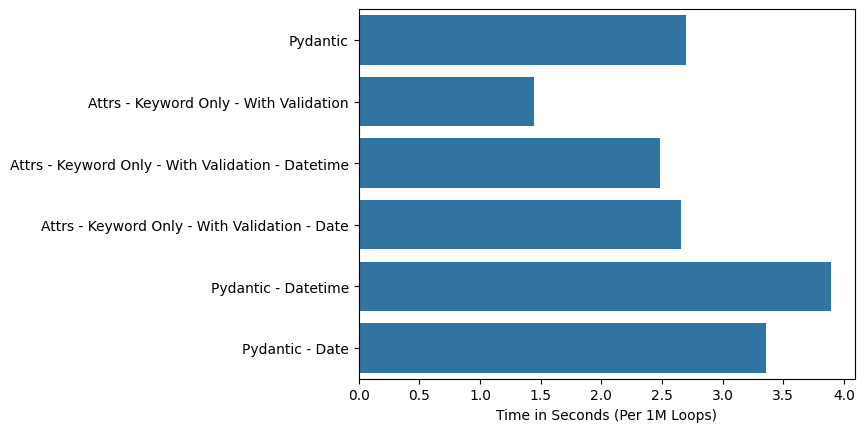
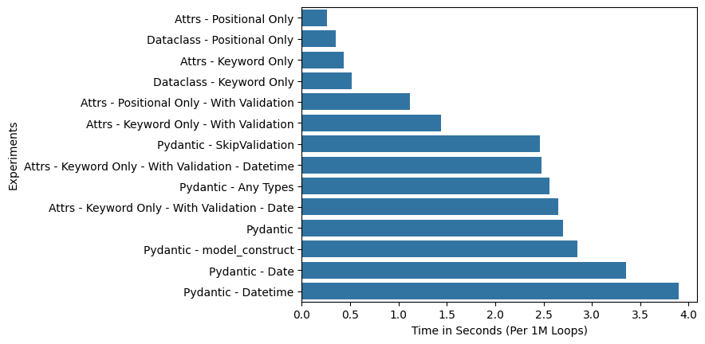

# Intro and Takeaways

I recently got interested in performance differences between the different data class libraries in Python: `dataclass`, `attrs`, and `pydantic`. What started as a simple investigation quickly spiralled into many interesting dimensions. This post is heavily influenced by two awesome posts investigating a similar question:

* [Why I Use Attrs Instead of Pydantic](https://threeofwands.com/why-i-use-attrs-instead-of-pydantic/), by [Tin Tvrtkovic](https://threeofwands.com/)
* [Attrs, Dataclasses and Pydantic](https://stefan.sofa-rockers.org/2020/05/29/attrs-dataclasses-pydantic/), by [Stefan Scherfke](https://stefan.sofa-rockers.org/about/)

My big takeaway is that the performance differences are very small, i.e. not large enough that one should choose one package over another based on performance. If you really want the fastest performance, use either `attrs` or `dataclass` without validation using only `positional` argument calls. The only significant slow down is using `datetime.datetime` or `datetime.date` objects in `pydantic`. I don't want to wholly recommend against it, but it does seem like an area one should be specifically careful about if performance is an upmost concern. 

# Experimental Setup and Measurement

To measure performance, I used the `timeit` module. As per the documents, I measured the performance using `timeit.repeat(number=1_000_000, repeat=5)`, taking the minimum value of the 5 runs. 

I started by defining a basic class `Inventory` which has three fields: `item`, `price`, `quantity`. I keep the type annonation blank, as defining more generic types (think `Any`) are a potential performance improvement. Note, this performance investigation is focused on this simple non-nested class. There is a [comment](https://docs.pydantic.dev/latest/concepts/models/#creating-models-without-validation) in the pydantic documents that `init` is faster than `model_construct` for simpler versus more complex classes. Thus, I don't suggest these results are *generically* true. 

```python
class InventoryAttrs:
    item
    price 
    quantity
```

We'll walk through a series of experiments, discoveries I made along the way. I use partial to define a simple `time_experiment` function I use throughout:

```python
time_experiment = partial(
    timeit.repeat,
    setup='pass',
    number=LOOPS,
    globals=globals()
)
```

## Comparing "Basic" Classes

First, we will compare the following:

```python
from pydantic import BaseModel 
from attrs import define 

# Define classes for pydantic, dataclass, and attrs
class InventoryPydantic(BaseModel):
    item: str 
    price: float
    quantity: int = 0 

@dataclass
class InventoryDataclass:
    item: str 
    price: float 
    quantity: int = 0

@define 
class InventoryAttrs:
    item: str 
    price: float 
    quantity: int = 0
```

Our experiment instantiates each of the classes using `Keyword` arguments, i.e:

```python
pydantic_base = time_experiment(stmt="InventoryPydantic(item='banana', price=1.99, quantity=10)")
dataclass_base = time_experiment(stmt="InventoryDataclass(item='banana', price=1.99, quantity=10)")
attrs_base = time_experiment(stmt="InventoryAttrs(item='banana', price=1.99, quantity=10)")
```

We can easily see that `dataclass` and `attrs` is much much faster. This is a well known outcome. The reason is that `pydantic` not only initializes an object, it also runs validation on the attributes of the object, i.e. checking the `item` is actually a `str` etc.

<center>
    
</center>

Let's try to do an apples to apples comparison by adding validation requirements to `attrs`. Note, there are no methods to validate `dataclass` within the standard library, so we ignore it.

## Comparing Classes using validations

We will keep our `InventoryPydantic`, but define two new classes with validations:

```python
from attrs import validators, field, define 

@define 
class InventoryAttrsValidated:
    item: str = field(validator=validators.instance_of(str))
    price: float = field(validator=validators.instance_of(float))
    quantity: int = field(default=0, validator=validators.instance_of(int))
```

I ran the following experiment:

```python
pydantic_base = time_experiment(stmt="InventoryPydantic(item='banana', price=1.99, quantity=10)")
attrs_validated = time_experiment(stmt="InventoryAttrsValidated(item='banana', price=1.99, quantity=10)")
```

We can see that even with validation, `attrs` performs better than `pydantic`:

<center>
    
</center>

## Trying to speed up Pydantic...unsuccessfully

There were a few methods I attempted to speed up Pydantic. Note, I'm on `pydantic==2.5.2`, so some of the tips and tricks may not work on this. Here's the few I tried:
* Use `SkipValidation` type, referenced in the [Validator](https://docs.pydantic.dev/latest/concepts/validators/) section of the pydantic docs
* Use `Any` type
* Instantiate class with `model_constructs`. Note, the [docs](https://docs.pydantic.dev/latest/concepts/models/#creating-models-without-validation) explicitly call out of that this may be slower for simpler classes.


```python
# Import additional modules
from pydantic import SkipValidation, BaseModel 
from typing import Any 

# pydantic with any types
class InventoryPydanticAny(BaseModel):
    # https://docs.pydantic.dev/latest/concepts/performance/
    item: Any 
    price: Any
    quantity: Any = 0 

# pydantic with skip validation types
class InventoryPydanticSkipValidation(BaseModel):
    item: SkipValidation[str]
    price: SkipValidation[float]
    quantity: SkipValidation[int] = 0 
```

I ran the following experiment:

```python
pydantic_base = time_experiment(stmt="InventoryPydantic(item='banana', price=1.99, quantity=10)")
pydantic_any = time_experiment(stmt="InventoryPydanticAny(item='banana', price=1.99, quantity=10)")
pydantic_skip_validation = time_experiment(stmt="InventoryPydanticSkipValidation(item='banana', price=1.99, quantity=10)")
pydantic_model_constructs = time_experiment(stmt="InventoryPydantic.model_constructs(item='banana', price=1.99, quantity=10)")
```

Surprisingly, none of these methods sped up Pydantic. Note, this may simply be due to the simplicity of the class. 

<center>
    
</center>

## Trying to speed up Dataclass and Attrs...somewhat successfully

As I was playing around with some different permutations, I stumbled on one sure fire way to improve performance, pass in only `positional` arguments when not running validation. 

```python
pydantic_base = time_experiment(stmt="InventoryPydantic(item='banana', price=1.99, quantity=10)")
attrs_base = time_experiment(stmt="InventoryAttrsValidated(item='banana', price=1.99, quantity=10)")
attrs_positional_only = time_experiment(stmt="InventoryAttrsValidated('banana', 1.99, 10)")
attrs_positional_only_with_validation = time_experiment(stmt="InventoryAttrsValidated('banana', 1.99, 10)")
attrs_positional_and_keyword_with_validation = time_experiment(stmt="InventoryAttrsValidated('banana', price=1.99, quantity=10)")
```

`pydantic` requires keyword arguments, so we can only test this for `attrs`. What we see is quite a performance improvement. Interestingly, when you run validation for `attrs` this goes away. 

<center>
    
</center>

The impact of `positional` versus `keyword` arguments was fairly surprising to me, though there's some talk of this when I do some searches. I had assumed that when you pass in an argument, it gets bound to an attribute in the same manner, regardless of if you passed it in as a `positional` or a `keyword` argument. Turns out this is wrong, and there's a bit of a rabbit hole you can go down, see this (potentially outdated) [blog post](https://eli.thegreenplace.net/2012/03/23/python-internals-how-callables-work). TLDR; there are optimizations within `CPython` for when a function is called, if the function only provides positional arguments there's a faster path that's taken. 


## datetime worsens Pydantic performance

Another issue I stumbled upon was how `datetime` was slow to validate for `pydantic`. I was able to validate this, trying both `datetime.datetime` and `datetime.date`. I had hypothesized since `date` doesn't have `time` attributes, maybe it would be significantly faster. 

```python
pydantic_base = time_experiment(stmt="InventoryPydantic(item='banana', price=1.99, quantity=10)")
attrs_base = time_experiment(stmt="InventoryAttrsValidated(item='banana', price=1.99, quantity=10)")
attrs_datetime = time_experiment(stmt="InventoryAttrsValidatedDatetime(item='banana', price=1.99, quantity=10, datetime=datetime.datetime(year=2023, month=10, day=1, hour=6, minute=30, second=10))")
attrs_date = time_experiment(stmt="InventoryAttrsValidatedDatetime(item='banana', price=1.99, quantity=10, date=datetime.date(year=2023, month=10, day=1))")
pydantic_datetime = time_experiment(stmt="InventoryPydanticDatetime(item='banana', price=1.99, quantity=10, datetime=datetime.datetime(year=2023, month=10, day=1, hour=6, minute=30, second=10))")
pydantic_date = time_experiment(stmt="InventoryPydanticDate(item='banana', price=1.99, quantity=10, date=datetime.date(year=2023, month=10, day=1))")
```

We see that `pydantic` is signficantly slower with datetime. This was actually discussed in one of the [blog posts](https://stefan.sofa-rockers.org/2020/05/29/attrs-dataclasses-pydantic/) mentioned up top. `pydantic` uses it's own home rolled date time validation. 

<center>
    
</center>

# Conclusion

Overall, we see some interesting overall performance differences. 

<center>
    
</center>

The most surprising was definitely around `positional` and `keyword` arguments, as well as, how `datetime` can slow down `pydantic` performance. Other areas of investigation here are, measuring performance for more complex classes (both nested and `enum`), measuring memory usage differences, as well as, further investigating how to speed up `pydantic` performance. 