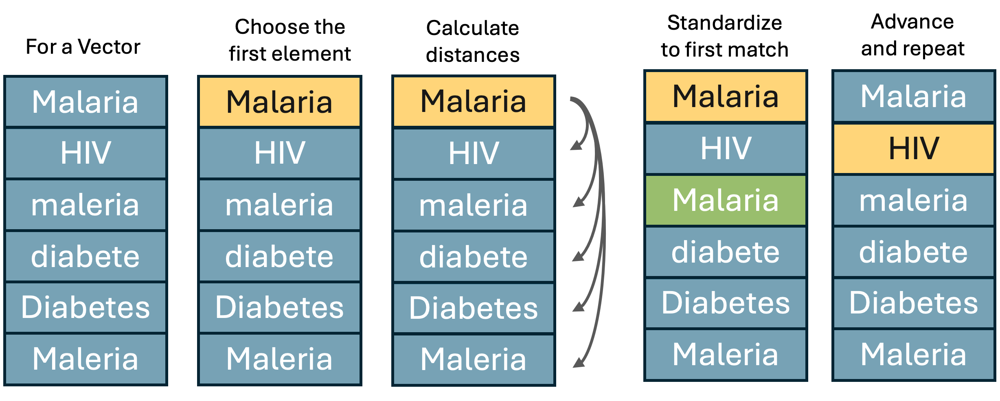

Standardizing data vectors is an important step in data science. For
example, different data sources often represent the same entity, such as
country names, in different ways or with different spellings. In
addition, small errors or formatting inconsistencies can complicate
joins and lead to difficulties in downstream analysis. While excellent
resources do exist to solve this problem for individual use cases, such
as the [countries](https://github.com/fbellelli/countries) package in R,
it can be useful to understand general methods to self-standardize
categorical vectors. There are three approaches that I’ve used to
standardize character vectors. I’ve written scripts below to illustrate
each method.

## The vector to standardize

Note: this data is fictional!

| disease_name       | outbreaks |
|:-------------------|----------:|
| Influenza          |        15 |
| Inflenza           |        10 |
| COVID-19           |        95 |
| sars-covid-19      |        90 |
| Malaria            |        20 |
| Maleria            |        22 |
| malaria            |        20 |
| Diabetes           |        30 |
| Diabetis           |        28 |
| HIV/AIDS           |        75 |
| HIV                |        70 |
| AIDS               |        65 |
| Tuberculosis       |        40 |
| Tuberclosis        |        38 |
| Alzheimers         |        23 |
| Alzheimers Disease |        27 |
| Heart Disease      |        60 |
| Heart Diease       |        58 |

## Standardization by similarity matching

The most straight forward way to standardize a character vector is to
use string distance. String distance is a measure of how different two
strings are. The method I tend to use is
[Jaro–Winkler](https://en.wikipedia.org/wiki/Jaro%E2%80%93Winkler_distance)
distance. The distance returned is normalized so that a score of 0
represents an exact match between two strings and a 1 represents maximal
difference. In R, the main package for calculating string distance is
the [stringdist](https://github.com/markvanderloo/stringdist) package.
For this use case we need to come up with an algorithm that will
sequentially move down a vector, finding the first match within a
pre-specified string distance and adopting it as the new standard.
Graphically the algorithm should essentially do the following.

<p style="text-align:center;">

</p>

To walk down the vector we could either use for loops or some kind of
recursive function. Fortunately there is a function in the purrr package
that is perfect for the job,
[reduce](https://blog.zhaw.ch/datascience/r-reduce-applys-lesser-known-brother/)!
In order to use either approach we first need to define the function we
want to apply between each individual element and the vector. I’m going
to call the function `fuzzy_match` though that name may already be in
use elsewhere.

``` r
# This is pretty cool!
fuzzy_match <- function(vector, element, max_dist = 0.1) {
  
  # Return the closest matching element in the vector 
  # Add in a few guards against failure to match
  key <- vector[vector != element]
  dist <- stringdist::stringdist(element, key, method = "jw")
  if(!is.null(element)) {
    if(!is.na(element)) {
      if(length(dist) > 0 & any(!is.na(dist))) {
        if(min(dist, na.rm = T) < max_dist) return(c(vector, key[which.min(dist)]))
      }
    }
  }

  # If no match within max_dist is found, return the original element
  return(c(vector, element))
}
```

Now we just need to invoke it using the reduce function as so:

``` r
# Slick right?
outbreak_data <- outbreak_data |> 
  mutate(Similarity = reduce(disease_name, fuzzy_match, max_dist = 0.1))
```

which produces the following:

| disease_name       | Similarity         | outbreaks |
|:-------------------|:-------------------|----------:|
| Influenza          | Influenza          |        15 |
| Inflenza           | Influenza          |        10 |
| COVID-19           | COVID-19           |        95 |
| sars-covid-19      | sars-covid-19      |        90 |
| Malaria            | Malaria            |        20 |
| Maleria            | Malaria            |        22 |
| malaria            | Malaria            |        20 |
| Diabetes           | Diabetes           |        30 |
| Diabetis           | Diabetes           |        28 |
| HIV/AIDS           | HIV/AIDS           |        75 |
| HIV                | HIV                |        70 |
| AIDS               | AIDS               |        65 |
| Tuberculosis       | Tuberculosis       |        40 |
| Tuberclosis        | Tuberculosis       |        38 |
| Alzheimers         | Alzheimers         |        23 |
| Alzheimers Disease | Alzheimers Disease |        27 |
| Heart Disease      | Heart Disease      |        60 |
| Heart Diease       | Heart Disease      |        58 |

Notice how not everything was standardized? That’s because we chose a
relatively stringent maximum string distance. If we instead set
`max_dist = 0.3` we get the following:

| disease_name       | Similarity         | Similarity_0.3 | outbreaks |
|:-------------------|:-------------------|:---------------|----------:|
| Influenza          | Influenza          | Influenza      |        15 |
| Inflenza           | Influenza          | Influenza      |        10 |
| COVID-19           | COVID-19           | COVID-19       |        95 |
| sars-covid-19      | sars-covid-19      | sars-covid-19  |        90 |
| Malaria            | Malaria            | Malaria        |        20 |
| Maleria            | Malaria            | Malaria        |        22 |
| malaria            | Malaria            | Malaria        |        20 |
| Diabetes           | Diabetes           | Diabetes       |        30 |
| Diabetis           | Diabetes           | Diabetes       |        28 |
| HIV/AIDS           | HIV/AIDS           | HIV/AIDS       |        75 |
| HIV                | HIV                | HIV/AIDS       |        70 |
| AIDS               | AIDS               | AIDS           |        65 |
| Tuberculosis       | Tuberculosis       | Tuberculosis   |        40 |
| Tuberclosis        | Tuberculosis       | Tuberculosis   |        38 |
| Alzheimers         | Alzheimers         | Alzheimers     |        23 |
| Alzheimers Disease | Alzheimers Disease | Alzheimers     |        27 |
| Heart Disease      | Heart Disease      | Heart Disease  |        60 |
| Heart Diease       | Heart Disease      | Heart Disease  |        58 |

The weakness of this approach is that it is not always clear what the
best maximum distance to use is. If you set the maximum distance high
enough you might be able to match difficult cases, such as
`COVID-19 and sars-covid-19` but you run the risk of accidentally
changing something too far, like matching `Heart Disease to Malaria`. It
isn’t always clear where that border should be drawn. Another problem is
that this algorithm just chooses the first match to standardize on, not
the best match. It could just as easily settle on converting everything
to `melaria instead of Malaria`. It doesn’t know which of the two
strings is *better* just how different two strings are from each other.

## Standardization by heirarchical clustering

Another way to use string distances to group like elements is through
hierarchical clustering. Hierarchical clustering iteratively splits a
vector into progressively finer clusters based on some measure of
distance. This method operates on a matrix of distances. Looking at the
matrix can give you a sense of why some of the disease names were or
were not standardized by the approach above.

``` r
dist_matrix <- stringdistmatrix(outbreak_data$disease_name, method = "jw")
mat <- dist_matrix |> as.matrix()
rownames(mat) <- outbreak_data$disease_name
colnames(mat) <- outbreak_data$disease_name
knitr::kable(round(mat, 3))
```

|                    | Influenza | Inflenza | COVID-19 | sars-covid-19 | Malaria | Maleria | malaria | Diabetes | Diabetis | HIV/AIDS |   HIV |  AIDS | Tuberculosis | Tuberclosis | Alzheimers | Alzheimers Disease | Heart Disease | Heart Diease |
|:-------------------|----------:|---------:|---------:|--------------:|--------:|--------:|--------:|---------:|---------:|---------:|------:|------:|-------------:|------------:|-----------:|-------------------:|--------------:|-------------:|
| Influenza          |     0.000 |    0.037 |    0.588 |         1.000 |   0.497 |   0.413 |   0.497 |    0.588 |    0.588 |    0.588 | 0.519 | 0.546 |        0.639 |       0.631 |      0.526 |              0.528 |         0.541 |        0.537 |
| Inflenza           |     0.037 |    0.000 |    0.583 |         1.000 |   0.488 |   0.399 |   0.488 |    0.583 |    0.583 |    0.583 | 0.514 | 0.542 |        0.694 |       0.689 |      0.553 |              0.509 |         0.532 |        0.528 |
| COVID-19           |     0.588 |    0.583 |    0.000 |         0.465 |   1.000 |   1.000 |   1.000 |    1.000 |    1.000 |    0.528 | 0.528 | 0.417 |        1.000 |       1.000 |      1.000 |              0.606 |         0.599 |        0.597 |
| sars-covid-19      |     1.000 |    1.000 |    0.465 |         0.000 |   0.447 |   0.447 |   0.447 |    0.532 |    0.576 |    1.000 | 1.000 | 1.000 |        0.453 |       0.487 |      0.608 |              0.701 |         0.545 |        0.506 |
| Malaria            |     0.497 |    0.488 |    1.000 |         0.447 |   0.000 |   0.095 |   0.095 |    0.577 |    0.488 |    1.000 | 1.000 | 1.000 |        0.552 |       0.544 |      0.535 |              0.579 |         0.374 |        0.365 |
| Maleria            |     0.413 |    0.399 |    1.000 |         0.447 |   0.095 |   0.000 |   0.190 |    0.488 |    0.399 |    1.000 | 1.000 | 1.000 |        0.490 |       0.480 |      0.426 |              0.485 |         0.367 |        0.356 |
| malaria            |     0.497 |    0.488 |    1.000 |         0.447 |   0.095 |   0.190 |   0.000 |    0.577 |    0.488 |    1.000 | 1.000 | 1.000 |        0.552 |       0.544 |      0.535 |              0.569 |         0.374 |        0.365 |
| Diabetes           |     0.588 |    0.583 |    1.000 |         0.532 |   0.577 |   0.488 |   0.577 |    0.000 |    0.083 |    1.000 | 1.000 | 0.542 |        0.458 |       0.451 |      0.450 |              0.509 |         0.463 |        0.386 |
| Diabetis           |     0.588 |    0.583 |    1.000 |         0.576 |   0.488 |   0.399 |   0.488 |    0.083 |    0.000 |    1.000 | 1.000 | 0.542 |        0.472 |       0.462 |      0.553 |              0.593 |         0.397 |        0.386 |
| HIV/AIDS           |     0.588 |    0.583 |    0.528 |         1.000 |   1.000 |   1.000 |   1.000 |    1.000 |    1.000 |    0.000 | 0.208 | 0.542 |        1.000 |       1.000 |      0.592 |              0.546 |         0.532 |        0.528 |
| HIV                |     0.519 |    0.514 |    0.528 |         1.000 |   1.000 |   1.000 |   1.000 |    1.000 |    1.000 |    0.208 | 0.000 | 0.472 |        1.000 |       1.000 |      1.000 |              1.000 |         0.530 |        0.528 |
| AIDS               |     0.546 |    0.542 |    0.417 |         1.000 |   1.000 |   1.000 |   1.000 |    0.542 |    0.542 |    0.542 | 0.472 | 0.000 |        1.000 |       1.000 |      0.550 |              0.565 |         0.558 |        0.556 |
| Tuberculosis       |     0.639 |    0.694 |    1.000 |         0.453 |   0.552 |   0.490 |   0.552 |    0.458 |    0.472 |    1.000 | 1.000 | 1.000 |        0.000 |       0.028 |      0.547 |              0.528 |         0.466 |        0.528 |
| Tuberclosis        |     0.631 |    0.689 |    1.000 |         0.487 |   0.544 |   0.480 |   0.544 |    0.451 |    0.462 |    1.000 | 1.000 | 1.000 |        0.028 |       0.000 |      0.537 |              0.513 |         0.454 |        0.518 |
| Alzheimers         |     0.526 |    0.553 |    1.000 |         0.608 |   0.535 |   0.426 |   0.535 |    0.450 |    0.553 |    0.592 | 1.000 | 0.550 |        0.547 |       0.537 |      0.000 |              0.148 |         0.505 |        0.461 |
| Alzheimers Disease |     0.528 |    0.509 |    0.606 |         0.701 |   0.579 |   0.485 |   0.569 |    0.509 |    0.593 |    0.546 | 1.000 | 0.565 |        0.528 |       0.513 |      0.148 |              0.000 |         0.375 |        0.398 |
| Heart Disease      |     0.541 |    0.532 |    0.599 |         0.545 |   0.374 |   0.367 |   0.374 |    0.463 |    0.397 |    0.532 | 0.530 | 0.558 |        0.466 |       0.454 |      0.505 |              0.375 |         0.000 |        0.067 |
| Heart Diease       |     0.537 |    0.528 |    0.597 |         0.506 |   0.365 |   0.356 |   0.365 |    0.386 |    0.386 |    0.528 | 0.528 | 0.556 |        0.528 |       0.518 |      0.461 |              0.398 |         0.067 |        0.000 |

Now that we have a matrix containing the distances between every element
we need to group them. For that we can use the
[hclust](https://www.rdocumentation.org/packages/stats/versions/3.6.2/topics/hclust)
package in R.

``` r
hc <- hclust(dist_matrix, "ward.D2")
hc$labels <- outbreak_data$disease_name
ggdendro::ggdendrogram(hc)
```

<!-- -->

There are several clustering algorithms. The one used here is `average`
which is based on the average distance between points in each cluster.
Another alternative for this task might be `ward.D2` which minimizes the
total within-cluster variance. Unfortunately, as with the similarity
method a choice must be made for a cutoff threshold, this time based on
tree distance instead of maximum distance.

``` r
clusters <- cutree(hc, h = 0.2) |> 
  enframe(name = "disease_name", value = "cluster") |> 
  group_by(cluster) |>
  mutate(HC = disease_name[1]) |> 
  ungroup()

outbreak_data <- outbreak_data |> left_join(clusters |> select(-cluster))
```

    ## Joining with `by = join_by(disease_name)`

``` r
knitr::kable(outbreak_data |> select(-outbreaks, everything(), outbreaks))
```

| disease_name       | Similarity         | Similarity_0.3 | HC            | outbreaks |
|:-------------------|:-------------------|:---------------|:--------------|----------:|
| Influenza          | Influenza          | Influenza      | Influenza     |        15 |
| Inflenza           | Influenza          | Influenza      | Influenza     |        10 |
| COVID-19           | COVID-19           | COVID-19       | COVID-19      |        95 |
| sars-covid-19      | sars-covid-19      | sars-covid-19  | sars-covid-19 |        90 |
| Malaria            | Malaria            | Malaria        | Malaria       |        20 |
| Maleria            | Malaria            | Malaria        | Malaria       |        22 |
| malaria            | Malaria            | Malaria        | Malaria       |        20 |
| Diabetes           | Diabetes           | Diabetes       | Diabetes      |        30 |
| Diabetis           | Diabetes           | Diabetes       | Diabetes      |        28 |
| HIV/AIDS           | HIV/AIDS           | HIV/AIDS       | HIV/AIDS      |        75 |
| HIV                | HIV                | HIV/AIDS       | HIV           |        70 |
| AIDS               | AIDS               | AIDS           | AIDS          |        65 |
| Tuberculosis       | Tuberculosis       | Tuberculosis   | Tuberculosis  |        40 |
| Tuberclosis        | Tuberculosis       | Tuberculosis   | Tuberculosis  |        38 |
| Alzheimers         | Alzheimers         | Alzheimers     | Alzheimers    |        23 |
| Alzheimers Disease | Alzheimers Disease | Alzheimers     | Alzheimers    |        27 |
| Heart Disease      | Heart Disease      | Heart Disease  | Heart Disease |        60 |
| Heart Diease       | Heart Disease      | Heart Disease  | Heart Disease |        58 |

## Natural Language Processing (NLP)

Finally we can turn to Natural Language Processing to standardize things
for us. This approach has both advantages and dis-advantages. One of the
advantages is that large language models like chatGPT may have an idea
of which of two strings is better, given the context. That’s a pretty
big bonus. A disadvantage is that the results you get from these models
are not as reproducible as a purely rules-based, or algorithmic
approach. These advantages and disadvantages represent a trade-off. In
order to benefit from the model’s knowledge about proper nomenclature,
you give up a clear understanding of *why* each element was standardized
in the way it was.

There is also an element of trust that the results returned were not
altered or biased in any way by the model. This isn’t an issue with
small datasets but could be a real concern when dealing with tables with
millions of rows. Then it can be very difficult to tell if the model
just happens to be biased against some of the results. Perhaps it is
much more stringent about matching names starting with the letter ‘J’
than those that start with ‘S’. Who knows what evil lurks in the hearts
of LLM’s? The Shadow knows.

<p style="text-align:center;">

</p>

To perform vector harmonization using NLP in R we can turn to the
[openai](https://irudnyts.github.io/openai/) package, which is a wrapper
around OpenAI’s API. The next step is to acquire an OpenAI API key which
is available [here](https://platform.openai.com/api-keys). The API key
needs to be loaded as a system variable using
Sys.setenv(OPENAI_API_KEY=…) or in a project .env file. If you do choose
to store it there it would be worth looking into
[git-crypt](https://medium.com/@sumitkum/securing-your-secret-keys-with-git-crypt-b2fa6ffed1a6)
to secure your .env file. Make sure to do this *before* you add your
key!

Once the API key is acquired, we have still have to set some more things
up. This includes choosing which model we want to use, telling the model
how it should act and formatting our query appropriately. In R this
involves generating a nested list.

``` r
messages <-
    list(
      list("role" = "system",
           "content" = "you act as a function that standardizes a provided vector and returns a vector of equal length formated as a JSON object."),
      list("role" = "user",
           "content" = "The following vector contains disease names. Please alter the following disease names to remove minor errors and formatting inconsistencies and to standardize on the appropriate disease name."),
      list("role" = "user",
           "content" = paste(outbreak_data$disease_name, collapse = ","))
      )
```

Now we can submit our query, extract the data from the response and add
a column of standardized disease names. Sometimes however, the model
will return malformed JSON, or will reply as a paragraph of text instead
of a structured object. In those cases the whole thing won’t work. It’s
also not easy to tell the model how aggressive it should be in
standardizing. But hey, if it doesn’t work we can always re-submit the
query until it does!

``` r
response <- create_chat_completion(
    model = "gpt-3.5-turbo",
    messages = messages) |>
  bind_cols() 

# If the model returns a malformed response just keep trying until it gets it right.
for(try in 1:100) {
  tryCatch({
    cat(paste("Attempt:", try, "\n"))
    nlp_standardized <- response$message.content |>
      jsonlite::fromJSON() |>
      unlist()
    outbreak_data <- outbreak_data |> mutate(NLP = nlp_standardized)
    cat("Success!\n")
    break()
  }, error = function(e) {
    cat("Error encountered:", conditionMessage(e),"\nRetrying...\n")
    response <<- create_chat_completion(
      model = "gpt-3.5-turbo",
      messages = messages) |>
      bind_cols() 
  })
}
```

    ## Attempt: 1 
    ## Error encountered: lexical error: invalid char in json text.
    ##                                        ```json {   "diseases": [     "
    ##                      (right here) ------^
    ##  
    ## Retrying...
    ## Attempt: 2 
    ## Error encountered: lexical error: invalid char in json text.
    ##                                        Here is the standardized list o
    ##                      (right here) ------^
    ##  
    ## Retrying...
    ## Attempt: 3 
    ## Success!

``` r
knitr::kable(outbreak_data |> select(-outbreaks, everything(), outbreaks))
```

| disease_name       | Similarity         | Similarity_0.3 | HC            | NLP                 | outbreaks |
|:-------------------|:-------------------|:---------------|:--------------|:--------------------|----------:|
| Influenza          | Influenza          | Influenza      | Influenza     | Influenza           |        15 |
| Inflenza           | Influenza          | Influenza      | Influenza     | Influenza           |        10 |
| COVID-19           | COVID-19           | COVID-19       | COVID-19      | COVID-19            |        95 |
| sars-covid-19      | sars-covid-19      | sars-covid-19  | sars-covid-19 | COVID-19            |        90 |
| Malaria            | Malaria            | Malaria        | Malaria       | Malaria             |        20 |
| Maleria            | Malaria            | Malaria        | Malaria       | Malaria             |        22 |
| malaria            | Malaria            | Malaria        | Malaria       | Malaria             |        20 |
| Diabetes           | Diabetes           | Diabetes       | Diabetes      | Diabetes            |        30 |
| Diabetis           | Diabetes           | Diabetes       | Diabetes      | Diabetes            |        28 |
| HIV/AIDS           | HIV/AIDS           | HIV/AIDS       | HIV/AIDS      | HIV/AIDS            |        75 |
| HIV                | HIV                | HIV/AIDS       | HIV           | HIV/AIDS            |        70 |
| AIDS               | AIDS               | AIDS           | AIDS          | HIV/AIDS            |        65 |
| Tuberculosis       | Tuberculosis       | Tuberculosis   | Tuberculosis  | Tuberculosis        |        40 |
| Tuberclosis        | Tuberculosis       | Tuberculosis   | Tuberculosis  | Tuberculosis        |        38 |
| Alzheimers         | Alzheimers         | Alzheimers     | Alzheimers    | Alzheimer’s Disease |        23 |
| Alzheimers Disease | Alzheimers Disease | Alzheimers     | Alzheimers    | Alzheimer’s Disease |        27 |
| Heart Disease      | Heart Disease      | Heart Disease  | Heart Disease | Heart Disease       |        60 |
| Heart Diease       | Heart Disease      | Heart Disease  | Heart Disease | Heart Disease       |        58 |
