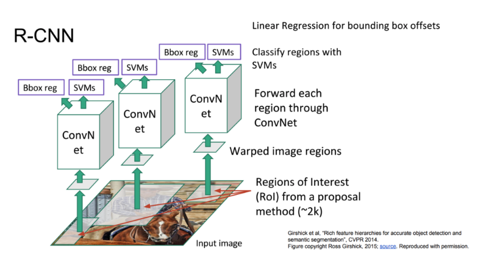
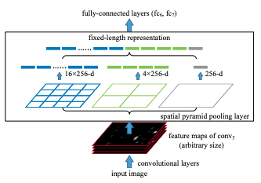
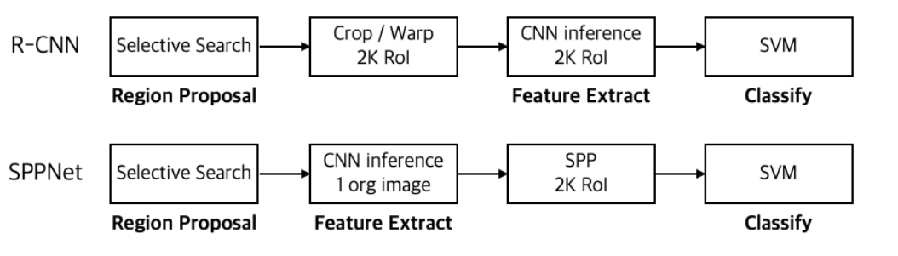

# detection
## R-CNN  

### 과정
1. Region Proposal:
- 입력 이미지에 Selective Search 알고리즘을 적용하여 bounding box 2천개를 추출.
- Selective Search는 주변 픽셀 간의 유사도를 기준으로 Segmentation을 만들고, 이를 기준으로 물체가 있을법한 박스를 추론하는 룰 베이스 알고리즘임.
2. 모든 박스를 227 x 227 크기로 리사이즈(warp).
3. 미리 이미지 넷 데이터를 통해 학습시켜놓은 CNN을 통과시켜 feature vector 추출.
4. 이 추출된 벡터를 가지고 각각의 클래스(Object의 종류) 마다 학습시켜놓은 SVM Classifier를 통과.
5. 바운딩 박스 리그레션을 적용하여 박스의 위치를 조정한다.

### 장점

### 단점

## SPP-NET
기존의 CNN 아키텍쳐들은 모두 입력 이미지가 고정되어야 했습니다. 
(ex. 224 x 224) 그렇기 때문에 신경망을 통과시키기 위해서는 이미지를 고정된 크기로 크롭하거나 비율을 조정(warp)해야 했습니다. 하지만 이렇게 되면 물체의 일부분이 잘리거나, 본래의 생김새와 달라지는 문제점이 있습니다. 여기서 저자들의 아이디어가 시작합니다.

"입력 이미지의 크기나 비율에 관계 없이 CNN을 학습 시킬 수는 없을까?"

### 과정
1. 먼저 전체 이미지를 미리 학습된 CNN을 통과시켜 피쳐맵을 추출합
2. Selective Search를 통해서 찾은 각각의 RoI들은 제 각기 크기와 비율이 다릅니다. 이에 SPP를 적용하여 고정된 크기의 feature vector를 추출합니다.
3. 그 다음 fully connected layer들을 통과 시킵니다.
4. 앞서 추출한 벡터로 각 이미지 클래스 별로 binary SVM Classifier를 학습시킵니다.
5. 마찬가지로 앞서 추출한 벡터로 bounding box regressor를 학습시킵니다.

Spatial Pyramid Pooling Structure  
SPP는 CNN layer를 통해 얻은 feature map을 정해진 grid(논문에서는 pyramid라고 함)로 나눈다.  
이 과정을 여러 개의 피라미드로 수행하며, 수행 시 피라미드의 1칸을 bin으로 정의하고 bin에 대해 max pooling을 적용한다.
적용한 결과를 쭉 concat하여 결과를 낸다. bin의 개수는 input feature map에 상관없이 정해져 있으므로, 항상 동일한 크기의 결과를 얻는다고 할 수 있다.
(예시에서는 21x256 개의 feature)

### 장점
- R-CNN과 달리 ROI를 고정 크기로 조절할 필요가 없이 가변적으로 받아 처리할 수 있다.

### 단점
1. end-to-end 방식이 아니라 학습에 여러 단계가 필요하다. (fine-tuning, SVM training, Bounding Box Regression)
2. 여전히 최종 클래시피케이션은 binary SVM, Region Proposal은 Selective Search를 이용한다.
3.  fine tuning 시에 SPP를 거치기 이전의 Conv 레이어들을 학습 시키지 못한다. 단지 그 뒤에 Fully Connnected Layer만 학습시킨다.

[blog](https://yeomko.tistory.com/13?category=888201)
https://herbwood.tistory.com/24 

