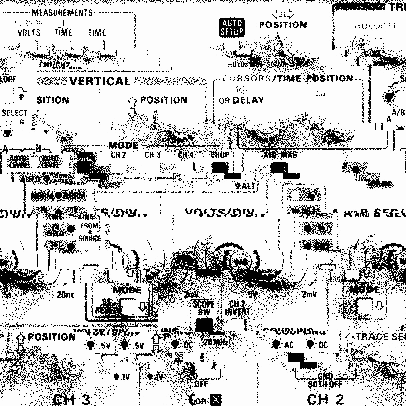
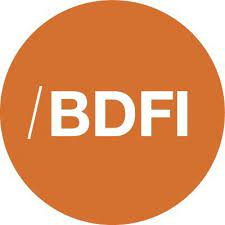
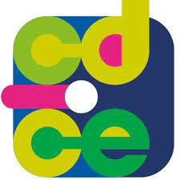

{:style="display:block; margin-left:auto; margin-right:auto"}{: width="350" }{: height-="350" }

TODO: complete the collaborators and acknowledgements list

This website is built by Dr Ola Michalec. Ola is a Lecturer in Digital Futures based at the University of Bristol Business School (Bristol Digital Futures Institute).

Ola’s research interests revolve around understanding how experts from diverse fields collaborate on digital innovations. Over the past decade, she has applied this question to the context of critical infrastructures, cyber security, and energy industry. Ola contributes to debates in Science and Technology Studies and plays an active role in communities such as [Research Institute for Sociotechnical Cyber Security](https://riscs.org.uk/).

[Google Scholar](https://scholar.google.com/citations?user=abDmargAAAAJ&hl=en&oi=ao)

[Orcid](https://orcid.org/0000-0003-3807-0197)

[University of Bristol profile](https://www.bristol.ac.uk/people/person/Ola-Michalec-71ecc9a4-46cc-44f7-b382-ab767d7dc1c5/)

{: width="350" }{:style="display:block; margin-left:auto; margin-right:auto"}

### Collaborators
We would like to credit the following people who contributed to the project:
* co-authors: Joe Bourne, Awais Rashid, Andrés Domínguez, Partha Das Choudhury, Marvin Ramokapane, Emily Godwin, Emily Johnstone, Alicia Cork, Dirk van der Linden, Sveta Milyaeva, Ben Shreeve, Nina H Di Cara, Natalie Zelenka, Huw Day, Euan DS Bennet, Vanessa Hanschke, Valerio Maggio, Charles Radclyffe, Roman Shkunov, Emma Tonkin, Zoë Turner, Kamilla Wells, Cian O’Donovan, Joshua R Moon
* artists: Jonny Heath, Ian Keavney, Jordan Collver, Eve Pyra, Mary Hart, Liz Ormian, Aude Nasr, Wen Li, Oliver Dean
* critical friends: Sam Young, *critical hype studies*, Peter Winter, Andrés Domínguez, *ESP editors*, Carsten Horn, Ruzanna Chitchyan

### Acknowledgements
We are grateful to our funders for their ongoing support, in particular:
* Bristol Digital Futures Institute and Bristol Cyber Security Group for administrative support and mentorship,
* Innovation Launchpad Network+ (Researcher-in-Residence Scheme in partnership with Energy Systems Catapult) for funding research and policy engagement
* Research England (C-DICE: The Centre for Postdoctoral Development in Cities, Infrastructure and Energy) for research, conference and public engagement funding.

{: width="150" }
{: width="150" }
{: width="150" }
{: width="150" }
