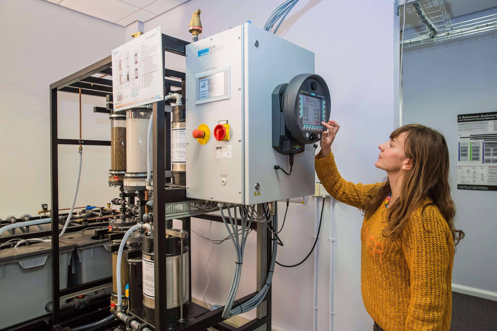

### Bio
This website is curated by Dr Ola Michalec, researcher at the University of Bristol. Ola Michalec is a Lecturer in Digital Futures based at the University of Bristol Business School (Bristol Digital Futures Institute).

Ola’s research interests revolve around understanding how experts from diverse fields collaborate on digital innovations. Over the past decade, she has applied this question to the context of critical infrastructures, cyber security, and energy industry. Ola contributes to debates in Science and Technology Studies and plays an active role in communities such as [Research Institute for Sociotechnical Cyber Security] (https://riscs.org.uk/).

[Google Scholar](https://scholar.google.com/citations?user=abDmargAAAAJ&hl=en&oi=ao)
[Orcid](https://orcid.org/0000-0003-3807-0197)
[University of Bristol profile](https://www.bristol.ac.uk/people/person/Ola-Michalec-71ecc9a4-46cc-44f7-b382-ab767d7dc1c5/)

### Collaborators
We would like to credit the following collaborators who contributed to the project.....

### Acknowledgements
We would like to thank our funders for enabling us to share our research, public engagement and conference activities: Bristol Digital Futures Institute (BDFI), Innovation Launchpad Network+ (Researcher-in-Residence), Research England (C-DICE)

insert logos of funders

