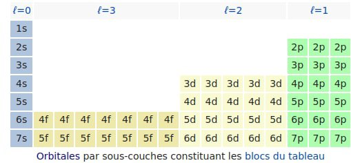
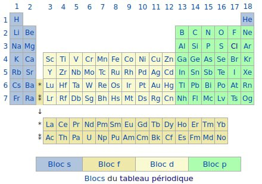

---
title: Atomes, nombres quantiques et toutes ces conneries III
subtitle: Où vous aller apprendre à ranger la chambre d'un ado…
summary: >
  « **Z. :** Pyyym j'peux me plaindre deux minutes de mon cours de chimie ? Pasque j'ai pas tout tout compris…<br>
  **PYM :** Mmmmh oui aucun prob…<br>
  **Z. :** C'était un bail à base de quatre nombres quantiques et de sous-couches électroniques de chépaquoi. »
cover:
  img: messy-room.jpg
  comment: Électron, va falloir ranger ta chambre fissa !
category: science
series: C'est quoi les nombres quantiques
tags: [someone was wrong, sciences, physique, chimie, tableau périodique]
status: published
...

Reprise(de tête) du petit cours d'intro à la physique quantique pour comprendre la chimie !

# Range ta chambre

## Feng shui d'électron

Bon voilà maintenant on sait comment sont faites les "_étagères à électrons_" donc on sait les ranger des électrons !


Alors certes on a de belles étagères… mais, comme en atteste ~~ma chambre~~ **une chambre d'ado**, il y a clairement plusieurs méthodes pour utiliser une étagère :


👆 Là techniquement IL Y A un placard et une étagère… quelque part…

Alors les chimistes ont une technique assez simple pour ranger les électrons façon feng shui : on les range de la plus basse énergie à la plus haute… en gros on remplit en premier là où ça coûte le moins cher !

Euh mais alors c'est facile ! On remplit dans l'ordre `1s 2s 2p 3s 3p 3d 4s` etc !!!

Nan. Car en fait les énergies des différentes sous-couche des fois il empiète un peu sur le niveau d'au-dessus et ça fout un peu le bordel.


Les chimistes ils ont fait un joli schéma vu qu'ils ont passé 50 ans à mesure toutes leur fucking raies dans tous les sens ! On y voit par exemple que si on veut aller par énergie croissante au début ça marche bien : `1s 2s 2p 3s 3p`… et là c'est le drame 😱 `4s` avant `3d` 😱😱😱

Bon avec le graph des énergies sous le nez on arrive à remplir les niveaux dans l'ordre mais c'est un peu casse ~~couilles~~ gonades. L'autre solution c'est de se taper les calculs exacts du niveau d'énergie à chaque fois… bon OK, c'est VRAIMENT pas plus simple !

Alors un monsieur - avec un nom atroce à écrire - a trouvé une règle simple pour savoir comment on range les électrons : la règle de ~~Kieslowsky~~ ~~Klieshlow~~… rhaaaaaa bordel **Klechkowski** ! Sa règle c'est que vous devez écrire les orbitales niveau par niveau :

```
1s
2s 2p
3s 3p 3d
4s 4p 4d 4f
5s 5p 5d 5f 5g
```

(oui après f on continue avec l'alphabet sauf le j qui ressemble trop à un i)

et ensuite vous allez remplir en faisant des diagonales bas-gauche :

{ width="50%" }

Et ça correspond bien à la mesure des chimistes : 4s se remplit avant 3d 🥳


## Marie Kondo, vient ranger mes éléments !

Bon bah voilà on sait ranger les électrons ! Mais est-ce que ça permettrait pas aussi de ranger les éléments eux même ???


La seule couche qui compte vraiment pour la chimie, c'est celle qui réagit… c'est à dire celle qui est en surface donc la plus haute. 🤔 Bon déjà on va ranger ensemble tous les éléments qui ont pour dernière orbitale remplie les orbitales s et on va les ranger par n croissant (donc du plus léger au plus lourd puisque pour avoir un n grand il faut plus d'électrons donc plus de proton dans le noyau donc des atomes plus lourd).

Ça donnerait quoi ?

Ceux qui sont à demi remplis (un seul électron dans la couche s) de n=1 à n=7:

```
H Li Na K Rb Cs Fr
```

Ceux qui sont complètement remplis (2 électrons dans la couche s) de n=1 à n=7 :

```
He Be Mg Ca Sr Ba Ra
```

Bon on pourrait continuer pareil pour les orbitales p… (il n'y en aurait pas pour n=1 par contre car les orbitales p ça commence à n=2) et idem pour les orbitales d et puis même f. Et genre on mettrait ça dans un tableau : une colonne pour les s, 3 colonnes pour les p (qui ont 3 orbitales) 5 colonnes pour les d (car 5 orbitales) et 7 colonnes pour les f (car 7 orbitales)…



👆 Feng shui ta mère des éléments ! C'est comme ça qu'il faudrait ranger ! Bon chaque case correspond à 2 éléments en vrai car on a 2 électrons par orbitale…

Et si on met les noms des éléments là-dedans ça donne quoi ?




…c'est la fucking table de Mendeleïev !!!!! Le tableau périodique des éléments !!!!!!!!!!!!!!!!!!!!!!!

Note : pour des raisons chimiques on a juste déplacé l'hélium au-dessus de la dernière colonne, car il se comporte exactement comme ceux qui ont la totalité de leur couche pleine (normal lui aussi a la totalité de sa couche pleine… c'est juste qu'il a que 2 électrons 😅)

Il avait fallu des années pour le faire expérimentalement… des années… et il y a toujours eu plein de trou dedans (car on avait pas découvert l'élément à tel ou tel endroit) et pour le faire il avait fallut regarder comment chaque élément réagissait avec plein de truc pour le mettre dans la bonne colonne (dans une colonne tous les éléments doivent réagir pareil).

Et là paf ! Juste avec la théorie des orbitales atomiques et leur nombre quantiques chelous… tu le construis en one shot !!!! Et ce genre de truc… c'est ce qui fait que malgré les comportements apparemment absurdes qu'elle implique et les calculs infâmes qu'il faut faire… la physique quantique est un outil de ouf !

Donc la physique quantique avec ses électrons gazeux qui se téléportent, qui se comportent comme des fantômes et qui tels des instagrameuses posent pour la photo dès qu'on les regarde et ses atomes entourés de grosses bouboules, altères et autre morceaux de ballon venu des enfers… eh ben c'est la meilleure description qu'on ait de la réalité (pour les machins très petits) !

# À retenir

- le principe de décrire les électrons avec 4 nombre quantique qui ont des valeurs ultra limitées : **n ℓ mℓ** et **s**
- le nom des familles d'orbitales : **s p d f** (_**s**phérique_, _**p**olaires_, _**d**iagonales_, _**f**outraque_ pour s'en souvenir)
- on peut mettre **2 électrons par orbitale**
- l'ordre de remplissage avec la **règle Klechlowsk**i (les diagonale bas-gauche)
- tout ça a été obtenu grâce au boulot de _chimistes absolument géniaux_ qui ont bossé des années pour essayer de trouver une théorie qui explique des situations à priori incompréhensibles…

Ah j'oubliais… il y a un taré qui a réussi à vraiment représenter en 3D ce que sont exactement les orbitales atomiques… c'est putain super dur, car il faut représenter les probabilités, le mouvement et tout (et même les 1s en fait c'est assez complexe, car la probabilité toutes simple que je t'ai montré c'est celle du 1s… le 2s ça forme comme des bouboules concentriques :

<iframe width="100%" height="315" src="https://www.youtube.com/embed/W2Xb2GFK2yc" title="YouTube video player" frameborder="0" allow="accelerometer; autoplay; clipboard-write; encrypted-media; gyroscope; picture-in-picture" allowfullscreen></iframe>

# Remerciements

Je tiens à remercier Cécile, Ophélie, Gui² et bien sûr Z. pour leurs questions, relectures, corrections, discussions et tout. Parce que, il faut bien avouer, cet article a été particulièrement velu, un genre de 😸Maine Coon😸 de la physique !
