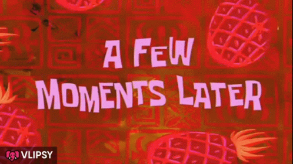
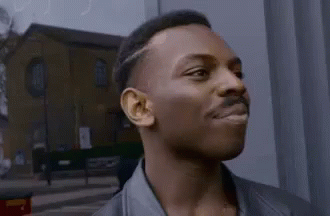

---
title: Paris - Belfort - Paris s'il-vous-plait
subtitle: Vous avez toujours rêver de visiter Mulhouse
summary: Moi tout ce que je voulais c'était aller à Belfort et revenir. Mais apparemment c'est pas possible…
cover:
  img: train-monopoly.jpg
  comment: Photo by Joshua Hoehne on Unsplash
category: pymfactor
tags: [pas de bol, transports]
status: published
...

Moi tout ce que je voulais c'était aller à Belfort et revenir. Mais apparemment c'est pas possible…

Je devais aller pour la journée dans la belle ville de [Belfort](https://www.coquetelbar-belfort-franchecompte.fr) pour jury de soutenance de mon stagiaire T.[^thomas], visiter un peu son école et zou retour pour Paname. Simple, basique.

[^thomas]: Tu te reconnaitras. Et si tu te reconnais pas et que tu as un prénom qui commence par T, vas-y profite c'est ton jour de gloire.

Alors… train retour annulé cette nuit "plus de motrice disponible" 😳 et en plus pour l'aller c'est 35 min de retard au départ… ce qui ne serait pas trop grave si la soutenance de mon stagiaire n'avait pas, elle, été avancée de 30 min ce matin. J'ai donc au max 50 min pour aller de la gare TGV à la salle de soutenance mais le temps de trajet estimé est de 1h15 🤯

Mais revenons à mon aller : J'ai au max 50 min pour aller de la gare TGV à la salle de soutenance mais le temps de trajet estimé est de 1h15... Ai-je précisé que la soutenance dure 10 min ?

Nan mais tout va bien se passer. Je dois juste prendre un bus… ah oui pour ça il me faut un ticket… ah nan une appli pour pouvoir acheter des ticket électronique. Easy… sauf que pour ça il faut télécharger la [bonne appli](https://play.google.com/store/apps/details?id=fr.airweb.tixipass&hl=fr&gl=US). Et pour la télécharger il faut du réseau.

Gare de Belfort TGV, seul réseau dispo du "edge" sa mère la péripatéticienne de sa race ! Bon bah on va essayer de… `<téléchargement 1%>` récupérer l'appli `<téléchargement 2%>` quand même `<téléchargement 3%>`. Rhaaaaaaaaaaaa !!! Bon et le wifi de la gare ? Ah il marche ! LEntement mais c'est mieux que du Edge. Aller on lance le téléchargement et pendant ce temps je me rapproche du bus `<réseau wifi déconnecté>` Bah what the putain de fuck ?! JE fais deux pas en arrière `<réseau wifi connecté>`. Bordel de bordel le wifi a une porté de 1m autour de la gare ! Et le bus est à 300 m.

PYM attend comme un con le chargement de l'appli comme un couillon dans la gare. Bon voilà c'est fait ! C'est bon, oui ?!

C'était déjà juste pour pécho le bus mais là, pffff. Bon on va le tenter mais j'y crois moyen[^ycroire]. Of course, j'ai raté mon bus à 20 secondes. Bonus : un mec à l'arrêt qui me voyait courir depuis la gare m'a dit :

:::{.dialog}
| « Rhooooo c'est con ça s'est joué à ça 👌
| — Mais vous avez pas dit au chauffeur de m'attendre ?
| — Bah j'étais sûr que tu arriverais mec ! »
:::

Bref après ce qui me semble 2000 km j'arrive à l'École où se déroule la soutenance.

[^ycroire]: Mon stagiaire non plus… la différence entre lui et moi c'est que lui ça le fait peut-être un peu stresser. Un peu.

La soutenance, tout ça, le jury, tout ça. On miam avec mon stagiaire et ses colloc. Bref c'est cool. Il ne "reste plus qu'à rentrer" 👈 Notez cet optimisme, c'est mignon. Stupide mais mignon.

Alors vous allez rire… le matin j'avais l'impression d'avoir "quelques soucis de train". Ça a réussi à empirer.

Souvenez-vous, mon TGV de retour avait été annulé brutalement cette nuit et j'avais pu changer mon billet pour un mix débile à base de :

1. Belfort - Mulhouse (TGV)
2. Mulhouse - Strasbourg (TER)
3. strasbourg - Paris (TGV)
4. Arrivée 20h50

Pour un total de 4h20 de trajet… trajet qui dans l'autre sens ne prenait que 2h16.

Mais même ça c'était trop simple, bordel : mon premier TGV à 20 min de retard. Or la correspondance avec le suivant est de 12 minutes. Qu'est-ce que vous en déduisez ? « Oh mais tu vas dormir à Mulhouse toi ! » Exactement !

[#yaPasMoyen](https://getyarn.io/yarn-clip/6171b1c7-157d-4e47-a3e9-5b05d4d2da3b#0ZWkBhcf.copy){.hashtag}

Direction le guichet. En urgence. \<imaginez moi traversant la gare avec les sirènes et des motards qui m'ouvrent la voie ou un truc comme ça>

:::{.dialog}
« Alors oui effectivement la correspondance c'est mort monsieur »
:::

Alors voilà ce qu'on me propose en ~~plan B~~… ah bah nan là on est déjà au plan C :

1. Prendre le TGV prévu malgré le retard (facile)
2. Rater le TER suivant (facile aussi)
3. Prendre le TER suivant (ça reste dans mes cordes)
4. Rater le TGV Strasbourg - Paris (nickel j'ai de l'entrainement maintenant)
5. Espérer la clémence du contrôleur du TGV Strasbourg - Paris d'après (faci... wait what ?!)

C'est mal barré.

:::{.dialog}
| « Euh mais attendez, avant qu'on discute faisabilité… ça me fait arriver à quelle heure votre bail là ?
| — 21h50
| — 😳
| — Monsieur ?
| — Va manger tes morts, meuf ![^tesmorts] Ça fait plus de 5h30 de trajet avec en plus une étape "espère que le contrôleur est sympa"
:::

[^tesmorts]: On peut envisager que, en vrai, je l'ai dit en y mettant un peu plus les forme. Mais comme ça vous aurez l'impression que j'ai un minimum de street cred'

Contre proposition by PYM :

1. Foutez moi dans le TGV direct pour Paris de 18h06 bordel !!! Il y a encore des places dedans ! »
2. C'est tout

Ah oui, parce que, entre temps, une jeune fille super sympa, Salomé, s'était pointé, fort étonnée de ne point trouver son TGV pour Paris sur les panneaux d'affichage de la gare. En plus il y avait un connard qui monopolisait les 3 nanas du guichet avec une histoire de train en retard et de correspondance en mousse (oui le connard c'est moi). Bon vu que j'étais le seul interlocuteur libre, et malgré mon rôle de connard auto-attribué, j'ai essayé de lui annoncer la nouvelle de la disparition de son TGV de le triangle des Bermudes de Franche-Comté. J'ai essayé de lui expliqué que justement je monopolisait l'équipe pour essayer de trouver un ~~plan B~~ euh un ~~plan C~~ bordel on en est déjà au **plan D** pour tous nous sauver. Et c'est là qu'une phrase magique est sortie :

« Ah mais si la jeune fille a encore son ticket du train annulé de 16h04 elle peut prendre le TGV direct de 18h06 il y a encore des places dedans[^encoredesplaces], on vient de vérifier. »

[^encoredesplaces]: Cette affirmation s'avèrera totalement fantaisiste un peu plus tard…

Donc en fait pour elle c'était simple. Elle pu donc repartir attendre le TGV de 18h06.

C'est comme ça que j'ai mis au point ma contre proposition.

:::{.dialog}
| « C'est pas possible monsieur… vous avez un TER dans votre ticket… ça dépend de la région… on peut pas l'échanger pour un TGV qui dépend pas de la région.
| — Mais j'ai pu échanger TGV 👉 TGV+RER ce matin…
| — Ah oui c'est vrai… c'est bizarre…
| — Mais qu'est que the fuck whaaaaaaat ?!
| — Mais écoutez, monsieur, l'échange ne peut pas se faire dans l'autre sens
| — Ça vous gêne si je me met à pleurer un petit peu ? »
:::

Face à mon désarroi, j'ai bien senti qu'elles essayaient des trucs hein…

:::{.dialog}
| « Attendez on va voir si le plan C de tout à l'heure pourrait marcher…
| — …
| — Ah c'est mal barré car les gars de Strasbourg vont vous dire que vous auriez du changer votre billet ici…
| — Mais… mais… c'est littéralement ce que je vous demande de faire !
| — Ah oui mais il diraient ça parce qu'ils nous aiment pas et que ça les déresponsabilise…»
:::

[#laisserMoiMourir](https://www.editionsopportun.com/produit/718/9782380153262/ou-mourir-a-paris){.hashtag}

Je crois que c'est là que j'ai émis l'hypothèse que c'était un complot de l'office de tourisme de la région pour me forcer à visiter Mulhouse et Strasbourg…

Bon en attendant la mort, après avoir fini d'aider Salomé, la nana super sympa qui avait le même souci de train, je commençais à aiguiller un mec qui voulait aller à Paris (le fou !!!)… bah oui vu que je continuais de monopoliser tout le staff, j'essayais d'aider la communauté en retour.

:::{.dialog}
| « Vous devriez bosser ici, me dit une nana du guichet, vous êtes efficace !
| — …un effet de contraste sans doute…
| — Pardon ?
| — Nan rien… trouvez moi un moyen d'atteindre Paris ! »
:::

Appel au QG SNCF qui dit d'appeler le représentant région qui demande de voir avec le responsable des TGV INOUI à Paris… qui dit de voir avec le contrôleur à Strasbourg. Ah et lui aussi pense que le sus-mentionné contrôleur m'enverra chier mais que ça serait jouable si j'était dans un direct pour Paris… à condition de réussir à joindre le contrôleur du train à l'avance depuis Belfort !

Là une des nana du guichet dit « *Oh ils font chier hein, je l'appelle et je met une annotation sur votre billet monsieur, kizivienne me dire ke g padroi !!!* » (avec un fort accent suisse[^passuisse] tout ça)

[^passuisse]: Oui je sais c'est pas un accent suisse, ça doit être accent franc-comtois… mais sérieusement pour moi le castelroussain qui vit à Paris… j'arrive pas à différencier. Si toi lecteur tu sais différencier : contacte moi et apprend-moi (pour de vrai ya tout pour me contacter dans l'en-tête du site : Telegram, Insta, FB, Twitter et même github pour les plus geek d'entre-vous).

Me voilà donc à attendre le TGV direct de 18h06 avec sur moi un billet pour Mulhouse-Strasbourg-Paris annoté d'un machin illisible qui pourrait aussi bien être "*Allez nicker vos mères Strasbourgeois de merde*" que "*Foutez ce mec au sous-sol et perdez la clé*". Je suis optimiste.

# Épilogue

Au final, j'ai pu prend le fameux TGV direct de 18h06 et je suis arrivé à 20h35 à Paris. Sauf que déjà il était pas direct et que bien sûr il ne restait en fait des places qu'entre Belfort et l'arrêt suivant mais pas du tout jusqu'à Paris.

Heureusement, j'ai retrouvé Salomé, l'autre naufragé du TGV disparu et on a passé un super voyage parce que bah déjà Salomé était super sympa et on discuté tout le trajet, ensuite les nanas de l'accueil SNCF, en vrai se sont pliées en 4 pour nous arranger le coup (en particulier celle qui s'est énervé et qui a griffonné mon billet). Enfin le contrôleur de notre train était ultra sympa et marrant et avec Salomé on a pu déconner avec lui de nos mésaventures.

Bref never give up. Il peut toujours sortir un truc cool d'une situation merdique (sauf dormir à Mulhouse !).

Par contre pourquoi ce genre de truc m'arrive tout le temps à moi en particulier, ça je n'ai pas d'autre explication que :

:::{.big-centered}
**My life is a movie with no director.**
:::

# Réflexion politique de circonstance

:::{.dialog}
| « Monsieur, avez-vous un avis sur le découpage et la privatisation de la SNCF ?
| — Celui qui a eu cette idée peut aller manger ses grands morts… et quand il aura fini je lui arrache la tête et je lui chie dans le cou !
| — Merci. À vous les studios. »
:::
