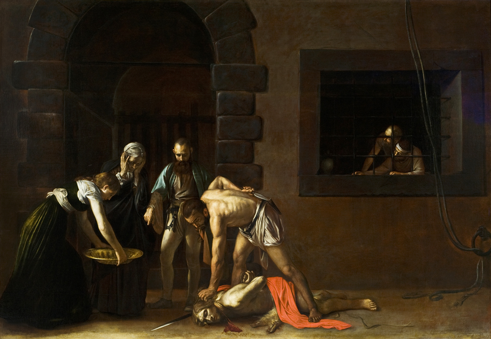
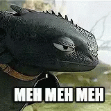

---
title: Atchoum à paillettes
subtitle: De la détermination expérimentale de la force d'un éternuement
summary: Je suis sorti acheter des petit crottins de chèvres et je suis revenue avec une nana qui pisse le sang par le crâne…
cover:
  img: Cathryn-virginia-phone-with-blood.jpg
  comment: illustration by Cathryn Virginia for Vice.com
category: pymfactor
tags: [pas de bol, atchoum]
status: draft
...

Je suis parti acheter des petits crottins de chèvres (ça n'a aucune importance mais je
tiens à le préciser) au Franprix en bas de chez moi. Je trouve l'objet de mon désir, je
l'achète et je rentre… là il reste donc 40m à faire…

C'est fous tout ce qui peut se passer en 40m.

Je m'apprête à remonter ma rue quand 2 jeune nanas s'apprêtent, elles, à la traverser.
Il y en a une avec deux grosses couettes et inévitablement une raie au milieu qui - tout
en marchant - montre une vidéo sur son phone à sa pote qui semble tout droit sortie d'un
pensionnat catholique  avec sa jupe plissée et ses chaussures cirées. Appelons cette
dernière Marie-Odile.

# [Et là c'est le drame](https://www.arteradio.com/son/61658634/et_la_c_est_le_drame)

\<à partir de maintenant imaginez la voix de Pierre Bellemard[^pierrebellmard]>

[^pierrebellmard]: Pour les plus jeunes d'entre-vous, Pierre Ballemard était... c'est
dur à définir. On va simplifier et dire un présentateur TV resté célèbre pour sa
capacité à raconter des fait divers comme si tu y était. Je pense que pour plain de gens
qu'on l'ont connu à la TV, ce mec **était** le fait divers. Avant même que soit né il
sévissait déjà :
[Pierre Bellemare raconte : "C'est arrivé un jour" | Archive INA](https://youtu.be/FLIBbV7UjSA?t=63)

Tout va très vite : Couette-Couette, 21 ans, étudiante en chimie est prise d'une brutale
envie d'éternuer. Sa voisine, Marie-Odile, jeune fille de bonne famille, et amie depuis
3 ans avec Couette-Couette se recule voyant l'éternuement arriver… grand bien lui prend
car effectivement il est terrible ! La jeune fille expectore si fort qu'elle jette
violemment sa tête en avant son crâne heurtant le téléphone portable Galaxy S20, rose à
paillettes à l'écran déjà fort endommagé…

En quelque seconde le PYM comprend l'horreur de la scène : le bord de l'innocent
téléphone avait été rendu coupant du fait du mauvais état de son écran. Et il était venu
percuter longuement le crâne de la jeune Couette-Couette, 21 ans étudiante en chimie…
crâne laissé à nue par une raie fort esthétique mais non moins téméraire.

Marie-Odile pris aussitôt un air effrayé, le sang s'étant mis à couler à flot du crâne
de sa malchanceuse voisine…

\<fin de la voix de Pierre Bellemard>

Bon la situation était pas belle à voir. La nana avait mis ses main en coupe et,
littéralement, elles se remplissaient de sang (on aurait dit un
Caravage[^peintreitalien] !). Sa pote, elle, était totalement HS hébétée… j'ai donc dû
traverser la rue et ~~recouvrir le crâne de Couette-Couette avec crottin écrasé~~
essayer de rassurer Couette-Couette. J'ai pu lui filer un paquet de mouchoir pour
tenter d'absorber le flux.

[^peintreitalien]: Oui, oui, les peintres italiens se sont beaucoup intéressé à la rue à côté de mon Franprix 

D'ailleurs en parlant de flux... Voyons voir à quel point sa pote a pu être utile pendant
la scène :

:::{.dialog}
| **Moi :** Il faudrait quelque chose pour éponger le sang et faire pression…
| **Marie-Odile :** _J'ai un tampon_ 👈 apparemment elle avait décidé de s'accrocher à son inutilité comme un pétoncle à son rocher.
| **Moi :** …
| **Marie-Odile :** _…Mais je le garde plutôt pour les "situations d'urgence"…_
| **Moi :** Euh… je… mais c'est pas un cas d'urgence là ?!
:::

Et pendant que les pétoncles décidaient de se désolidariser de Marie-Odile, il nous
fallait trouver une solution plus durable que mon paquet de mouchoir. Sinon on allait
avoir une Couette-Couette toute sèche comme après une rencontre après Dracula.

À notre disposition, en termes d'aide, nous avions (classé du plus proche au plus
éloigné de la scène):

- Marie-Odile… ouais bon, on a déjà vu que son inutilité n'a d'égal que son incapacité à
  évaluer la situation
- Hamed le mec de la caisse du Franprix… qui a du mal avec la vue du sang 🤔 nan ça
  semble pas être une bonne idée
- Dédé le SDF qui traine souvent au coin de la rue 🤔 Bon si on veut ajouter la
  septicémie à l'exsanguination c'est à lui que je penserai en premier
- La nana qui tient la pharmacie qui se trouve à 200m
  [#bingo](https://fr.wikihow.com/gagner-dans-la-vie)
- Les urgences de la Salpétrière à 500m mais là-bas c'est toujours le bordel, je le sais
  j'y suis aller très très souvent…

Direction la pharmacie donc. En 100m, notre geyser de sang commençait à se tarir. Je ne
savais pas si je devais mettre ça sur le compte d'un début de cicatrisation ou sur le
fait que Couette-Couette n'avais simplement plus de sang à fournir. Mais on a finit par
arriver à la pharmacie. Établissement où nous fûmes accueillis par :

:::{.big-centered}
« 😱 Saint Marie Mère de Dieu protégez-nous 😱 »
:::

:::{.small}
_Ok apparemment cette histoire est sponsorisée par la communauté catho de mon quartier…_
:::

On va pas se mentir, la pharmacienne était pas rassurée du tout. Quand elle a demandé ce
qui lui était arrivé, j'ai répondu « Un coup de fil ». Mais cette marque d'humour
décapant n'a vraiment amélioré la situation. Heureusement Marie-Odile était toujours là
pour s'assurer que je ne disais pas la plus grosse connerie de la pièce : « Vous savez
comment on enlève du sang de dessous un écran de téléphone ? ».

La pharmacienne a fini par appeler le SAMU pendant que je m'occupais de notre blessée de
guerre. J4avoue que j'aurais préféré l'inverse mais bon… A un moment la pharmacienne me
dit, le téléphone collé à son oreille « Il demande si le téléphone est encore planté
dans son crâne ? » je répondit par la négative tout en me demandant si, un jour,
j'aurais pour m'assister dans mes aventures au moins une personnes utile et efficace. Là
aussi une voix dans ma tête me répondit par la négative.

# Épilogue

La SAMU est arrivé super vite et ont pris en charge la pauvre Couette-Couette qui
commençait un peu à avoir le teint pâle. Marie-Odile a évidemment fait des siennes en
accueillant les secouristes par un « _Heureusement vous voilà enfin, je ne sais pas si
j'aurais pu tenir plus longtemps !_ ». La pharmacienne m'a demandé pourquoi je n'avais
pas appelé les secours moi-même, j'ai répondu que pour le faire j'aurais du laisser
notre sanguinolente Couette-Couette entre les mains de Marie-Odile et que ça ne me
semblait pas une bonne idée… la pharmacienne me fit remarquer que j'aurais pu demander à
~~l'autre gourdasse~~ Marie-Odile d'appeler les secours. C'est vrai.

Ah oui, au final c'était "Minimum 15 points de suture" pour la louloute. Dur.

# Bonus

<iframe width="100%" height="300" scrolling="no" frameborder="no" allow="autoplay" src="https://w.soundcloud.com/player/?url=https%3A//api.soundcloud.com/tracks/1306713199&color=%23ff5500&auto_play=false&hide_related=false&show_comments=true&show_user=true&show_reposts=false&show_teaser=true&visual=true"></iframe>
<a href="https://soundcloud.com/pymaldebaran" title="pymaldebaran" target="_blank" style="color: #cccccc; text-decoration: none;">pymaldebaran</a> · <a href="https://soundcloud.com/pymaldebaran/atchoum-a-paillettes-version-pierre-bellemerd" title="Atchoum à Paillettes - Version Pierre Bellemard" target="_blank" style="color: #cccccc; text-decoration: none;">Atchoum à Paillettes - Version Pierre Bellemard</a>

