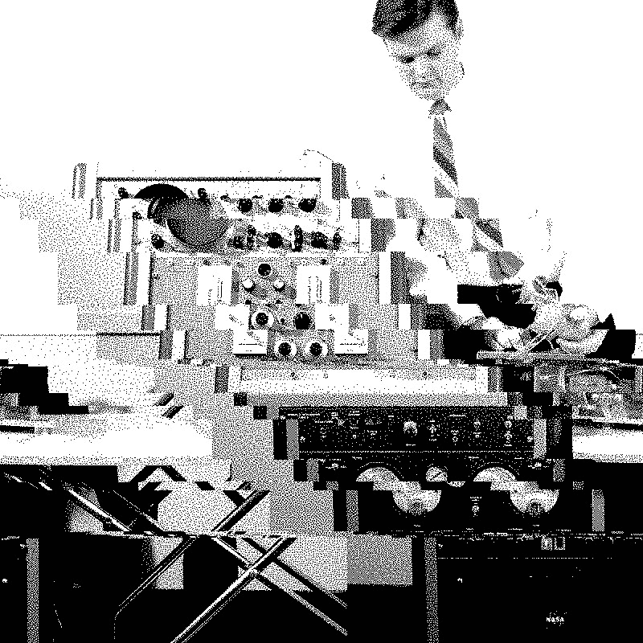

{:style="display:block; margin-left:auto; margin-right:auto"}{: width="350" }{: height="350" }

###Project title: Understanding disruptive powers of IoT in the energy sector 

The Internet of Thngs (IoT) is expected to play a major part in the ongoing transition of energy systems. With the possibility of new actors, tariffs, appliances and relationships, IoT could disrupt the energy market – whether for the better or worse. The notion of “disruption” should not be taken for granted – IoT’s success relies on software developers’ assumptions as well as regulatory requirements with regards security, privacy and data sharing. What arrangements are “good enough” to make IoT work? What are the social implications of these arrangements? What are the regulatory gaps resulting from development of IoT? How do we facilitate development of responsible innovation where IoT is aligned with policy goals of decarbonisation, affordability and security?

Previous research on IoT in energy focuses on appliances, consumers and emerging technologies. So far, there has been little focus on IoT in energy organisations and interactions between them. Without critical social science research on the disruptive powers of IoT to security and privacy of energy markets, there is a risk that energy innovation will not be aligned with public interest. The researchers will deliver reports on the future of current policies like Network and Information Systems Security Regulation and proposed regulations to consumer IoT security, and will engage with stakeholders in the field to inform current initiatives.

*Project team*: Prof Awais Rashid (PI), Dr Ola Michalec (Researcher Co-I), Joe Bourne (Creative Engagement)

*Outputs:* 

* **Journal article:** "Electric feels: The role of visual methods in energy futuring". 2024. In: Geo: Geography and Environment. By: Michalec, O., Bourne, J., Collver, J., Hart, M. F., Nasr, A., & Ormian, L. [Full text](https://doi.org/10.1002/geo2.156)

* **Journal article:** "Who will keep the lights on? Expertise and inclusion in cyber security visions of future energy systems". 2023 By Michalec, O., Shreeve, B. and Rashid, A. In: Energy Research and Social Science. [Full text](https://doi.org/10.1016/j.erss.2023.103327)

* **Briefing:** How to talk about security of emerging technologies? 2022 By Michalec, O. [Full text](https://petras-iot.org/wp-content/uploads/2022/03/How-to-talk-about-cybersecurity-of-emerging-technologies.pdf)

