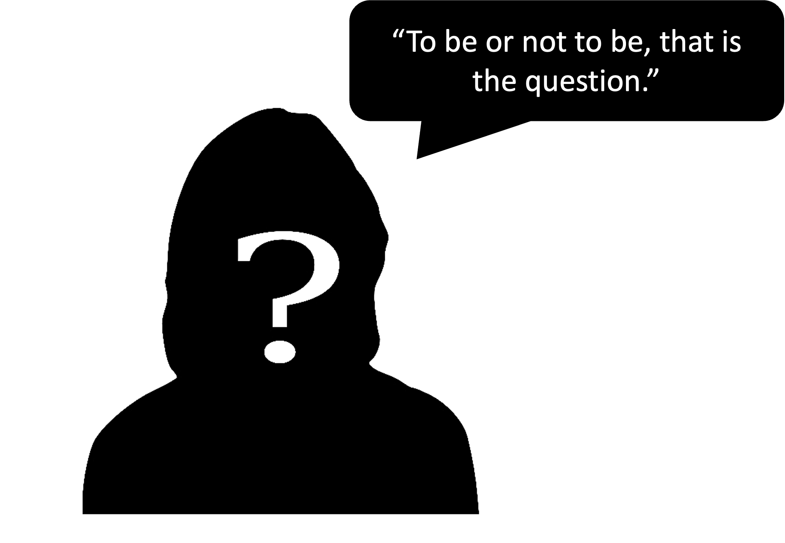
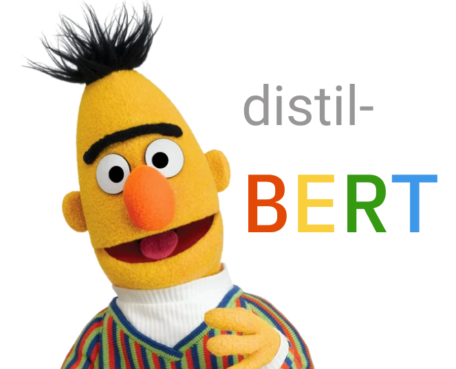
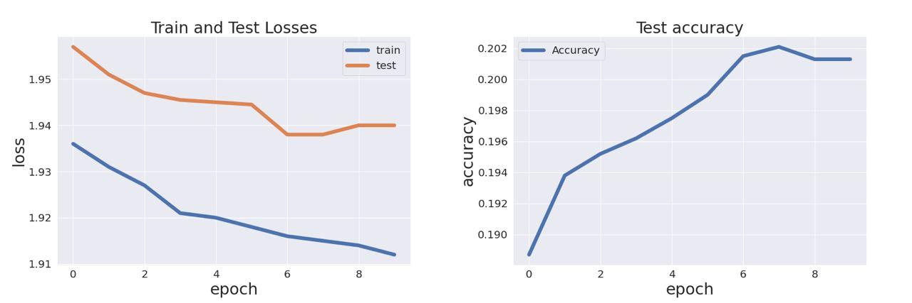
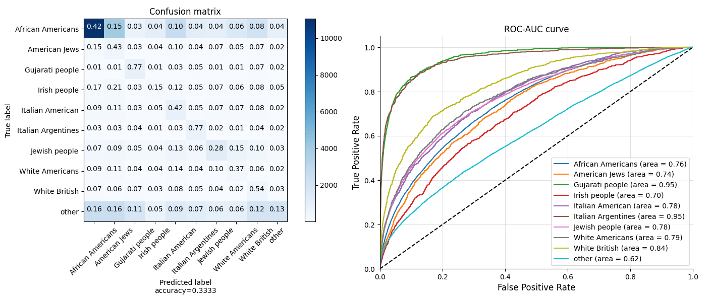
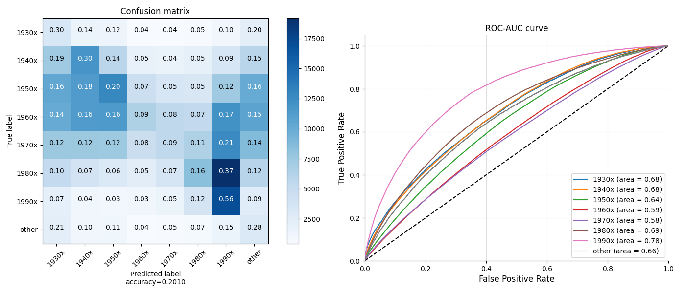

<!-- <style>
table {
margin: auto;
}
</style> -->


<style>
td {
  font-size: 15px;
  margin: auto;
}
</style>


## Introduction

Quotations, the repetition of well-known statement parts, have preserved and inherited wisdoms and perspectives 
that significantly changed the world. And we not only focus on the power of the words, but also the people who speaked 
them. There are lots of famous quotations that we can instantly identify the speakers. However, we can find a large 
number of quotations whose speakers are unidentifiable. We may never know their names, but is that possible to find 
other more details about their profiles? 

{: .mx-auto.d-block :}
<!--  -->

Our project, **DescribeByQuote**, aims to detect the profiles of the speakers from the quotations based on deep learning
methods. While performing analysis of Quotebank data we found out that around **34%** of quotations don't have assigned 
speakers to it (e.g., 1.8 million out of 5.2 million in file quotes-2020.json). Our goal is to answer the following question: if we cannot determine the exact author of a quotation, what other information can we get from it? We would like to achieve this by training the deep learning models that can help to classify with different features.

In that work, first we would need to generate labels for our quotations, which requires extra information. Therefore, we extracted those additional information about known authors of the quotations by parsing their information from **Wikipedia**. Through filtering and parsing, we successfully extracted six important features of the speakers as the labels for the data, including ```Gender, Occupation, Nationality, Ethic group, Date of birth, and Religion```. 

With the data and labels, we trained several models and verified the functionalities, then predicted the features of the 
quotations that are not assigned speakers in Quotebank. Also, we did some analysis on the outcomes and explored the 
relationships between different features, as well as tried to understand the mechanism of the prediction.

## Data

### Description

Dataset provided to us is composed of six datafiles each one containg qutation data for one year from 2015 to 2020. In this dataset we had following fields: ``` quotation text, most probable author of the quote, date of publishing quotation, probabilities of quotation authors, links to the quotation source ```

Additionaly we were provided with parquet dataset, with data scrapped from Wikipedia, containing these encoded field: ``` date of birth, nationality, gender, ethnic_group, occupation, party, academic_degree, id, candidacy, religion ```


To decode fields we used dataset with key value. Values have field name and short description.

### Preparation

We decided to start our data preparation with parsing quotation dataset with additial data from Wikipedia and decode all fields from shortucts to the full names. In dataset there were also multiple information about people having the same name but multiple Wikipedia pages. We decided to "explode" this records and save one row per Wikipedia page.

We wrote our data in parquet format having short read/write time, ability to read dataset consisting of data scattered through multiple files and reading cartain columns or rows which will meet desired conditions. Also there is possiblity to connect in the feautre with big data engins as for example Spark.

Therfore by parsing batch by batch we obtained new dataset containing 214M rows saved in parquet data folder.

## Data analysis

Before appling model to predict labels, for each label we created train, validation and test datasets. In these datasets there are records that have known speakers and known label which we will predict in the feature.

Before appling model to predict labels we wanted to choose only labels which might be applicable to almost all people. In the result we choose date of birth, nationality, gender, ethnic group, religion and occupation.

To simplify our tasks, and obtain better model predictions, in each feature we are taking the few most popular classes as seen in the table below.

<table>
<tr>
        <td><b>Feature Name</b></td>
        <td>Gender</td>
        <td>Occupation</td>
        <td>Nationality</td>
        <td>Ethnic Group</td>
        <td>Date of Birth</td>
        <td>Religion</td>
    </tr>
    <tr>
        <td><b>Class Num</b></td>
        <td>2</td>
        <td>10</td>
        <td>5</td>
        <td>10</td>
        <td>8</td>
        <td>10</td>
    </tr>
</table>

The date of birth which is continous variable we descretize into new clases in dacade sized buckets from 1930s to 1990s and having one more class for others.

For occupation we marged jobs in the same field as for example we marged basball player, hokey player and others into new class sportsman. 

In nationality we marged by continents and in other labels we took the 9 most popular classes and other examples we put in "other" bin.

### Dealing with class imbalance
<div>
  <div>
    <iframe src="plots/distribution_plots/gender/gender_proportion.html" height=445 width=445  frameborder="0" scrolling="yes"> </iframe>
    <iframe src="plots/distribution_plots/ethnic_group/ethnic_group_proportion.html"  height=445 width=445  frameborder="0" scrolling="yes"> </iframe>
  </div>
</div>

We see  our features our classes are inbalanced which might lead to biased prediction towards the most popular class. As we have significant amount of data we randomly choose only subset on it obtaining more balanced dystibution.


Pawel write about initial analisys, also we should mention that the classes was so imbalance and that we balanced them for the training but no tfor the validation and test sets. Put 1 exapmle about men and women differences (2 diagrams in 1 line and explanations) and 1 example of balanced and imbalanced data for 1 feature (again 2 diagrams in 1 line with explanations)

## Deep Learning Model

 
  Our main goal is to predict features based on the quotations. For this purpose we needed to choose a language model that perform well for the classification problem and at the same time doesn't require a lot of computational resourses. Moreover, the task of classifying quotations is a quite complex task that requires a global understanding of the text from the model. Thus, we chose pretrained DistilBERT model for our predictions. BERT is an open source machine learning framework for natural language processing (NLP). It is designed to help computers understand the meaning of ambiguous language in text by using surrounding text to establish context. The BERT framework was pre-trained using text from Wikipedia and can be fine-tuned with question and answer datasets. DistilBERT is a small, fast, cheap and light Transformer model based on the BERT architecture. It has about half the total number of parameters of BERT base and retains 95% of BERT’s performances on the language understanding benchmark GLUE.
  
  To use DistilBERT model for the classification task we collected text embeddings from the 0 output and add a classification head. The output of the final model is a probability vector with the size equal to the amount of classes.

## Experiment

We traned 6 models with the same architecture to predict 6 different features. For each feature we used a separate dataset which consisted of 3 columns: ``` qouteID, quotation, feature_name```. Each dataset was split into train, validation and test sets. The plots show the training history of model for ``` date_of_birth``` prediction.
 
We can see that both train and test losses go down as well as accuracy goes up until the 7th epoch. It means that seven epochs is enough for the training process and after it network starts overfitting. 


## Results and Analytics

<!-- Wei describes our results and asking question about correletions in the confusion matrix and why some classes prediciting much more better then others.
Here he will use confusion matrix plots and roc curves plots -->

After the experiment with the six datasets (i.e., quotations labelled with ```Gender, Occupation, Nationality, Ethic group, Date of birth, and Religion```), we recorded the train & test accuracies, and also generated ROC curves and Confusion Matrixes for the further analysis. And during the analysis, we found some very interesting phenomenons. Below are the table of the accuracy of the features:

<table>
<tr>
        <td><b>Feature Name</b></td>
        <td>Gender</td>
        <td>Occupation</td>
        <td>Nationality</td>
        <td>Ethnic Group</td>
        <td>Date of Birth</td>
        <td>Religion</td>
    </tr>
    <tr>
        <td><b>Class Num</b></td>
        <td>2</td>
        <td>10</td>
        <td>5</td>
        <td>10</td>
        <td>8</td>
        <td>10</td>
    </tr>
    <tr>
        <td><b>Accuracy</b></td>
        <td>62.78%</td>
        <td>30.97%</td>
        <td>46.45%</td>
        <td>33.33%</td>
        <td>22.10%</td>
        <td>22.52%</td>
    </tr>
</table>

Below are the Confusion Matrix and ROC-AUC curves of testing with ```Ethnic Group```:

The **color** of the right side colum represents the **number of samples**
{: .mx-auto.d-block :}

As we can see from the Confusion Matrix and ROC-AUC curves, the **Gujarati people** and **Italian Argentines** get the highest true positive rate and accuracy. However, the sample numbers of them are not as much as African Americans, why it is easier for the model to indentify **Gujarati people** and **Italian Argentines** with less samples for training?


Below are the Confusion Matrix and ROC curves of testing with ```Date of Birth```:

{: .mx-auto.d-block :}

As we can see from ROC-AUC curves and Confusion Matrix, quotations of the people born in 1990s gets the highest true positive rate and accuracy. Also, as shown in the 7th rows of the Matrix, most of people born in 1980s are indentified as 1990s. Why our model more likely recognizes 1980s people's quotations as from people born in 1990s?

As we keep analyzing the distribution of our data, we found some relations between different features. We believe these relations could answer the questions.


## Data insights

During evaluating our model we noticed that some classes detected better than others. This fact prompted us to delve deeper into the data research in search of some insiders who most likely help our models classify the desired class.

We assumed that perhaps the same groups of people prefer similar topics for conversation, which may encourage our model to classify quotes into the classes we need. But to test this hypothesis, we need to understand the context of the quote. We noticed that in 2019, the source of 83% of citations is the New York Times. In the remaining years, NY also occupies a leading position in the list of sources of quotations. The peculiarity of NY is that there is a topic in the link to the quote, to which NY equated this quote. This fact helped us to find out the context of most of the quotes.

### Data preparation

For every feature as gender, occupation, etc. we selected quotes with New York Times source. For every such quote we extracted topic from  quotes link and (because sometimes links don't fit the format we expect ) we dropped all topics with total amount less than 400.
As a result for every feature we collected dataset with quotes topics.

### Data analysis

#### Gender

We found out that our model distinguishes both men and women with the same accuracy. For further analysis, we decided to draw a distribution of topics for each gender.

<div class="row align-items-center no-gutters  mb-4 mb-lg-5">
  <div class="col-sm">
    <iframe src="plots/distribution_plots/gender/gender_female.html" height=400 width=445  frameborder="0" scrolling="yes"> </iframe>
    <iframe src="plots/distribution_plots/gender/gender_male.html"  height=400 width=445  frameborder="0" scrolling="yes"> </iframe>
  </div>
</div>


#### Date of birth
<div class="row align-items-center no-gutters  mb-4 mb-lg-5">
  <div class="col-sm">
    <iframe src="plots/distribution_plots/years/date_of_birth_1990x.html" height=400 width=445  frameborder="0" scrolling="yes"> </iframe>
    <iframe src="plots/distribution_plots/years/date_of_birth_other.html" height=400 width=445 frameborder="0" scrolling="yes"> </iframe>
  </div>
</div>

#### Ethnic group
<div class="row align-items-center no-gutters  mb-4 mb-lg-5">
  <div class="col-sm">
    <iframe src="plots/distribution_plots/ethnic_group/ethnic_group_Gujarati people.html" height=400 width=445 frameborder="0" scrolling="yes"> </iframe>
    <iframe src="plots/distribution_plots/ethnic_group/ethnic_group_Italian Argentines.html" height=400 width=445 frameborder="0" scrolling="yes"> </iframe>
    <iframe src="plots/distribution_plots/ethnic_group/ethnic_group_other.html" height=400 width=890 frameborder="0" scrolling="yes"> </iframe>
  </div>
</div>

## Conclusion


All together write smth clever and about future work
